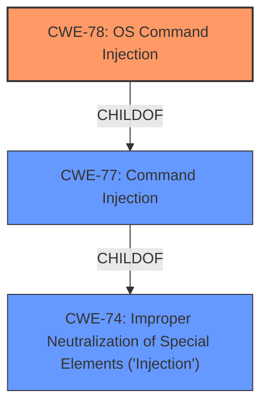

# Raw Analyzer Response for CVE-2022-0764

# Summary
| CWE ID | CWE Name | Confidence | CWE Abstraction Level | CWE Vulnerability Mapping Label | CWE-Vulnerability Mapping Notes |
|---|---|---|---|---|---|
| CWE-78 | Improper Neutralization of Special Elements used in an OS Command ('OS Command Injection') | 1.0 | Base | Allowed | Primary CWE |
| CWE-77 | Improper Neutralization of Special Elements used in a Command ('Command Injection') | 0.7 | Class | Allowed-with-Review | Secondary Candidate |

## Evidence and Confidence

*   **Confidence Score:** 1.0
*   **Evidence Strength:** HIGH

## Relationship Analysis
The primary relationship that impacted the decision was the ChildOf relationship between CWE-78 and CWE-77, where CWE-78 is a specific type of CWE-77. Since the vulnerability specifically involves OS commands, CWE-78 was chosen as the more accurate representation.

## Vulnerability Chain
The vulnerability chain starts with **improper neutralization** of special elements in user-provided input, leading to **OS command injection**, and resulting in arbitrary code execution.
  - Improper Input Handling (Root Cause) -> OS Command Injection -> Arbitrary Code Execution (Impact)

## Summary of Analysis
The initial assessment focused on identifying the root cause of the vulnerability. The description and CVE details clearly indicate that the application **fails to properly neutralize special elements** in user-provided input, which is then used to construct OS commands. This leads to **OS command injection**, allowing an attacker to execute arbitrary commands on the server.

The selection of CWE-78 is strongly supported by the evidence, particularly the CVE Reference Links Content Summary, which states: "The vulnerability stems from the way Strapi v4.0.0 to v4.1.0 (specifically between v4.0.0-alpha.2 and v4.1.0) creates projects with starters and templates via the CLI. It involves the execution of shell commands via `execa` to fetch npm packages, which can be vulnerable if user-provided input isn't properly sanitized or if the commands are constructed in a way that allows for command injection." Furthermore, "The core weakness is the use of `execa.command` or `execa.shell` to execute shell commands."

The graph relationships influenced the decision by highlighting that CWE-78 is a specific type of command injection, making it a more precise fit than the broader CWE-77.

The selected CWEs are at the optimal level of specificity because CWE-78 directly addresses the **OS command injection** aspect of the vulnerability, while higher-level CWEs like CWE-77 would be too general.

# Relevant CWE Information:

## CWE-78: Improper Neutralization of Special Elements used in an OS Command ('OS Command Injection')
**Abstraction:** Base
**Status:** Stable

### Description
The product constructs all or part of an OS command using externally-influenced input from an upstream component, but it **does not neutralize or incorrectly neutralizes special elements** that could modify the intended OS command when it is sent to a downstream component.

### Extended Description
This weakness can lead to a vulnerability in environments in which the attacker does not have direct access to the operating system, such as in web applications. Alternately, if the weakness occurs in a privileged program, it could allow the attacker to specify commands that normally would not be accessible, or to call alternate commands with privileges that the attacker does not have. The problem is exacerbated if the compromised process does not follow the principle of least privilege, because the attacker-controlled commands may run with special system privileges that increases the amount of damage.

### Alternative Terms
Shell injection
Shell metacharacters
OS Command Injection

### Relationships
ChildOf -> CWE-77
ChildOf -> CWE-74

### Mapping Guidance
**Usage:** Allowed
**Rationale:** This CWE entry is at the Base level of abstraction, which is a preferred level of abstraction for mapping to the root causes of vulnerabilities.

### Observed Examples
- **CVE-2020-10987:** OS command injection in Wi-Fi router, as exploited in the wild per CISA KEV.
- **CVE-2020-10221:** Template functionality in network configuration management tool allows OS command injection, as exploited in the wild per CISA KEV.

### Technical Explanation
The vulnerability allows attackers to inject arbitrary OS commands due to **insufficient input validation**. The Strapi application uses the `execa` library to execute shell commands for fetching npm packages, and the lack of proper neutralization of special elements in package names or versions enables command injection.

### Security Implications
Successful exploitation could lead to arbitrary code execution on the server, potentially leading to a full compromise of the server.

### Relationship Influence
The ChildOf relationship between CWE-78 and CWE-77 reinforces the selection of CWE-78 as it represents a specific type of command injection related to OS commands.

### MITRE Mapping Guidance
The MITRE mapping guidance recommends using the Base level of abstraction, which aligns with the selection of CWE-78.

## CWE-77: Improper Neutralization of Special Elements used in a Command ('Command Injection')
**Abstraction:** Class
**Status:** Draft

### Description
The product constructs all or part of a command using externally-influenced input from an upstream component, but it **does not neutralize or incorrectly neutralizes special elements** that could modify the intended command when it is sent to a downstream component.

### Alternative Terms
Command injection: an attack-oriented phrase for this weakness. Note: often used when "OS command injection" (CWE-78) was intended.

### Relationships
ChildOf -> CWE-74

### Mapping Guidance
**Usage:** Allowed-with-Review
**Rationale:** CWE-77 is often misused when OS command injection (CWE-78) was intended instead [REF-1287].

### Additional Notes
**[Terminology]** 
The "command injection" phrase carries different meanings, either as an attack or as a technical impact. The most common usage of "command injection" refers to the more-accurate OS command injection (CWE-78), but there are many command languages.

### Technical Explanation
This CWE is considered as a secondary candidate since the vulnerability description and the CVE reference specifically refer to OS commands being injected. While CWE-77 covers general command injection, CWE-78 is a more precise classification.

### Security Implications
Similar to CWE-78, this could lead to arbitrary code execution, but it is less specific to the OS context.

### Relationship Influence
The ParentOf relationship with CWE-78 highlights its relevance as a broader category of command injection, but it is less specific than CWE-78.

### MITRE Mapping Guidance
The MITRE mapping guidance suggests caution when using CWE-77, as it is often misused when CWE-78 is more appropriate, further supporting the primary selection of CWE-78.

### Other CWEs Considered but Not Used:

*   **CWE-74:** Improper Neutralization of Special Elements in Output Used by a Downstream Component ('Injection') - This is a high-level class and less specific than CWE-77 and CWE-78.
*   **CWE-88:** Improper Neutralization of Argument Delimiters in a Command ('Argument Injection') - While argument injection could be a contributing factor, the primary weakness is the ability to inject entire commands, making CWE-78 a better fit.
*   **CWE-95:** Improper Neutralization of Directives in Dynamically Evaluated Code ('Eval Injection') - This is not relevant as the vulnerability does not involve dynamic evaluation of code.
*   **CWE-117:** Improper Output Neutralization for Logs - This is not relevant as the vulnerability is not related to log injection.
*   **CWE-1236:** Improper Neutralization of Formula Elements in a CSV File - This is not relevant as the vulnerability does not involve CSV injection.
*   **CWE-1336:** Improper Neutralization of Special Elements Used in a Template Engine - This is not relevant as the vulnerability does not involve template injection.
*   **CWE-93:** Improper Neutralization of CRLF Sequences ('CRLF Injection') - This is not relevant as the vulnerability does not involve CRLF injection.