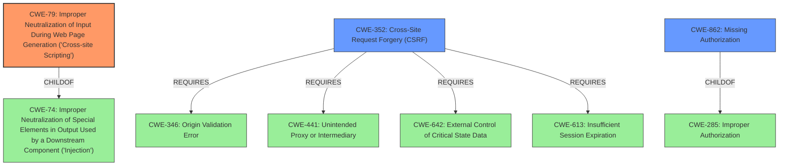

# Analysis for CVE-2022-0780

# Summary
| CWE ID | CWE Name | Confidence | CWE Abstraction Level | CWE Vulnerability Mapping Label | CWE-Vulnerability Mapping Notes |
|---|---|---|---|---|---|
| CWE-79 | Improper Neutralization of Input During Web Page Generation ('Cross-site Scripting') | 1.0 | Base | Allowed | Primary CWE |
| CWE-352 | Cross-Site Request Forgery (CSRF) | 0.75 | Compound | Allowed | Secondary Candidate |
| CWE-862 | Missing Authorization | 0.6 | Class | Allowed-with-Review | Secondary Candidate |

## Evidence and Confidence

*   **Confidence Score:** 0.85
*   **Evidence Strength:** HIGH

## Relationship Analysis
The primary CWE is CWE-79, which represents the **lack of sanitisation and escaping** of the customCss parameter, leading to Cross-Site Scripting. CWE-79 is a base-level CWE, making it a good fit. CWE-352 is a compound CWE that requires multiple conditions to be met, including the **lack of CSRF nonce verification**. CWE-862, Missing Authorization, is related because the disabling of CSRF nonce verification effectively results in missing authorization checks.

## Vulnerability Chain
The chain of events is as follows:
1.  **Root Cause 1:** **Lack of CSRF nonce verification** for the `siq_ajax` AJAX action.
2.  **Root Cause 2:** **Lack of sanitisation and escaping** of the `customCss` parameter.
3.  **Weakness:** This leads to the ability for unauthenticated attackers to inject malicious scripts.
4.  **Impact:** The injected script executes in the context of the administrator's browser, potentially leading to session hijacking, data theft, or other malicious activities (Cross-Site Scripting).

The chain includes both a missing security mechanism (CSRF protection) and improper handling of user input (lack of sanitization).

## Summary of Analysis
The primary weakness is the **lack of sanitisation and escaping** of the `customCss` parameter, which directly leads to Cross-Site Scripting (CWE-79). The disabling of CSRF nonce verification (CWE-352) allows unauthenticated attackers to exploit this vulnerability.

The vulnerability description states the "**lack of sanitisation and escaping** in the customCss parameter" leading to Cross-Site Scripting attacks. The CVE Reference Links Content Summary confirms this, stating that "The plugin disables CSRF nonce verification for the siq_ajax AJAX action, and it lacks sanitization and escaping of the customCss parameter."

CWE-79 is the most specific and accurate representation of the vulnerability because it directly addresses the improper neutralization of input during web page generation.

I considered other CWEs, such as CWE-96 (Improper Neutralization of Directives in Statically Saved Code ('Static Code Injection')), but it wasn't selected because the injected code isn't directly inserted into a static code file. CWE-94 (Improper Control of Generation of Code ('Code Injection')) was also considered but not selected, as the vulnerability is more specifically related to web page generation and XSS.

Relevant CWE Information:

# Enhanced Context (25 CWEs)

## CWE-1289: Improper Validation of Unsafe Equivalence in Input
**Abstraction Level**: Base
**Similarity Score**: 0.75
**Source**: dense

**Description**:
The product receives an input value that is used as a resource identifier or other type of reference, but it does not validate or incorrectly validates that the input is equivalent to a potentially-unsafe value.
**Rationale for not selecting:** Not the best fit, as the issue isn't about validating equivalence, but about sanitizing output.

## CWE-74: Improper Neutralization of Special Elements in Output Used by a Downstream Component ('Injection')
**Abstraction Level**: Class
**Similarity Score**: 0.75
**Source**: dense

**Description**:
The product constructs all or part of a command, data structure, or record using externally-influenced input from an upstream component, but it does not neutralize or incorrectly neutralizes special elements that could modify how it is parsed or interpreted when it is sent to a downstream component.
**Rationale for not selecting:** While this is related, CWE-79 is more specific to XSS.

## CWE-807: Reliance on Untrusted Inputs in a Security Decision
**Abstraction Level**: Base
**Similarity Score**: 0.75
**Source**: dense

**Description**:
The product uses a protection mechanism that relies on the existence or values of an input, but the input can be modified by an untrusted actor in a way that bypasses the protection mechanism.
**Rationale for not selecting:** Not the best fit. The core issue is improper neutralization, not relying on untrusted inputs in a security decision.

## CWE-639: Authorization Bypass Through User-Controlled Key
**Abstraction Level**: Base
**Similarity Score**: 0.75
**Source**: dense

**Description**:
The system's authorization functionality does not prevent one user from gaining access to another user's data or record by modifying the key value identifying the data.
**Rationale for not selecting:** This doesn't accurately describe the vulnerability.

## CWE-184: Incomplete List of Disallowed Inputs
**Abstraction Level**: Base
**Similarity Score**: 0.75
**Source**: dense

**Description**:
The product implements a protection mechanism that relies on a list of inputs (or properties of inputs) that are not allowed by policy or otherwise require other action to neutralize before additional processing takes place, but the list is incomplete.
**Rationale for not selecting:** This is not about an incomplete list of disallowed inputs, but a **lack of sanitisation and escaping**.

## CWE-472: External Control of Assumed-Immutable Web Parameter
**Abstraction Level**: Base
**Similarity Score**: 0.75
**Source**: dense

**Description**:
The web application does not sufficiently verify inputs that are assumed to be immutable but are actually externally controllable, such as hidden form fields.
**Rationale for not selecting:** The `customCss` parameter isn't necessarily assumed immutable.

## CWE-80: Improper Neutralization of Script-Related HTML Tags in a Web Page (Basic XSS)
**Abstraction Level**: Variant
**Similarity Score**: 0.74
**Source**: dense

**Description**:
The product receives input from an upstream component, but it does not neutralize or incorrectly neutralizes special characters such as "<", ">", and "&" that could be interpreted as web-scripting elements when they are sent to a downstream component that processes web pages.
**Rationale for not selecting:** This is a variant of CWE-79 but doesn't add more value.

## CWE-183: Permissive List of Allowed Inputs
**Abstraction Level**: Base
**Similarity Score**: 0.74
**Source**: dense

**Description**:
The product implements a protection mechanism that relies on a list of inputs (or properties of inputs) that are explicitly allowed by policy because the inputs are assumed to be safe, but the list is too permissive - that is, it allows an input that is unsafe, leading to resultant weaknesses.
**Rationale for not selecting:** Not about a permissive list, but **lack of sanitisation and escaping**.

## CWE-799: Improper Control of Interaction Frequency
**Abstraction Level**: Class
**Similarity Score**: 0.73
**Source**: dense

**Description**:
The product does not properly limit the number or frequency of interactions that it has with an actor, such as the number of incoming requests.