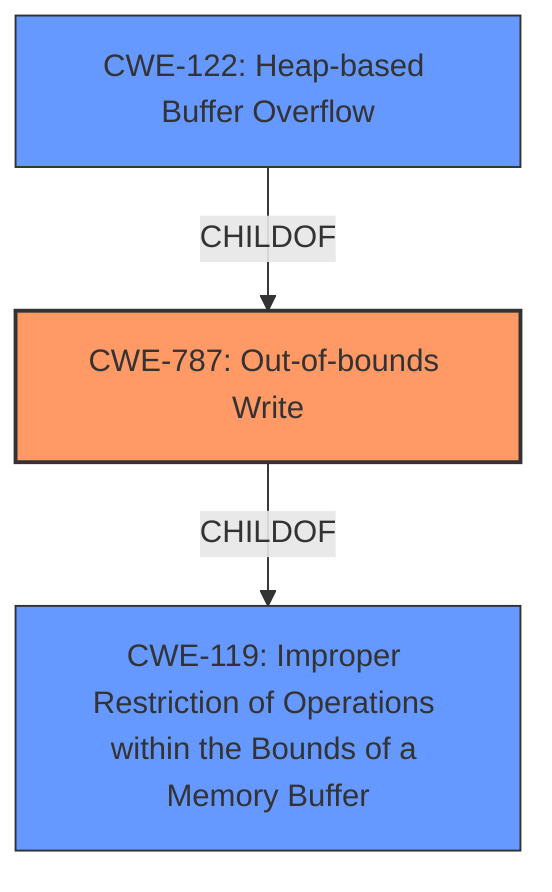

# Analysis Report for CVE-2022-0789

# Vulnerability Analysis Report: CVE-2022-0789

## Description


## Analysis (with Relationship Data)

# Summary
| CWE ID | CWE Name | Confidence | CWE Abstraction Level | CWE Vulnerability Mapping Label | CWE-Vulnerability Mapping Notes |
|---|---|---|---|---|---|
| CWE-787 | Out-of-bounds Write | 1.0 | Base | Allowed | Primary CWE |
| CWE-122 | Heap-based Buffer Overflow | 0.7 | Variant | Allowed | Secondary Candidate |
| CWE-119 | Improper Restriction of Operations within the Bounds of a Memory Buffer | 0.5 | Class | Discouraged | Secondary Candidate |

## Evidence and Confidence

*   **Confidence Score:** 0.9
*   **Evidence Strength:** HIGH

## Relationship Analysis
The primary CWE, CWE-787 (Out-of-bounds Write), is a base CWE and a parent of CWE-124 (Buffer Underwrite). CWE-787 is also related to CWE-119 (Improper Restriction of Operations within the Bounds of a Memory Buffer) through the ChildOf relationship: CWE-787 is a more specific type of CWE-119.
CWE-122 (Heap-based Buffer Overflow) is a variant of CWE-787, making it more specific. However, without direct evidence of heap allocation, CWE-787 is preferred.



## Vulnerability Chain
The vulnerability chain starts with a crafted HTML page leading to a **heap buffer overflow** in ANGLE which results in potential heap corruption.

## Summary of Analysis
The initial analysis identified a **heap buffer overflow** as the root cause, as stated in the vulnerability description and CVE details: "Heap **buffer overflow** in ANGLE." The primary CWE match based on similar CVE descriptions is CWE-787 (Out-of-bounds Write).

CWE-787 accurately represents the vulnerability because it describes writing data past the end of the intended buffer. The CVE Reference Links Content Summary also confirms the "**heap buffer overflow**" as the **weakness**.

CWE-122 (Heap-based Buffer Overflow) was considered since the overflow occurs in the heap. However, without more explicit evidence confirming the heap allocation mechanism, the broader CWE-787 is chosen.

CWE-119 (Improper Restriction of Operations within the Bounds of a Memory Buffer) was also considered, given its relation to buffer overflows. However, CWE-787 is a more specific and appropriate choice. The MITRE Mapping Guidance discourages the use of CWE-119 when more specific CWEs are available.

The final selection of CWE-787 is at the optimal level of specificity, accurately capturing the **out-of-bounds write** condition as the root cause.

Relevant CWE Information:
## CWE-787: Out-of-bounds Write
### Technical Explanation:
The vulnerability involves writing data beyond the allocated buffer's boundaries. This can overwrite adjacent memory regions, leading to unpredictable behavior and potentially arbitrary code execution.
### Security Implications:
Out-of-bounds writes can corrupt data structures, overwrite function pointers, or inject malicious code, leading to a complete system compromise.
### Relationship:
CWE-787 is a base CWE and a parent of CWE-124 (Buffer Underwrite). It is also a child of CWE-119 (Improper Restriction of Operations within the Bounds of a Memory Buffer).
### Mapping Guidance:
The official MITRE mapping guidance allows for the use of CWE-787.
## CWE-122: Heap-based Buffer Overflow
### Technical Explanation:
This is a specific type of buffer overflow where the vulnerable buffer is allocated on the heap. Overwriting data on the heap can lead to memory corruption and potentially arbitrary code execution.
### Security Implications:
Similar to stack-based buffer overflows, heap-based overflows can lead to arbitrary code execution and complete system compromise.
### Relationship:
CWE-122 is a variant of CWE-787.
### Mapping Guidance:
The official MITRE mapping guidance allows for the use of CWE-122.
## CWE-119: Improper Restriction of Operations within the Bounds of a Memory Buffer
### Technical Explanation:
This is a general class of vulnerabilities that involve reading or writing outside the intended boundaries of a memory buffer.
### Security Implications:
Out-of-bounds access can lead to information disclosure, denial of service, or arbitrary code execution.
### Relationship:
CWE-119 is a class CWE and a parent of CWE-787 and CWE-125.
### Mapping Guidance:
The official MITRE mapping guidance discourages the use of CWE-119 when more specific CWEs are available.


## CWE Relationship Analysis

Current CWEs represent these abstraction levels: .


### Vulnerability Chain Analysis

**Chain starting from CWE-124:**
- 124 (Buffer Underwrite ('Buffer Underflow')) - ROOT


**Chain starting from CWE-119:**
- 119 (Improper Restriction of Operations within the Bounds of a Memory Buffer) - ROOT


### CWE Relationship Diagram

```mermaid
graph TD
    classDef primary fill:#f96,stroke:#333,stroke-width:2px
    classDef secondary fill:#69f,stroke:#333
    classDef tertiary fill:#9e9,stroke:#333
```


*Report generated on 2025-03-31 01:49:54*
