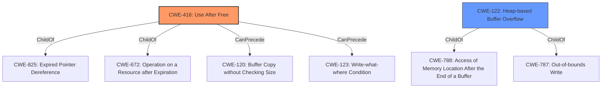

# Raw Analyzer Response for CVE-2022-0793

# Summary
| CWE ID | CWE Name | Confidence | CWE Abstraction Level | CWE Vulnerability Mapping Label | CWE-Vulnerability Mapping Notes |
|---|---|---|---|---|---|
| CWE-416 | Use After Free | 1.0 | Variant | Allowed | Primary CWE |
| CWE-122 | Heap-based Buffer Overflow | 0.5 | Variant | Allowed | Secondary Candidate |

## Evidence and Confidence

*   **Confidence Score:** 0.8
*   **Evidence Strength:** HIGH

## Relationship Analysis
The primary CWE is CWE-416 **Use After Free**, which is a variant level CWE. CWE-416 has child-of relationships with CWE-825 and CWE-672, indicating it's a specific type of resource management issue. It can also precede CWE-120 **Buffer Copy without Checking Size of Input ('Classic Buffer Overflow')** and CWE-123 **Write-what-where Condition**, suggesting a potential chain of exploitation. CWE-122 **Heap-based Buffer Overflow** is a variant of CWE-788 and CWE-787. The **heap corruption** mentioned in the description may be related to **heap-based buffer overflows**, which may have resulted from **use after free**.

## Vulnerability Chain
The vulnerability chain starts with a **use-after-free** condition (CWE-416). This can lead to **heap corruption**, possibly through a **heap-based buffer overflow** (CWE-122), if the freed memory is reallocated and then overwritten. The attacker exploits this through a crafted Chrome extension and specific user interaction.

## Summary of Analysis
The primary weakness is the **use-after-free** (CWE-416) condition. The vulnerability description and CVE summary both explicitly mention this. The description also mentions **heap corruption**, suggesting a possible consequence of the **use-after-free**. The retriever results also list CWE-416 as the top candidate.

Evidence:
- Vulnerability Description Key Phrases: "rootcause: **Use after free**", "weakness: **heap corruption**"
- CVE Reference Links Content Summary: "**Root cause of vulnerability:** The vulnerability is due to a use-after-free error"
- CVE Reference Links Content Summary: "**Weaknesses/vulnerabilities present:** Use-after-free vulnerability."

CWE-122 **Heap-based Buffer Overflow** is a reasonable secondary candidate due to the mention of **heap corruption**. If the **use-after-free** results in the reallocated memory being overwritten, leading to **heap corruption**, then a **heap-based buffer overflow** could be involved. However, the provided evidence doesn't definitively confirm this, so the confidence is lower.

I considered other CWEs from the Retriever Results, but they are less relevant. For example, CWE-366 **Race Condition within a Thread** and CWE-362 **Concurrent Execution using Shared Resource with Improper Synchronization ('Race Condition')** are possibilities, but there is no mention of threading or concurrency in the description. CWE-590 **Free of Memory not on the Heap** and CWE-415 **Double Free** are related to memory management errors, but the core issue is the **use-after-free**, not freeing memory that was not allocated or freeing the same memory twice.

The selected CWEs are at the optimal level of specificity. CWE-416 is a variant-level CWE that accurately describes the root cause. CWE-122 is also a variant-level CWE and a possible consequence of CWE-416, but with lower confidence.

Relevant CWE Information:
- CWE-416: Use After Free
- CWE-122: Heap-based Buffer Overflow