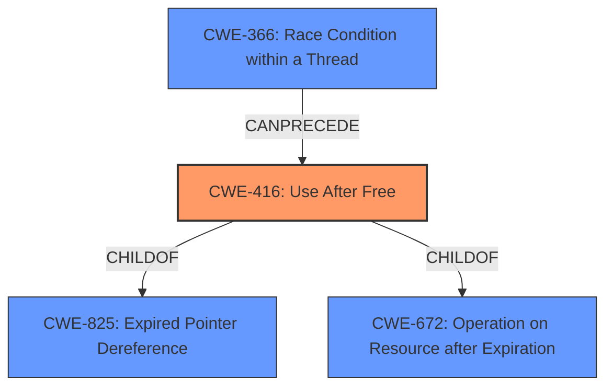

# Analysis for CVE-2022-0796

# Summary
| CWE ID  | CWE Name   | Confidence | CWE Abstraction Level | CWE Vulnerability Mapping Label | CWE-Vulnerability Mapping Notes |
|--------------|-------------------------------------------------------------------------|----------------------|------------------------------------|----------------------------------------------------|---------------------------------------------------------------------------------------------------------------------------------------------------------------------------------|
| CWE-416  | Use After Free       | 1   | Variant   | Allowed | The product reuses or references memory after it has been freed. |
| CWE-366 | Race Condition within a Thread | 0.5 | Base | Allowed | If two threads of execution use a resource simultaneously, there exists the possibility that resources may be used while invalid, in turn making the state of execution undefined. |

## Evidence and Confidence

*   **Confidence Score:** 0.8
*   **Evidence Strength:** HIGH

## Relationship Analysis
The primary CWE is CWE-416, which is a variant of CWE-825 (Expired Pointer Dereference) and CWE-672 (Operation on Resource after Expiration). CWE-366 (Race Condition within a Thread) is considered as a secondary factor if the **use after free** is caused by concurrent execution.

## Vulnerability Chain
The vulnerability chain starts with the **use after free** (**weakness**) in the Media component of Google Chrome which can lead to heap corruption (**impact**) through a crafted HTML page (**vector**). If the **use after free** is caused by concurrent execution then CWE-366 would be part of the chain.

## Summary of Analysis
The vulnerability is a **use after free** in the Media component of Google Chrome.

The primary CWE is CWE-416 Use After Free. This is supported by:
*   **Vulnerability Description Key Phrases:** states "**weakness:** **use after free**"
*   **CWE for similar CVE Descriptions:** "**Primary CWE Match** CWE-416" and "#### Top CWEs\n- CWE-416 (Count: 989)"
*   **CVE Reference Links Content Summary:** reports "**Root cause of vulnerability**: Use after free" and "**Weaknesses/vulnerabilities present**: Use after free in Media component."
*   **Retriever Results:** Rank 1 is CWE-416 Use After Free

CWE-416 is a Variant, which is the preferred level of abstraction.

CWE-366 Race Condition within a Thread is a possible secondary CWE if the **use after free** is caused by concurrent execution. There is no information in the provided text to confirm this.

The other CWEs were considered but are not a good fit:
*   CWE-843 Access of Resource Using Incompatible Type ('Type Confusion'): The vulnerability is specifically a **use after free**, not necessarily a type confusion issue.
*   CWE-122 Heap-based Buffer Overflow: While heap corruption is mentioned as an impact, the root cause is the **use after free**, not a buffer overflow.
*   CWE-415 Double Free: The vulnerability is a **use after free**, not a double free.
*   CWE-451 User Interface (UI) Misrepresentation of Critical Information: This CWE is related to UI issues, which is not the case here.
*   CWE-123 Write-what-where Condition: This is a potential consequence of memory corruption, but the root cause is the **use after free**.
*   CWE-356 Product UI does not Warn User of Unsafe Actions: This is related to UI warnings, which is not the case here.
*   CWE-362 Concurrent Execution using Shared Resource with Improper Synchronization ('Race Condition'): Considered as a secondary CWE above.
*   CWE-911 Improper Update of Reference Count: While this could potentially lead to a **use after free**, the provided information specifically identifies the issue as a **use after free**.
*   CWE-120 Buffer Copy without Checking Size of Input ('Classic Buffer Overflow'): This CWE is specifically about buffer copies without size checking, which is not described in the vulnerability.
*   CWE-825 Expired Pointer Dereference: This is a parent of CWE-416, so CWE-416 is more specific.
*   CWE-476 NULL Pointer Dereference: This is a different type of pointer issue than **use after free**.
*   CWE-787 Out-of-bounds Write: While this could be a consequence of a **use after free**, the root cause is the **use after free**.
*   CWE-170 Improper Null Termination: This is not related to the described vulnerability.
*   CWE-1341 Multiple Releases of Same Resource or Handle: This is similar to double-free, not **use after free**.