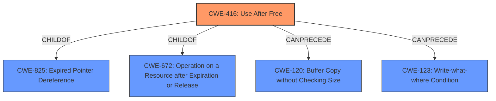

# Analysis for CVE-2022-0798

# Summary
| CWE ID | CWE Name | Confidence | CWE Abstraction Level | CWE Vulnerability Mapping Label | CWE-Vulnerability Mapping Notes |
|---|---|---|---|---|---|
| CWE-416 | Use After Free | 1 | Variant | Allowed | Primary CWE |

## Evidence and Confidence

*   **Confidence Score:** 1
*   **Evidence Strength:** HIGH

## Relationship Analysis
The primary relationship is that CWE-416 is a variant. The other relationships show potential chains related to this vulnerability, such as CanPrecede relationships to memory corruption issues (CWE-120, CWE-123).

## Vulnerability Chain
The vulnerability chain starts with the **use-after-free** condition (CWE-416), which leads to **heap corruption**.

## Summary of Analysis
The analysis is based on the vulnerability description, key phrases, and CVE reference links content summary. The primary **rootcause** is a **use-after-free** vulnerability. The vulnerability leads to **heap corruption**.

The primary CWE match for similar CVE descriptions is CWE-416 (Use After Free), and the retriever results also list CWE-416 as the top result with a variant abstraction level and allowed usage. The description of CWE-416, "The product reuses or references memory after it has been freed," directly matches the vulnerability description.

Other CWEs were considered but deemed less relevant:

*   CWE-366 (Race Condition within a Thread): While concurrency issues can sometimes lead to use-after-free, there's no explicit mention of race conditions in the provided description.
*   CWE-122 (Heap-based Buffer Overflow): While **heap corruption** is mentioned, the **root cause** is **use-after-free**, not a buffer overflow directly.
*   CWE-843 (Access of Resource Using Incompatible Type ('Type Confusion')): Type confusion isn't explicitly mentioned, so it's less likely than CWE-416.
*   CWE-415 (Double Free): The vulnerability description does not state that the same memory is freed twice.
*   CWE-123 (Write-what-where Condition): Similar to CWE-122 the description does not state that an arbitrary value can be written to an arbitrary location.

Therefore, the most appropriate CWE is CWE-416 (Use After Free).

Relevant CWE Information:

# Enhanced Context (25 CWEs)

## CWE-366: Race Condition within a Thread
**Abstraction Level**: Base
**Similarity Score**: 0.77
**Source**: dense

**Description**:
If two threads of execution use a resource simultaneously, there exists the possibility that resources may be used while invalid, in turn making the state of execution undefined.

**Mapping Guidance**:
- Usage: Allowed
- Rationale: This CWE entry is at the Base level of abstraction, which is a preferred level of abstraction for mapping to the root causes of vulnerabilities.

## CWE-122: Heap-based Buffer Overflow
**Abstraction Level**: Variant
**Similarity Score**: 0.293

**Description**:
A heap overflow condition is a buffer overflow, where the buffer that can be overwritten is allocated in the heap portion of memory, generally meaning that the buffer was allocated using a routine such as malloc().

**Mapping Guidance**:
- Usage: Allowed
- Rationale: This CWE entry is at the Variant level of abstraction, which is a preferred level of abstraction for mapping to the root causes of vulnerabilities.

## CWE-843: Access of Resource Using Incompatible Type ('Type Confusion')
**Abstraction Level**: Base
**Similarity Score**: 0.73

**Description**:
The product allocates or initializes a resource such as a pointer, object, or variable using one type, but it later accesses that resource using a type that is incompatible with the original type.

**Mapping Guidance**:
- Usage: Allowed
- Rationale: This CWE entry is at the Base level of abstraction, which is a preferred level of abstraction for mapping to the root causes of vulnerabilities.

## CWE-415: Double Free
**Abstraction Level**: Variant
**Similarity Score**: 0.249

**Description**:
The product calls free() twice on the same memory address, potentially leading to modification of unexpected memory locations.

**Mapping Guidance**:
- Usage: Allowed
- Rationale: This CWE entry is at the Variant level of abstraction, which is a preferred level of abstraction for mapping to the root causes of vulnerabilities.

## CWE-123: Write-what-where Condition
**Abstraction Level**: Base
**Similarity Score**: 5.03

**Description**:
Any condition where the attacker has the ability to write an arbitrary value to an arbitrary location, often as the result of a buffer overflow.

**Mapping Guidance**:
- Usage: Allowed
- Rationale: This CWE entry is at the Base level of abstraction, which is a preferred level of abstraction for mapping to the root causes of vulnerabilities.

## CWE-416: Use After Free
**Abstraction Level**: Variant
**Similarity Score**: 4.53

**Description**:
The product reuses or references memory after it has been freed. At some point afterward, the memory may be allocated again and saved in another pointer, while the original pointer references a location somewhere within the new allocation. Any operations using the original pointer are no longer valid because the memory "belongs" to the code that operates on the new pointer.

**Mapping Guidance**:
- Usage: Allowed
- Rationale: This CWE entry is at the Variant level of abstraction, which is a preferred level of abstraction for mapping to the root causes of vulnerabilities.