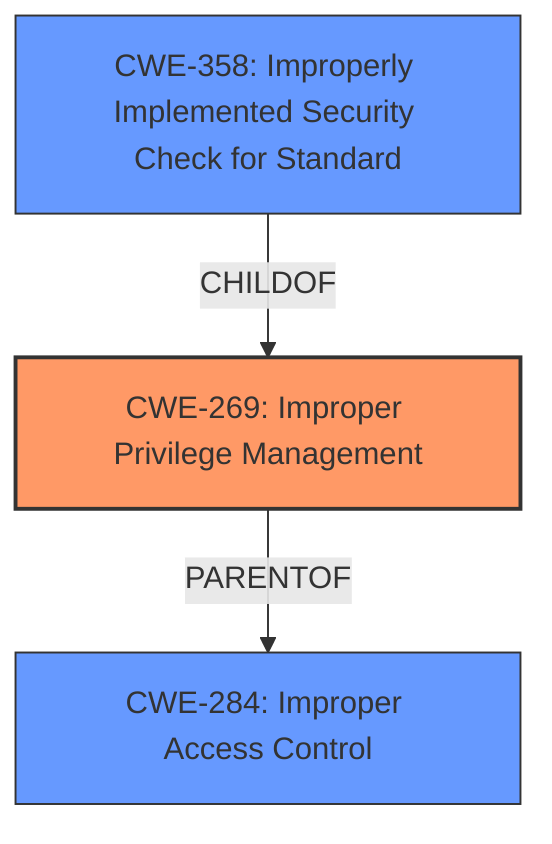

# Analysis for CVE-2022-0799

# Summary
| CWE ID | CWE Name | Confidence | CWE Abstraction Level | CWE Vulnerability Mapping Label | CWE-Vulnerability Mapping Notes |
|---|---|---|---|---|---|
| CWE-269 | Improper Privilege Management | 0.8 | Class | Primary | Allowed |
| CWE-358 | Improperly Implemented Security Check for Standard | 0.7 | Base | Secondary | Allowed |
| CWE-284 | Improper Access Control | 0.5 | Pillar | Secondary | Discouraged |

## Evidence and Confidence

*   **Confidence Score:** 0.8
*   **Evidence Strength:** MEDIUM

## Relationship Analysis
The primary classification is CWE-269, which is a Class-level CWE. This vulnerability involves a failure in managing privileges, which is a broad category. Other CWEs were considered, such as CWE-358, because the description mentions "insufficient policy enforcement," which suggests that a security check might not have been correctly implemented, linking to a specific standard. CWE-284 (Improper Access Control) was also considered because privilege management falls under access control, but it's a very high-level (Pillar) CWE and thus less specific.

## Vulnerability Chain
The vulnerability chain starts with the **insufficient policy enforcement** in the installer, leading to a local privilege escalation. The chain is:

1.  Insufficient Policy Enforcement (**ROOTCAUSE**)
2.  Privilege Escalation (**IMPACT**)

## Summary of Analysis
The primary classification is CWE-269 (Improper Privilege Management) because the core issue is the inadequate management of privileges during the installation process. The vulnerability description explicitly states "**insufficient policy enforcement**," which directly relates to how privileges are handled. The impact is a local privilege escalation, confirming that the vulnerability allows an attacker to gain higher-level privileges than intended.

CWE-358 (Improperly Implemented Security Check for Standard) was also considered because the description mentions "insufficient policy enforcement," which could be seen as a failure to properly implement a security check. However, CWE-269 more directly addresses the core issue of privilege management.

CWE-284 (Improper Access Control) is a very high-level (Pillar) CWE, and while privilege management falls under access control, it's less specific than CWE-269. The evidence supports the selection of CWE-269 at the Class level because it directly addresses the **rootcause** and impact described in the vulnerability.

Relevant CWE Information:

# Enhanced Context (25 CWEs)
The following CWEs were identified as potentially relevant to this vulnerability:

## CWE-358: Improperly Implemented Security Check for Standard
**Abstraction Level**: Base
**Similarity Score**: 0.80
**Source**: dense

**Description**:
The product does not implement or incorrectly implements one or more security-relevant checks as specified by the design of a standardized algorithm, protocol, or technique.

**Mapping Guidance**:
- Usage: Allowed
- Rationale: This CWE entry is at the Base level of abstraction, which is a preferred level of abstraction for mapping to the root causes of vulnerabilities.

## CWE-269: Improper Privilege Management
The description of CWE-269 fits the scenario well, as the vulnerability description indicates that **insufficient policy enforcement** leads to privilege escalation.
CWE-269: Improper Privilege Management
**Abstraction:** Class
**Status:** Stable

### Description
The software does not properly manage privileges, possibly including privilege assignment, privilege revocation, or checking of required privileges before an action is performed.

### Extended Description

If the software does not manage privileges properly, then an attacker may be able to bypass intended access restrictions to perform unauthorized actions, possibly gaining elevated privileges.

### Alternative Terms
None

### Relationships
ChildOf -> CWE-284

### Mapping Guidance
Usage: Allowed
Rationale: This CWE entry is a Class and might have Base-level children that would be more appropriate
Comments: Examine children of this entry to see if there is a better fit
Reasons:
Abstraction

### Observed Examples
CVE-2022-34918: In Joomla! 4.0.0 through 4.2.2 an **insufficient privilege checks** in the article edit form allowed users to edit articles that they shouldn't have been able to.
CVE-2022-34715: Windows Print Spooler Elevation of Privilege Vulnerability

### Mitigation
Strategies

Compilation
  * Enable compiler options that make binaries more resistant to privilege escalation attacks such as Address Space Layout Randomization (ASLR) and Data Execution Prevention (DEP).

Operating Environment
  * Follow the principle of least privilege. Give each privilege to only those principals who need it.
  * Do not hard-code account names, passwords, or cryptographic keys into the source code.

### Potential Mitigations
Applying the principle of least privilege and ensuring that privilege checks are correctly implemented are potential mitigations.