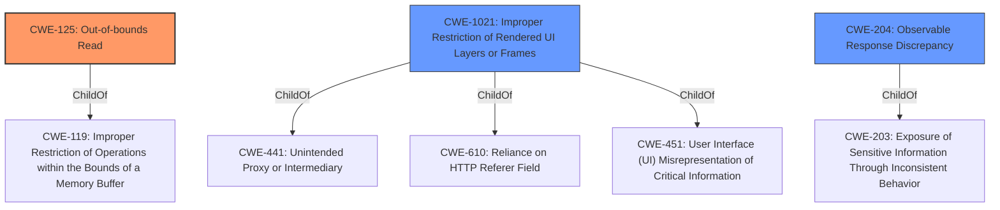

# Enhanced Analysis for CVE-2022-0806

# Summary
| CWE ID | CWE Name | Confidence | CWE Abstraction Level | CWE Vulnerability Mapping Label | CWE-Vulnerability Mapping Notes |
|---|---|---|---|---|---|
| CWE-125 | Out-of-bounds Read | 0.8 | Base | Allowed | Primary CWE |
| CWE-1021 | Improper Restriction of Rendered UI Layers or Frames | 0.6 | Base | Allowed | Secondary Candidate |
| CWE-204 | Observable Response Discrepancy | 0.5 | Base | Allowed | Secondary Candidate |

## Evidence and Confidence

*   **Confidence Score:** 0.8
*   **Evidence Strength:** HIGH

## Relationship Analysis
The primary CWE, CWE-125 (Out-of-bounds Read), is related to CWE-119 (Improper Restriction of Operations within the Bounds of a Memory Buffer). The secondary CWE, CWE-1021 (Improper Restriction of Rendered UI Layers or Frames), is related to CWE-441 (Unintended Proxy or Intermediary), CWE-610 (Reliance on HTTP Referer Field), and CWE-451 (User Interface (UI) Misrepresentation of Critical Information). There is no direct relationship between CWE-125 and CWE-1021. CWE-204 (Observable Response Discrepancy) is a child of CWE-203 (Exposure of Sensitive Information Through Inconsistent Behavior). The abstraction levels (Base) support direct mapping.



## Vulnerability Chain
The vulnerability chain starts with a crafted HTML page, leading to a **data leak** in the Canvas component, and resulting in a potential out-of-bounds read, allowing a remote attacker to potentially leak cross-origin data via screen sharing.

## Summary of Analysis
The primary assessment is based on the provided evidence, specifically the "Vulnerability Description Key Phrases" which identify a **data leak**, and the "CVE Reference Links Content Summary" which explicitly states "**Data leak** in Canvas." This aligns with CWE-125, given the potential for reading data beyond intended boundaries in memory when handling Canvas elements.

The graph relationships helped to contextualize potential related weaknesses.

CWE-125 is chosen as the primary CWE because it directly addresses the **root cause** of the vulnerability: an **out-of-bounds read** due to the **data leak**.

CWE-1021 is considered as a secondary CWE because the vulnerability involves tricking the user into engaging in screen sharing via a crafted HTML page, which could involve UI redress.

CWE-204 is considered as a secondary CWE because the **data leak** itself might be caused by different responses to crafted HTML pages that reveal internal state information.

The selected CWEs are at the optimal level of specificity because they represent the specific type of weakness (out-of-bounds read) and related attack vectors (UI redress and response discrepancy).

Relevant CWE Information:

# Enhanced Context (25 CWEs)

## CWE-125: Out-of-bounds Read
**Abstraction Level**: Base
**Similarity Score**: 0.79
**Source**: dense

**Description**:
The product reads data past the end, or before the beginning, of the intended buffer.

**Mapping Guidance**:
- Usage: Allowed
- Rationale: This CWE entry is at the Base level of abstraction, which is a preferred level of abstraction for mapping to the root causes of vulnerabilities.
- CWE-125 is the primary CWE because it aligns with the **root cause** of the vulnerability, which is a **data leak** that leads to reading data beyond the intended boundaries. The "CVE Reference Links Content Summary" confirms this interpretation.

## CWE-131: Incorrect Calculation of Buffer Size
**Abstraction Level**: Base
**Similarity Score**: 0.78
**Source**: dense

**Description**:
The product does not correctly calculate the size to be used when allocating a buffer, which could lead to a buffer overflow.
- CWE-131 is not selected because the vulnerability description does not explicitly mention incorrect buffer size calculation.

## CWE-191: Integer Underflow (Wrap or Wraparound)
**Abstraction Level**: Base
**Similarity Score**: 0.77
**Source**: dense

**Description**:
The product subtracts one value from another, such that the result is less than the minimum allowable integer value, which produces a value that is not equal to the correct result.
- CWE-191 is not selected because there is no evidence of integer underflow in the vulnerability description.

## CWE-805: Buffer Access with Incorrect Length Value
**Abstraction Level**: Base
**Similarity Score**: 0.77
**Source**: dense

**Description**:
The product uses a sequential operation to read or write a buffer, but it uses an incorrect length value that causes it to access memory that is outside of the bounds of the buffer.
- CWE-805 is not selected because it is similar to CWE-125, but CWE-125 is a more direct match for the **data leak** description.

## CWE-126: Buffer Over-read
**Abstraction Level**: Variant
**Similarity Score**: 0.77
**Source**: dense

**Description**:
The product reads from a buffer using buffer access mechanisms such as indexes or pointers that reference memory locations after the targeted buffer.
- CWE-126 is not selected because it is a variant of out-of-bounds read, but CWE-125 is a more general and suitable match.

## CWE-908: Use of Uninitialized Resource
**Abstraction Level**: Base
**Similarity Score**: 0.77
**Source**: dense

**Description**:
The product uses or accesses a resource that has not been initialized.
- CWE-908 is not selected because the vulnerability description does not indicate the use of uninitialized resources.

## CWE-843: Access of Resource Using Incompatible Type ('Type Confusion')
**Abstraction Level**: Base
**Similarity Score**: 0.77
**Source**: dense

**Description**:
The product allocates or initializes a resource such as a pointer, object, or variable using one type, but it later accesses that resource using a type that is incompatible with the original type.
- CWE-843 is not selected because there is no mention of incompatible types being used.

## CWE-404: Improper Resource Shutdown or Release
**Abstraction Level**: Class
**Similarity Score**: 0.77
**Source**: dense

**Description**:
The product does not release or incorrectly releases a resource before it is made available for re-use.
- CWE-404 is not selected because resource shutdown or release is not part of the description.

## CWE-667: Improper Locking
**Abstraction Level**: Class
**Similarity Score**: 0.77
**Source**: dense

**Description**:
The product does not properly acquire or release a lock on a resource, leading to unexpected resource state changes and behaviors.
- CWE-667 is not selected because there is no mention of locking issues.

## CWE-226: Sensitive Information in Resource Not Removed Before Reuse
**Abstraction Level**: Base
**Similarity Score**: 0.77
**Source**: dense

**Description**:
The product releases a resource such as memory or a file so that it can be made available for reuse, but it does not clear or "zeroize" the information contained in the resource before the product performs a critical state transition or makes the resource available for reuse by other entities.
- CWE-226 is not selected because the description does not involve sensitive information not being removed before reuse.

## CWE-923: Improper Restriction of Communication Channel to Intended Endpoints
**Abstraction Level**: Class
**Similarity


## CWE Relationship Analysis

Current CWEs represent these abstraction levels: .


### Vulnerability Chain Analysis

**Chain starting from CWE-131:**
- 131 (Incorrect Calculation of Buffer Size) - ROOT


**Chain starting from CWE-226:**
- 226 (Sensitive Information in Resource Not Removed Before Reuse) - ROOT


### CWE Relationship Diagram

```mermaid
graph TD
    classDef primary fill:#f96,stroke:#333,stroke-width:2px
    classDef secondary fill:#69f,stroke:#333
    classDef tertiary fill:#9e9,stroke:#333
```