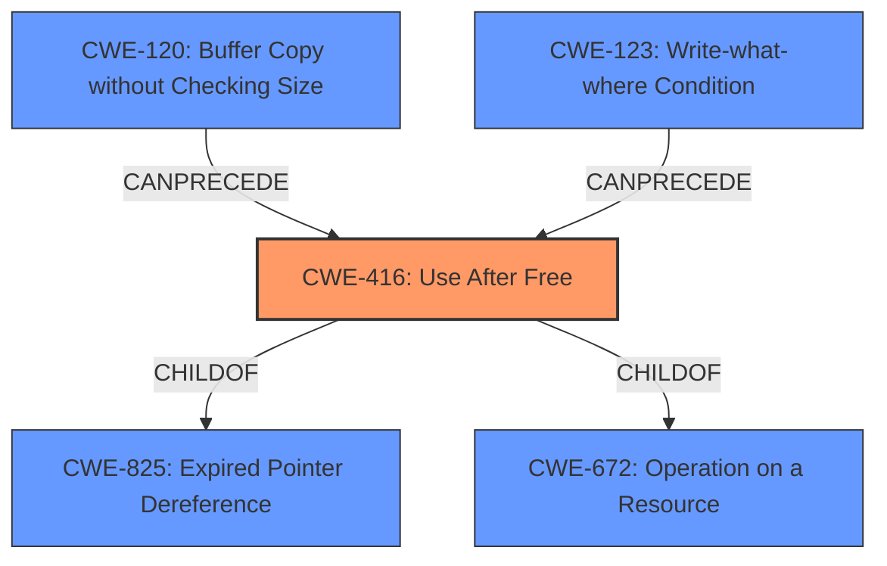

# Analysis Report for CVE-2022-0808

# Vulnerability Analysis Report: CVE-2022-0808

## Description


## Analysis (with Relationship Data)

# Summary
| CWE ID  | CWE Name                                                                                                  | Confidence | CWE Abstraction Level | CWE Vulnerability Mapping Label | CWE-Vulnerability Mapping Notes |
| :-------- | :---------------------------------------------------------------------------------------------------------- | :--------- | :---------------------- | :------------------------------ | :------------------------------ |
| CWE-416 | Use After Free | 1.0       | Variant               | Allowed                       | Primary CWE                   |
| CWE-787 | Out-of-bounds Write | 0.4       | Base                   | Allowed                         | Secondary Candidate                 |

## Evidence and Confidence

*   **Confidence Score:** 0.8
*   **Evidence Strength:** HIGH

## Relationship Analysis
The primary relationship that influenced the decision was the hierarchical relationship where CWE-416 "Use After Free" can be a child of CWE-825 "Expired Pointer Dereference" and CWE-672 "Operation on a Resource that Operates on More Than One Resource". The other relationship to consider is the CanPrecede relationships showing how other CWEs such as CWE-120 "Buffer Copy without Checking Size of Input ('Classic Buffer Overflow')" and CWE-123 "Write-what-where Condition" can lead to CWE-416. The abstraction levels guided the selection towards CWE-416 as a Variant, which is more specific than its Class parents.



## Vulnerability Chain
The vulnerability chain starts with a **use after free** condition, potentially leading to heap corruption.

## Summary of Analysis
The primary assessment is based on the provided evidence, which explicitly states the **rootcause** as "**use after free**" in the vulnerability description. This aligns directly with the definition of CWE-416. The CVE Reference Links Content Summary reinforces this by stating "Root cause of vulnerability: Use-after-free in Chrome OS Shell" and "Weaknesses/vulnerabilities present: Use-after-free". The retriever results also list CWE-416 as the top candidate.

The graph relationships support the selection of CWE-416, placing it appropriately within the hierarchy. The decision to select CWE-416 is based on its direct match to the provided evidence and its appropriate level of specificity as a Variant.

The secondary candidate is CWE-787 "Out-of-bounds Write". The **impact** of the vulnerability is described as "heap corruption". A **use after free** can lead to an out-of-bounds write if the freed memory is reallocated and then accessed using the original pointer. However, since the description does not explicitly state an out-of-bounds write, the confidence in this mapping is lower.

Relevant CWE Information:

# Enhanced Context (25 CWEs)

## CWE-404: Improper Resource Shutdown or Release
**Abstraction Level**: Class
**Similarity Score**: 0.80
**Source**: dense

**Description**:
The product does not release or incorrectly releases a resource before it is made available for re-use.

**Mapping Guidance**:
- Usage: Allowed-with-Review
- Rationale: This CWE entry is a Class and might have Base-level children that would be more appropriate

*Not Used:* While a "use after free" scenario involves a resource not being properly managed, CWE-416 more directly describes the specific error condition.

## CWE-356: Product UI does not Warn User of Unsafe Actions
**Abstraction Level**: Base
**Similarity Score**: 0.79
**Source**: dense

**Description**:
The product's user interface does not warn the user before undertaking an unsafe action on behalf of that user. This makes it easier for attackers to trick users into inflicting damage to their system.

**Mapping Guidance**:
- Usage: Allowed
- Rationale: This CWE entry is at the Base level of abstraction, which is a preferred level of abstraction for mapping to the root causes of vulnerabilities.

*Not Used:* This CWE relates to UI warnings, which is not the primary **rootcause** of the vulnerability.

## CWE-667: Improper Locking
**Abstraction Level**: Class
**Similarity Score**: 0.78
**Source**: dense

**Description**:
The product does not properly acquire or release a lock on a resource, leading to unexpected resource state changes and behaviors.

**Mapping Guidance**:
- Usage: Allowed-with-Review
- Rationale: This CWE entry is a Class and might have Base-level children that would be more appropriate

*Not Used:* This CWE describes locking issues, which are not the **rootcause** of this vulnerability.

## CWE-226: Sensitive Information in Resource Not Removed Before Reuse
**Abstraction Level**: Base
**Similarity Score**: 0.78
**Source**: dense

**Description**:
The product releases a resource such as memory or a file so that it can be made available for reuse, but it does not clear or "zeroize" the information contained in the resource before the product performs a critical state transition or makes the resource available for reuse by other entities.

**Mapping Guidance**:
- Usage: Allowed
- Rationale: This CWE entry is at the Base level of abstraction, which is a preferred level of abstraction for mapping to the root causes of vulnerabilities.

*Not Used:* While related to resource reuse, this CWE focuses on sensitive information, not the core "use after free" condition.

## CWE-668: Exposure of Resource to Wrong Sphere
**Abstraction Level**: Class
**Similarity Score**: 0.78
**Source**: dense

**Description**:
The product exposes a resource to the wrong control sphere, providing unintended actors with inappropriate access to the resource.

**Mapping Guidance**:
- Usage: Discouraged
- Rationale: CWE-668 is high-level and is often misused as a catch-all when lower-level CWE IDs might be applicable. It is sometimes used for low-information vulnerability reports [REF-1287]. It is a level-1 Class (i.e., a child of a Pillar). It is not useful for trend analysis.

*Not Used:* This CWE is too general and doesn't fit the specific vulnerability.

## CWE-754: Improper Check for Unusual or Exceptional Conditions
**Abstraction Level**: Class
**Similarity Score**: 0.78
**Source**: dense

**Description**:
The product does not check or incorrectly checks for unusual or exceptional conditions that are not expected to occur frequently during day to day operation of the product.

**Mapping Guidance**:
- Usage: Allowed-with-Review
- Rationale: This CWE entry is a Class and might have Base-level children that would be more appropriate

*Not Used:* This CWE is not directly related to the **use after free** condition.

## CWE-665: Improper Initialization
**Abstraction Level**: Class
**Similarity Score**: 0.78
**Source**: dense

**Description**:
The product does not initialize or incorrectly initializes a resource, which might leave the resource in an unexpected state when it is accessed or used.

**Mapping Guidance**:
- Usage: Discouraged
- Rationale: This CWE entry is a level-1 Class (i.e., a child of a Pillar). It might have lower-level children that would be more appropriate

*Not Used:* This CWE is too general and doesn't directly explain the **use after free**.

## CWE-451: User Interface (UI) Misrepresentation of Critical Information
**Abstraction Level**: Class
**Similarity Score**: 0.78
**Source**: dense

**Description**:
The user interface (UI) does not properly represent critical information to the user, allowing the information - or its source - to be obscured or spoofed. This is often a component in phishing attacks.

**Mapping Guidance**:
- Usage: Allowed-with-Review
- Rationale: This CWE entry is a Class and might have Base-level children that would be more appropriate

*Not Used:* This CWE focuses on UI misrepresentation, not the underlying memory management issue.

## CWE-843: Access of Resource Using Incompatible Type ('Type Confusion')
**Abstraction Level**: Base
**Similarity Score**: 0.77
**Source**: dense

**Description**:
The product allocates or initializes a resource such as a


## CWE Relationship Analysis

Current CWEs represent these abstraction levels: .


### Vulnerability Chain Analysis

**Chain starting from CWE-825:**
- 825 (Expired Pointer Dereference) - ROOT


**Chain starting from CWE-843:**
- 843 (Access of Resource Using Incompatible Type ('Type Confusion')) - ROOT


### CWE Relationship Diagram

```mermaid
graph TD
    classDef primary fill:#f96,stroke:#333,stroke-width:2px
    classDef secondary fill:#69f,stroke:#333
    classDef tertiary fill:#9e9,stroke:#333
```


*Report generated on 2025-03-31 04:07:42*
