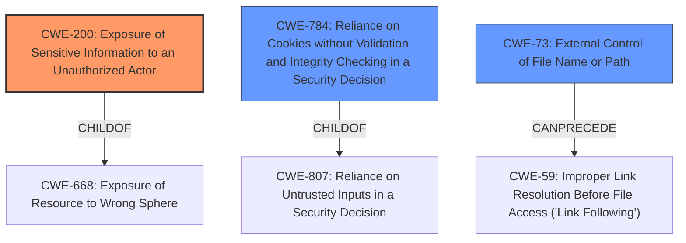

# Analysis for CVE-2022-0813

# Summary
| CWE ID | CWE Name | Confidence | CWE Abstraction Level | CWE Vulnerability Mapping Label | CWE-Vulnerability Mapping Notes |
|---|---|---|---|---|---|
| CWE-200 | Exposure of Sensitive Information to an Unauthorized Actor | 0.7 | Class | Primary CWE | Discouraged |
| CWE-784 | Reliance on Cookies without Validation and Integrity Checking in a Security Decision | 0.6 | Variant | Secondary Candidate | Allowed |
| CWE-73 | External Control of File Name or Path | 0.5 | Base | Secondary Candidate | Allowed |

## Evidence and Confidence

*   **Confidence Score:** 0.7
*   **Evidence Strength:** MEDIUM

## Relationship Analysis
The primary CWE is CWE-200, which is a Class-level weakness describing the exposure of sensitive information. While it's discouraged, it's the best fit given the provided information. Secondary CWEs like CWE-784 and CWE-73 provide more specific potential root causes. CWE-784 focuses on the validation of cookies, while CWE-73 addresses external control of file names or paths. These relationships help provide a more complete understanding of the vulnerability, but without more specific details on the root cause, CWE-200 remains the most appropriate primary classification.

## Vulnerability Chain
The vulnerability chain starts with a weakness that allows an attacker to create invalid requests. This leads to the exposure of potentially sensitive information. The exact nature of the **WEAKNESS** that allows the creation of invalid requests isn't fully clear from the description but could involve **External Control of File Name or Path (CWE-73)** or **Reliance on Cookies without Validation and Integrity Checking in a Security Decision (CWE-784)**. The ultimate impact is **Exposure of Sensitive Information to an Unauthorized Actor (CWE-200)**.

## Summary of Analysis
The initial analysis focused on identifying the primary **WEAKNESS** that leads to the exposure of sensitive information. The vulnerability description states that "PhpMyAdmin 5.1.1 and before allows an attacker to retrieve potentially sensitive information by creating invalid requests."

Based on the provided evidence, **CWE-200 (Exposure of Sensitive Information to an Unauthorized Actor)** is the most relevant primary CWE. The vulnerability description explicitly mentions the retrieval of potentially sensitive information as the impact. However, CWE-200 is a Class-level CWE and is discouraged for direct mapping when more specific CWEs are available.

The "Retriever Results" provide several potential candidates. **CWE-784 (Reliance on Cookies without Validation and Integrity Checking in a Security Decision)** is a possible secondary **WEAKNESS**, as the description mentions the cookie section being affected. Similarly, **CWE-73 (External Control of File Name or Path)** could be relevant if the invalid requests involve manipulation of file names or paths.

The choice of CWE-200 is justified because the primary impact is the exposure of sensitive information. While the root cause is not explicitly stated, the provided context points to a potential issue with request validation or parameter handling, which leads to this exposure. The selection of CWE-200 acknowledges the high-level nature of the available information while still capturing the core security concern.

Relevant CWE Information:

# Enhanced Context (25 CWEs)
The following CWEs were identified as potentially relevant to this vulnerability:

## CWE-23: Relative Path Traversal
**Abstraction Level**: Base
**Similarity Score**: 0.79
**Source**: dense

**Description**:
The product uses external input to construct a pathname that should be within a restricted directory, but it does not properly neutralize sequences such as ".." that can resolve to a location that is outside of that directory.

**Mapping Guidance**:
- Usage: Allowed
- Rationale: This CWE entry is at the Base level of abstraction, which is a preferred level of abstraction for mapping to the root causes of vulnerabilities.

## CWE-41: Improper Resolution of Path Equivalence
**Abstraction Level**: Base
**Similarity Score**: 0.78
**Source**: dense

**Description**:
The product is vulnerable to file system contents disclosure through path equivalence. Path equivalence involves the use of special characters in file and directory names. The associated manipulations are intended to generate multiple names for the same object.

**Mapping Guidance**:
- Usage: Allowed
- Rationale: This CWE entry is at the Base level of abstraction, which is a preferred level of abstraction for mapping to the root causes of vulnerabilities.

## CWE-36: Absolute Path Traversal
**Abstraction Level**: Base
**Similarity Score**: 0.78
**Source**: dense

**Description**:
The product uses external input to construct a pathname that should be within a restricted directory, but it does not properly neutralize absolute path sequences such as "/abs/path" that can resolve to a location that is outside of that directory.

**Mapping Guidance**:
- Usage: Allowed
- Rationale: This CWE entry is at the Base level of abstraction, which is a preferred level of abstraction for mapping to the root causes of vulnerabilities.

## CWE-552: Files or Directories Accessible to External Parties
**Abstraction Level**: Base
**Similarity Score**: 0.77
**Source**: dense

**Description**:
The product makes files or directories accessible to unauthorized actors, even though they should not be.

**Mapping Guidance**:
- Usage: Allowed
- Rationale: This CWE entry is at the Base level of abstraction, which is a preferred level of abstraction for mapping to the root causes of vulnerabilities.

## CWE-538: Insertion of Sensitive Information into Externally-Accessible File or Directory
**Abstraction Level**: Base
**Similarity Score**: 0.76
**Source**: dense

**Description**:
The product places sensitive information into files or directories that are accessible to actors who are allowed to have access to the files, but not to the sensitive information.

**Mapping Guidance**:
- Usage: Allowed
- Rationale: This CWE entry is at the Base level of abstraction, which is a preferred level of abstraction for mapping to the root causes of vulnerabilities.

## CWE-59: Improper Link Resolution Before File Access ('Link Following')
**Abstraction Level**: Base
**Similarity Score**: 0.76
**Source**: dense

**Description**:
The product attempts to access a file based on the filename, but it does not properly prevent that filename from identifying a link or shortcut that resolves to an unintended resource.

**Mapping Guidance**:
- Usage: Allowed
- Rationale: This CWE entry is at the Base level of abstraction, which is a preferred level of abstraction for mapping to the root causes of vulnerabilities.

## CWE-73: External Control of File Name or Path
**Abstraction Level**: Base
**Similarity Score**: 0.76
**Source**: dense

**Description**:
The product allows user input to control or influence paths or file names that are used in filesystem operations.

**Mapping Guidance**:
- Usage: Allowed
- Rationale: This CWE entry is at the Base level of abstraction, which is a preferred level of abstraction for mapping to the root causes of vulnerabilities.

## CWE-639: Authorization Bypass Through User-Controlled Key
**Abstraction Level**: Base
**Similarity Score**: 0.76
**Source**: dense

**Description**:
The system's authorization functionality does not prevent one user from gaining access to another user's data or record by modifying the key value identifying the data.

**Mapping Guidance**:
- Usage: Allowed
- Rationale: This CWE entry is at the Base level of abstraction, which is a preferred level of abstraction for mapping to the root causes of vulnerabilities.

## CWE-807: Reliance on Untrusted Inputs in a Security Decision
**Abstraction Level**: Base
**Similarity Score**: 0.76
**Source**: dense

**Description**:
The product uses a protection mechanism that relies on the existence or values of an input, but the input can be modified by an untrusted actor in a way that bypasses the protection mechanism.

**Mapping Guidance**:
- Usage: Allowed
- Rationale: This CWE entry is at the Base level of abstraction, which is a preferred level of abstraction for mapping to the root causes of vulnerabilities.

## CWE-668: Exposure of Resource to Wrong Sphere
**Abstraction