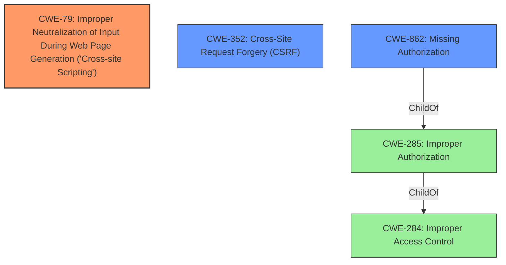

# Raw Analyzer Response for CVE-2022-0818

# Summary
| CWE ID | CWE Name | Confidence | CWE Abstraction Level | CWE Vulnerability Mapping Label | CWE-Vulnerability Mapping Notes |
|---|---|---|---|---|---|
| CWE-79 | Improper Neutralization of Input During Web Page Generation ('Cross-site Scripting') | 1.0 | Base | Allowed | Primary CWE |
| CWE-352 | Cross-Site Request Forgery (CSRF) | 0.9 | Compound | Allowed | Secondary Candidate |
| CWE-862 | Missing Authorization | 0.8 | Class | Allowed-with-Review | Secondary Candidate |

## Evidence and Confidence

*   **Confidence Score:** 0.9
*   **Evidence Strength:** HIGH

## Relationship Analysis
The primary weakness is CWE-79, which results from a **lack of authorization and CSRF checks** coupled with a **lack of sanitization**. CWE-352 (CSRF) is included because the description mentions a **lack of CSRF checks** which allows an attacker to trick a user into performing actions they did not intend to perform. CWE-862 (Missing Authorization) is included because the description mentions a **lack of authorization** on a specific action handler. These weaknesses allow for the injection of malicious XSS payloads. The abstraction levels were considered, and the most specific and relevant CWEs were chosen based on the available information.

## Vulnerability Chain
The vulnerability chain starts with the **lack of authorization and CSRF checks**, which leads to the ability to inject malicious XSS payloads. The **lack of sanitization** enables the stored XSS vulnerability. An unauthenticated attacker can exploit this to inject malicious JavaScript code into the plugin's settings, which is then executed when an administrator views the settings page.

## Summary of Analysis
The initial analysis identified CWE-79 as the primary weakness due to the stored XSS vulnerability. The **lack of authorization and CSRF checks** were also identified as contributing factors. The final assessment confirms CWE-79 as the primary weakness, with CWE-352 and CWE-862 as secondary contributing factors.

The evidence from the vulnerability description and CVE reference links content summary supports this assessment. Specifically, the phrases "**lack of authorization and CSRF checks**" and "does not sanitize its settings" indicate the root causes, while "enables an unauthenticated attacker to inject malicious XSS payloads" describes the resulting vulnerability.

The graph relationships influenced the selection by highlighting the connections between the different types of access control issues. However, the primary focus remained on the XSS vulnerability, which is directly caused by the **lack of sanitization**.

The selected CWEs are at the optimal level of specificity because they accurately represent the specific weaknesses present in the vulnerability. CWE-79 is a Base-level CWE that directly addresses the XSS vulnerability. CWE-352 is a Compound CWE that captures the **lack of CSRF checks**, and CWE-862 is a Class-level CWE that addresses the **missing authorization**.

Relevant CWE Information:

# Enhanced Context (25 CWEs)
The following CWEs were identified as potentially relevant to this vulnerability:

## CWE-79: Improper Neutralization of Input During Web Page Generation ('Cross-site Scripting')
**Abstraction Level**: Base
**Similarity Score**: 8435.75
**Source**: sparse

**Description**:
The product does not neutralize or incorrectly neutralizes user-controllable input before it is placed in output that is used as a web page that is served to other users.

**Mapping Guidance**:
- Usage: Allowed
- Rationale: This CWE entry is at the Base level of abstraction, which is a preferred level of abstraction for mapping to the root causes of vulnerabilities.

## CWE-352: Cross-Site Request Forgery (CSRF)
**Abstraction Level**: Compound
**Similarity Score**: 8153.43
**Source**: sparse

**Description**:
The web application does not, or can not, sufficiently verify whether a well-formed, valid, consistent request was intentionally provided by the user who submitted the request.

**Mapping Guidance**:
- Usage: Allowed
- Rationale: This is a well-known Composite of multiple weaknesses that must all occur simultaneously, although it is attack-oriented in nature.

## CWE-862: Missing Authorization
**Abstraction Level**: Class
**Similarity Score**: 7957.23
**Source**: sparse

**Description**:
The product does not perform an authorization check when an actor attempts to access a resource or perform an action.

**Mapping Guidance**:
- Usage: Allowed-with-Review
- Rationale: This CWE entry is a Class and might have Base-level children that would be more appropriate

### CWE Considerations and Justifications:

*   **CWE-74: Improper Neutralization of Special Elements in Output Used by a Downstream Component ('Injection')** - Discouraged because CWE-79 is more specific for XSS.
*   **CWE-116: Improper Encoding or Escaping of Output** - This is related to CWE-79 but less specific, as CWE-79 directly addresses the XSS issue.
*   **CWE-284: Improper Access Control** - This is a very high-level (Pillar) CWE and less descriptive than CWE-862.
*   **CWE-285: Improper Authorization** - This is a Class-level CWE but less descriptive than CWE-862, which specifically mentions the missing authorization check.
*   **CWE-425: Direct Request ('Forced Browsing')** - While relevant, it's less direct than CWE-862, which specifically covers missing authorization.
*   **CWE-434: Unrestricted Upload of File with Dangerous Type** - Not applicable as there's no mention of file uploads.

The evidence from the vulnerability description and CVE reference links content summary supports this assessment. Specifically, the phrases "**lack of authorization and CSRF checks**" and "does not sanitize its settings" indicate the root causes, while "enables an unauthenticated attacker to inject malicious XSS payloads" describes the resulting vulnerability.