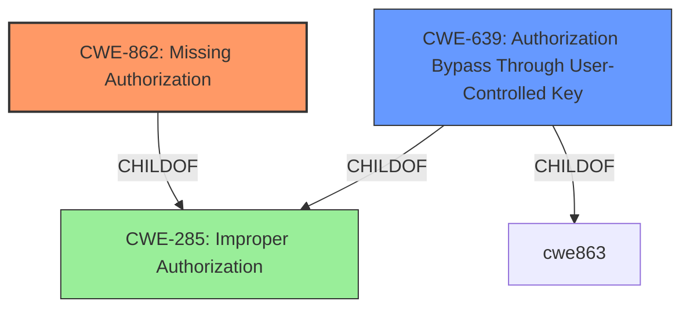

# Analysis for CVE-2022-0825

# Summary
| CWE ID | CWE Name | Confidence | CWE Abstraction Level | CWE Vulnerability Mapping Label | CWE-Vulnerability Mapping Notes |
|---|---|---|---|---|---|
| CWE-862 | Missing Authorization | 1.0 | Class | Primary | Allowed-with-Review |
| CWE-639 | Authorization Bypass Through User-Controlled Key | 0.7 | Base | Secondary | Allowed |

## Evidence and Confidence

*   **Confidence Score:** 0.9
*   **Evidence Strength:** HIGH

## Relationship Analysis
The primary relationship that influenced my decision was the parent-child relationship between CWE-285 (Improper Authorization), and its children CWE-862 (Missing Authorization) and CWE-863 (Incorrect Authorization). Since the description explicitly mentions "**improper authorisation**" and the plugin **does not** perform authorization checks, CWE-862 is more fitting than CWE-863 which is for when a check is performed **incorrectly**. CWE-639 (Authorization Bypass Through User-Controlled Key) was also considered as a possible secondary weakness, as the customer ID could be considered a user-controlled key that is not properly validated.

## Vulnerability Chain
The vulnerability chain begins with the **missing authorization** check. This leads to the impact of unauthorized users being able to modify appointment statuses and retrieve sensitive information.

## Summary of Analysis
The initial assessment identified the **improper authorisation** as the root cause, which aligns with CWE-862 (Missing Authorization). The evidence is strong, as the "CVE Reference Links Content Summary" confirms that the plugin "does not implement authorization checks". This directly supports the selection of CWE-862. Additionally, the possibility of CWE-639 (Authorization Bypass Through User-Controlled Key) as a secondary weakness was considered, given that the user ID might be manipulable to access other users' data.

The graph relationships reinforced the decision to choose CWE-862 over its parent CWE-285 (Improper Authorization), as CWE-862 provides a more specific and accurate representation of the vulnerability. The selected CWEs are at the optimal level of specificity because they directly address the **missing authorization** check and the potential for unauthorized access to other users' data via a manipulable key. The high retriever score for CWE-862 and the explicit mention of **missing authorization** in the vulnerability description further solidifies the choice.

Relevant CWE Information:

**CWE-862: Missing Authorization**
The product does not perform an authorization check when an actor attempts to access a resource or perform an action. This aligns directly with the vulnerability where the Amelia WordPress plugin does not check if a customer has the authority to update the booking status of other customers.

**CWE-639: Authorization Bypass Through User-Controlled Key**
The system's authorization functionality does not prevent one user from gaining access to another user's data or record by modifying the key value identifying the data. This is possibly relevant because an attacker could modify a key to get access to other users' data.

CWEs considered but not used:

*   CWE-863: Incorrect Authorization - While related to authorization, this CWE describes a situation where an authorization check is performed incorrectly, not when it's missing altogether. The vulnerability description clearly states a **missing authorization** check, making CWE-862 a more accurate fit.
*   CWE-352: Cross-Site Request Forgery (CSRF) - Although CSRF could be a potential attack vector, the primary weakness is the **missing authorization** check, not the lack of CSRF protection.
*   CWE-285: Improper Authorization - This is a higher-level class that encompasses both missing and incorrect authorization. While technically applicable, CWE-862 provides a more specific and accurate description of the vulnerability.
*   CWE-472: External Control of Assumed-Immutable Web Parameter - While there are parameters being passed, the main issue is the lack of authorization to change appointment status, not that a parameter is being externally controlled.