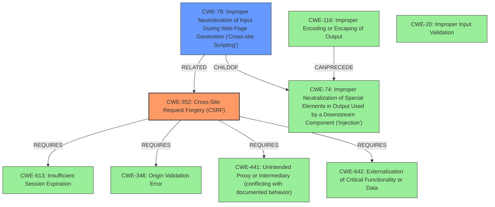

# Enhanced Analysis for CVE-2022-0830

# Summary
| CWE ID | CWE Name | Confidence | CWE Abstraction Level | CWE Vulnerability Mapping Label | CWE-Vulnerability Mapping Notes |
|---|---|---|---|---|---|
| CWE-352 | Cross-Site Request Forgery (CSRF) | 1.0 | Compound | Primary | Allowed |
| CWE-79 | Improper Neutralization of Input During Web Page Generation ('Cross-site Scripting') | 1.0 | Base | Secondary | Allowed |

## Evidence and Confidence

*   **Confidence Score:** 1.0
*   **Evidence Strength:** HIGH

## Relationship Analysis
The primary weakness is the **lack of CSRF checks**, which directly corresponds to CWE-352. The secondary weakness is the presence of **cross-site scripting**, which aligns with CWE-79. CWE-352 requires proper session management (CWE-613) and protection mechanisms (CWE-346, CWE-441, CWE-642) to prevent attackers from forging requests. CWE-79 can be a result of missing output encoding (CWE-116) and is often related to improper input validation (CWE-20). The relationship between XSS (CWE-79) and CSRF (CWE-352) is also noted, where CSRF can trick victims into submitting requests containing XSS payloads. Both CWE-352 and CWE-79 are at appropriate levels of abstraction: Compound and Base, respectively.



## Vulnerability Chain
The vulnerability chain starts with the **lack of CSRF checks** (CWE-352). This allows attackers to create malicious requests. The second part of the vulnerability is the **improper sanitization and escaping of form field values** allowing for **cross-site scripting** (CWE-79).

CWE-352 (Root Cause) -> CWE-79 (Resulting Impact)

## Summary of Analysis
The initial analysis identified two key weaknesses: **lack of CSRF checks** and **cross-site scripting**. The retriever results also showed CWE-352 and CWE-79 as likely candidates. The relationship analysis confirmed that CWE-352 and CWE-79 are the most appropriate CWEs, with CWE-352 as the primary cause and CWE-79 as a secondary impact. The evidence from the vulnerability description and CVE reference links supports this conclusion.

The vulnerability description states: "The FormBuilder WordPress plugin through 1.08 does not have CSRF checks in place when creating/updating and deleting forms, and does not sanitise as well as escape its form field values. As a result, attackers could make logged in admin update and delete arbitrary forms via a CSRF attack, and put Cross-Site Scripting payloads in them."

The CVE Reference Links Content Summary states: "The FormBuilder plugin lacks CSRF (Cross-Site Request Forgery) protection when creating, updating, and deleting forms. Additionally, the plugin doesn't sanitize or escape form field values properly." It also states "Attackers can inject XSS payloads into form fields, potentially leading to account takeover, data theft, or other malicious actions when a victim views the form."

The selected CWEs are at the optimal level of specificity because they accurately represent the root cause and impact of the vulnerability. CWE-352 is a Compound weakness that captures the essence of CSRF attacks, while CWE-79 is a Base weakness that describes the specific type of XSS vulnerability.

Relevant CWE Information:

# Enhanced Context (25 CWEs)
The following CWEs were identified as potentially relevant to this vulnerability:

## CWE-472: External Control of Assumed-Immutable Web Parameter
**Abstraction Level**: Base
**Similarity Score**: 0.76
**Source**: dense

**Description**:
The web application does not sufficiently verify inputs that are assumed to be immutable but are actually externally controllable, such as hidden form fields.

**Mapping Guidance**:
- Usage: Allowed
- Rationale: This CWE entry is at the Base level of abstraction, which is a preferred level of abstraction for mapping to the root causes of vulnerabilities.

*This CWE was considered but not selected because the primary issue is the **lack of CSRF checks**, not the external control of assumed-immutable parameters.*

## CWE-807: Reliance on Untrusted Inputs in a Security Decision
**Abstraction Level**: Base
**Similarity Score**: 0.76
**Source**: dense

**Description**:
The product uses a protection mechanism that relies on the existence or values of an input, but the input can be modified by an untrusted actor in a way that bypasses the protection mechanism.

**Mapping Guidance**:
- Usage: Allowed
- Rationale: This CWE entry is at the Base level of abstraction, which is a preferred level of abstraction for mapping to the root causes of vulnerabilities.

*This CWE was considered but not selected because the primary issue is the **lack of CSRF checks**, not the reliance on untrusted inputs in a security decision.*

## CWE-639: Authorization Bypass Through User-Controlled Key
**Abstraction Level**: Base
**Similarity Score**: 0.76
**Source**: dense

**Description**:
The system's authorization functionality does not prevent one user from gaining access to another user's data or record by modifying the key value identifying the data.

**Mapping Guidance**:
- Usage: Allowed
- Rationale: This CWE entry is at the Base level of abstraction, which is a preferred level of abstraction for mapping to the root causes of vulnerabilities.

*This CWE was considered but not selected because the primary issue is the **lack of CSRF checks**, not an authorization bypass through a user-controlled key.*

## CWE-1289: Improper Validation of Unsafe Equivalence in Input
**Abstraction Level**: Base
**Similarity Score**: 0.75
**Source**: dense

**Description**:
The product receives an input value that is used as a resource identifier or other type of reference, but it does not validate or incorrectly validates that the input is equivalent to a potentially-unsafe value.

**Mapping Guidance**:
- Usage: Allowed
- Rationale: This CWE entry is at the Base level of abstraction, which is a preferred level of abstraction for mapping to the root causes of vulnerabilities.

*This CWE was considered but not selected because the primary issue is the **lack of CSRF checks**, not the improper validation of unsafe equivalence in input.*

## CWE-1220: Insufficient Granularity of Access Control
**Abstraction Level**: Base
**Similarity Score**: 0.75
**Source**: dense

**Description**:
The product implements access controls via a policy or other feature with the intention to disable or restrict accesses (reads and/or writes) to assets in a system from untrusted agents. However, implemented access controls lack required granularity, which renders the control policy too broad because it allows accesses from unauthorized agents to the security-sensitive assets.

**Mapping Guidance**:
- Usage: Allowed
- Rationale: This CWE entry is at the Base level of abstraction, which is a preferred level of abstraction for mapping to the root causes of vulnerabilities.

*This CWE was considered but not selected because the primary issue is the **lack of CSRF checks**, not the insufficient granularity of access control.*

## CWE-74: Improper Neutralization of Special Elements in Output Used by a Downstream Component ('Injection')
**Abstraction Level**: Class
**


## CWE Relationship Analysis

Current CWEs represent these abstraction levels: .


### Vulnerability Chain Analysis

**Chain starting from CWE-472:**
- 472 (External Control of Assumed-Immutable Web Parameter) - ROOT


**Chain starting from CWE-807:**
- 807 (Reliance on Untrusted Inputs in a Security Decision) - ROOT


### CWE Relationship Diagram

```mermaid
graph TD
    classDef primary fill:#f96,stroke:#333,stroke-width:2px
    classDef secondary fill:#69f,stroke:#333
    classDef tertiary fill:#9e9,stroke:#333
```