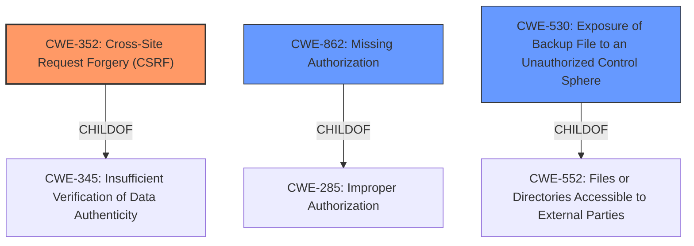

# Analysis for CVE-2022-0833

# Summary
| CWE ID | CWE Name | Confidence | CWE Abstraction Level | CWE Vulnerability Mapping Label | CWE-Vulnerability Mapping Notes |
|---|---|---|---|---|---|
| CWE-352 | Cross-Site Request Forgery (CSRF) | 0.9 | Compound | Primary | Allowed |
| CWE-862 | Missing Authorization | 0.9 | Class | Secondary | Allowed-with-Review |
| CWE-530 | Exposure of Backup File to an Unauthorized Control Sphere | 0.7 | Variant | Secondary | Allowed |

## Evidence and Confidence

*   **Confidence Score:** 0.9
*   **Evidence Strength:** HIGH

## Relationship Analysis
The primary weakness is identified as CWE-352, Cross-Site Request Forgery (CSRF), a compound weakness that requires multiple conditions to be met. CWE-862, Missing Authorization, is a related Class-level weakness representing the lack of authorization checks. CWE-530, Exposure of Backup File to an Unauthorized Control Sphere, is a Variant-level weakness that describes the specific exposure of the backup file.

## Vulnerability Chain
The vulnerability chain starts with **missing authorization and CSRF checks**. This allows unauthenticated attackers to trigger the refresh-backup action. The lack of proper access control then results in a publicly accessible temporary file, leading to information disclosure of the backup filename and ultimately allowing the attacker to download the database backup.
- **Root Cause:** **Missing Authorization and CSRF checks**
- **Weakness:** Publicly Accessible Temporary File
- **Impact:** Information Disclosure (Backup Filename) and Database Backup Download

## Summary of Analysis
The initial analysis identified the **missing authorization and CSRF checks** as the root cause, leading to unauthorized access and information disclosure. The retriever results supported this by listing CWE-352, CWE-862, and CWE-425 as high-ranking candidates. The final assessment concludes that CWE-352 and CWE-862 are the most appropriate primary and secondary classifications, respectively, with CWE-530 providing further specificity.

The selection is based on the following evidence:

*   "The Church Admin WordPress plugin before 3.4.135 does not have authorisation and CSRF in some of its action as well as requested files" - This directly indicates the **missing authorization and CSRF checks**, aligning with both CWE-352 and CWE-862.
*   "allowing unauthenticated attackers to repeatedly request the refresh-backup action" - This highlights the missing authorization, as unauthenticated users can trigger critical functionality.
*   "simultaneously keep requesting a publicly accessible temporary file generated by the plugin in order to disclose the final backup filename, which can then be fetched by the attacker to download the backup of the plugins DB data" - This describes the information disclosure vulnerability arising from the **missing authorization and CSRF checks**, further supporting the selection of CWE-352 and CWE-862, and adding CWE-530 to reflect the publicly accessible backup file.

The graph relationships influenced the final selection by highlighting the connection between **missing authorization** (CWE-862) and broader authorization issues (CWE-285). However, CWE-862 is a more precise classification than CWE-285.

The selected CWEs are at the optimal level of specificity. CWE-352 accurately captures the compound nature of the CSRF vulnerability. CWE-862 pinpoints the **missing authorization** as a contributing factor. CWE-530 further specifies the context by describing the exposure of the backup file.

Relevant CWE Information:

# Enhanced Context (25 CWEs)
The following CWEs were identified as potentially relevant to this vulnerability:

## CWE-472: External Control of Assumed-Immutable Web Parameter
**Abstraction Level**: Base
**Similarity Score**: 0.78
**Source**: dense

**Description**:
The web application does not sufficiently verify inputs that are assumed to be immutable but are actually externally controllable, such as hidden form fields.

**Mapping Guidance**:
- Usage: Allowed
- Rationale: This CWE entry is at the Base level of abstraction, which is a preferred level of abstraction for mapping to the root causes of vulnerabilities.

## CWE-639: Authorization Bypass Through User-Controlled Key
**Abstraction Level**: Base
**Similarity Score**: 0.78
**Source**: dense

**Description**:
The system's authorization functionality does not prevent one user from gaining access to another user's data or record by modifying the key value identifying the data.

**Mapping Guidance**:
- Usage: Allowed
- Rationale: This CWE entry is at the Base level of abstraction, which is a preferred level of abstraction for mapping to the root causes of vulnerabilities.

## CWE-74: Improper Neutralization of Special Elements in Output Used by a Downstream Component ('Injection')
**Abstraction Level**: Class
**Similarity Score**: 0.78
**Source**: dense

**Description**:
The product constructs all or part of a command, data structure, or record using externally-influenced input from an upstream component, but it does not neutralize or incorrectly neutralizes special elements that could modify how it is parsed or interpreted when it is sent to a downstream component.

**Mapping Guidance**:
- Usage: Discouraged
- Rationale: CWE-74 is high-level and often misused when lower-level weaknesses are more appropriate.

## CWE-425: Direct Request ('Forced Browsing')
**Abstraction Level**: Base
**Similarity Score**: 0.78
**Source**: dense

**Description**:
The web application does not adequately enforce appropriate authorization on all restricted URLs, scripts, or files.

**Mapping Guidance**:
- Usage: Allowed
- Rationale: This CWE entry is at the Base level of abstraction, which is a preferred level of abstraction for mapping to the root causes of vulnerabilities.

## CWE-1289: Improper Validation of Unsafe Equivalence in Input
**Abstraction Level**: Base
**Similarity Score**: 0.78
**Source**: dense

**Description**:
The product receives an input value that is used as a resource identifier or other type of reference, but it does not validate or incorrectly validates that the input is equivalent to a potentially-unsafe value.

**Mapping Guidance**:
- Usage: Allowed
- Rationale: This CWE entry is at the Base level of abstraction, which is a preferred level of abstraction for mapping to the root causes of vulnerabilities.

## CWE-184: Incomplete List of Disallowed Inputs
**Abstraction Level**: Base
**Similarity Score**: 0.77
**Source**: dense

**Description**:
The product implements a protection mechanism that relies on a list of inputs (or properties of inputs) that are not allowed by policy or otherwise require other action to neutralize before additional processing takes place, but the list is incomplete.

**Mapping Guidance**:
- Usage: Allowed
- Rationale: This CWE entry is at the Base level of abstraction, which is a preferred level of abstraction for mapping to the root causes of vulnerabilities.

## CWE-807: Reliance on Untrusted Inputs in a Security Decision
**Abstraction Level**: Base
**Similarity Score**: 0.77
**Source**: dense

**Description**:
The product uses a protection mechanism that relies on the existence or values of an input, but the input can be modified by an untrusted actor in a way that bypasses the protection mechanism.

**Mapping Guidance**:
- Usage: Allowed
- Rationale: This CWE entry is at the Base level of abstraction, which is a preferred level of abstraction for mapping to the root causes of vulnerabilities.

## CWE-116: Improper Encoding or Escaping of Output
**Abstraction Level**: Class
**Similarity Score**: 0.77
**Source**: dense

**Description**:
The product prepares a structured message for communication with another component, but encoding or escaping of the data is either missing or done incorrectly. As a result, the intended structure of the message is not preserved.

**Mapping Guidance**:
- Usage: Allowed-with-Review
- Rationale: This CWE entry is a Class and might have Base-level children that would be more appropriate

## CWE-41: Improper Resolution of Path Equivalence