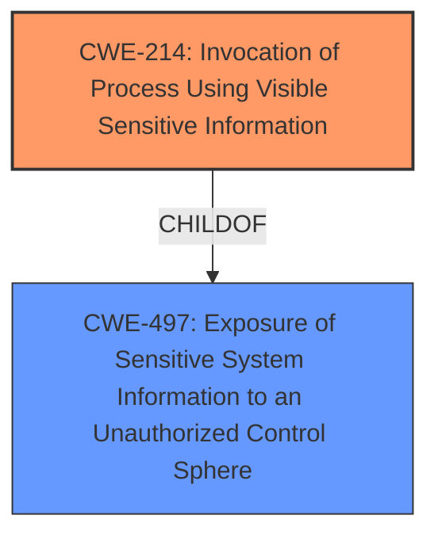

# Analysis for CVE-2022-0851

# Summary
| CWE ID | CWE Name | Confidence | CWE Abstraction Level | CWE Vulnerability Mapping Label | CWE-Vulnerability Mapping Notes |
|---|---|---|---|---|---|
| CWE-214 | Invocation of Process Using Visible Sensitive Information | 1.0 | Base | Allowed | Primary CWE: The activation key is passed as a command-line argument, making it visible to local users. |
| CWE-497 | Exposure of Sensitive System Information to an Unauthorized Control Sphere | 0.7 | Base | Allowed | Secondary CWE: The activation key is sensitive system-level information exposed to unauthorized actors. |

## Evidence and Confidence

*   **Confidence Score:** 0.9
*   **Evidence Strength:** HIGH

## Relationship Analysis
The primary relationship that influenced the decision was that CWE-214 is a child of CWE-497. The evidence points strongly to CWE-214 as the more specific and appropriate classification, as it directly addresses the mechanism of exposure via command-line arguments.

## Vulnerability Chain
The vulnerability chain is as follows:
1.  The `convert2rhel` tool passes the activation key as a command-line argument to `subscription-manager`.
2.  This results in the exposure of sensitive information (the activation key) to local users via process listings.
3.  An attacker can then use this key to register systems under the victim's subscription, leading to unauthorized access and potential financial loss.

The root cause is the **insecure handling of sensitive data** by passing it as a command-line argument. The impact is unauthorized system registration and potential financial loss.

## Summary of Analysis
Initially, both CWE-214 and CWE-497 seemed relevant. However, the detailed description of the vulnerability, particularly the method of exposure (command-line arguments), strongly supports CWE-214 as the primary classification.

The evidence from the CVE Reference Links Content Summary states: "The `convert2rhel` tool passes the activation key as a command-line argument to `subscription-manager`... Passing sensitive information like the activation key via command-line arguments makes it visible to local users." This directly aligns with the description of CWE-214.

CWE-497, while applicable, is a broader category. Since CWE-214 provides a more precise description of the vulnerability's mechanism, it is the more appropriate choice.

The selected CWEs are at the optimal level of specificity because they accurately reflect the root cause and the direct method of exploitation. CWE-214 describes the specific vulnerability mechanism, while CWE-497 captures the broader context of sensitive information exposure.

Relevant CWE Information:

# Enhanced Context (25 CWEs)
The following CWEs were identified as potentially relevant to this vulnerability:

## CWE-113: Improper Neutralization of CRLF Sequences in HTTP Headers ('HTTP Request/Response Splitting')
**Abstraction Level**: Variant
**Similarity Score**: 0.78
**Source**: dense

**Description**:
The product receives data from an HTTP agent/component (e.g., web server, proxy, browser, etc.), but it does not neutralize or incorrectly neutralizes CR and LF characters before the data is included in outgoing HTTP headers.

**Mapping Guidance**:
- Usage: Allowed
- Rationale: This CWE entry is at the Variant level of abstraction, which is a preferred level of abstraction for mapping to the root causes of vulnerabilities.

**Why Not Selected:** This CWE is not relevant as the vulnerability doesn't involve HTTP headers or CRLF sequences.

## CWE-74: Improper Neutralization of Special Elements in Output Used by a Downstream Component ('Injection')
**Abstraction Level**: Class
**Similarity Score**: 0.76
**Source**: dense

**Description**:
The product constructs all or part of a command, data structure, or record using externally-influenced input from an upstream component, but it does not neutralize or incorrectly neutralizes special elements that could modify how it is parsed or interpreted when it is sent to a downstream component.

**Mapping Guidance**:
- Usage: Discouraged
- Rationale: CWE-74 is high-level and often misused when lower-level weaknesses are more appropriate.

**Why Not Selected:** This CWE is too general and doesn't accurately reflect the specific issue of passing sensitive information as command-line arguments.

## CWE-93: Improper Neutralization of CRLF Sequences ('CRLF Injection')
**Abstraction Level**: Base
**Similarity Score**: 0.75
**Source**: dense

**Description**:
The product uses CRLF (carriage return line feeds) as a special element, e.g. to separate lines or records, but it does not neutralize or incorrectly neutralizes CRLF sequences from inputs.

**Mapping Guidance**:
- Usage: Allowed
- Rationale: This CWE entry is at the Base level of abstraction, which is a preferred level of abstraction for mapping to the root causes of vulnerabilities.

**Why Not Selected:** This CWE is not relevant as the vulnerability doesn't involve CRLF sequences.

## CWE-212: Improper Removal of Sensitive Information Before Storage or Transfer
**Abstraction Level**: Base
**Similarity Score**: 0.75
**Source**: dense

**Description**:
The product stores, transfers, or shares a resource that contains sensitive information, but it does not properly remove that information before the product makes the resource available to unauthorized actors.

**Mapping Guidance**:
- Usage: Allowed
- Rationale: This CWE entry is at the Base level of abstraction, which is a preferred level of abstraction for mapping to the root causes of vulnerabilities.

**Why Not Selected:** This CWE is related, but the specific issue is not about storage or transfer, but rather the exposure through command-line arguments.

## CWE-41: Improper Resolution of Path Equivalence
**Abstraction Level**: Base
**Similarity Score**: 0.74
**Source**: dense

**Description**:
The product is vulnerable to file system contents disclosure through path equivalence. Path equivalence involves the use of special characters in file and directory names. The associated manipulations are intended to generate multiple names for the same object.

**Mapping Guidance**:
- Usage: Allowed
- Rationale: This CWE entry is at the Base level of abstraction, which is a preferred level of abstraction for mapping to the root causes of vulnerabilities.

**Why Not Selected:** This CWE is not relevant as the vulnerability doesn't involve path equivalence or file system manipulation.

## CWE-138: Improper Neutralization of Special Elements
**Abstraction Level**: Class
**Similarity Score**: 0.74
**Source**: dense

**Description**:
The product receives input from an upstream component, but it does not neutralize or incorrectly neutralizes special elements that could be interpreted as control elements or syntactic markers when they are sent to a downstream component.

**Mapping Guidance**:
- Usage: Discouraged
- Rationale: This CWE entry is a level-1 Class (i.e., a child of a Pillar). It might have lower-level children that would be more appropriate

**Why Not Selected:** Too general of a weakness and doesn't match the specific vulnerability.

## CWE-1289: Improper Validation of Unsafe Equivalence in Input
**Abstraction Level**: Base
**Similarity Score**: 0.74
**Source**: dense

**Description**:
The product receives an input value that is used as a resource identifier or other type of reference, but it does not validate or incorrectly validates that the input is equivalent to a potentially-unsafe value.

**Mapping Guidance**:
- Usage: Allowed
- Rationale: This CWE entry is at the Base level of abstraction, which is a preferred level of abstraction for mapping to the root causes of vulnerabilities.

**Why Not Selected:** The vulnerability isn't about validating equivalence of input; it's about exposing sensitive information.

## CWE-214: Invocation of Process Using Visible Sensitive Information
**Abstraction Level**: Base
**Similarity Score**: 0.74
**Source**: dense

**Description**:
A process is invoked with sensitive command-line arguments, environment variables, or other elements that can be seen by other processes on the operating system.

**Mapping Guidance**:
- Usage: Allowed
- Rationale: This CWE entry is at the Base level of abstraction, which is a preferred level of abstraction for mapping to the root causes of vulnerabilities.

**Why Selected:** This is the primary CWE, it perfectly describes the root cause of the vulnerability where the **sensitive information** is passed via command line arguments.

## CWE-668: Exposure of Resource to Wrong Sphere
**Abstraction Level**: Class
**Similarity Score**: 0.73
**Source**: dense

**Description**:
The product exposes a resource to the wrong control sphere, providing unintended actors with inappropriate access to the resource.

**Mapping Guidance**:
- Usage: Discouraged
- Rationale: CWE-668 is high