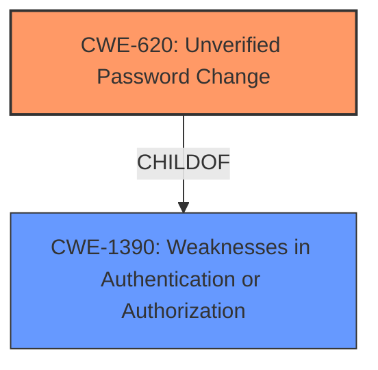

# Analysis Report for CVE-2022-0859

# Vulnerability Analysis Report: CVE-2022-0859

## Description


## Analysis (with Relationship Data)

# Summary
| CWE ID | CWE Name | Confidence | CWE Abstraction Level | CWE Vulnerability Mapping Label | CWE-Vulnerability Mapping Notes |
|---|---|---|---|---|---|
| CWE-620 | Unverified Password Change | 0.7 | Base | Allowed | Primary CWE |

## Evidence and Confidence

*   **Confidence Score:** 0.7
*   **Evidence Strength:** MEDIUM

## Relationship Analysis
The primary CWE, CWE-620 [Unverified Password Change], is a Base level CWE. It is part of a hierarchy with CWE-1390 as its parent. No chain relationships were identified as being relevant.



## Vulnerability Chain
The vulnerability allows a local attacker to **point an ePO server to an arbitrary SQL server during the restoration of the ePO server**. To achieve this the attacker would have to be logged onto the server hosting the ePO server (restricted to administrators) and to know the SQL server password. The **root cause** is the lack of verification when changing the SQL server password during a restoration. This **leads to** the ability to point to an arbitrary SQL server.

## Summary of Analysis
The vulnerability allows an attacker to point an ePO server to an arbitrary SQL server during restoration by exploiting the lack of verification when changing the SQL server password.

The most relevant CWE appears to be CWE-620 [Unverified Password Change].

CWE-620 [Unverified Password Change] is the best fit because the **root cause** is the **lack of verification when the SQL server password is changed**. This aligns directly with CWE-620's description: "When setting a new password for a user, the product does not require knowledge of the original password, or using another form of authentication."

Other CWEs Considered:

*   CWE-522 [Insufficiently Protected Credentials]: This CWE is a Class-level CWE and is too broad. The vulnerability is not about the protection of credentials but about the password change **not being verified**.
*   CWE-200 [Exposure of Sensitive Information to an Unauthorized Actor]: This CWE is a Class-level CWE and is not the **root cause**, but the impact.
*   CWE-269 [Improper Privilege Management]: This CWE is a Class-level CWE and is too broad. The vulnerability is not about privilege management but about the password change **not being verified**.
*   CWE-611 [Improper Restriction of XML External Entity Reference]: This CWE is related to XML processing and is not relevant to the vulnerability.
*   CWE-918 [Server-Side Request Forgery (SSRF)]: This CWE is not relevant as the **root cause** does not involve forging server-side requests.
*   CWE-1272 [Sensitive Information Uncleared Before Debug/Power State Transition]: This CWE is not relevant because the vulnerability doesn't involve debug/power state transitions.
*   CWE-22 [Improper Limitation of a Pathname to a Restricted Directory ('Path Traversal')]: This CWE is not relevant as it focuses on path traversal issues, which are unrelated to this password change vulnerability.
*   CWE-285 [Improper Authorization]: This CWE is a Class-level CWE and too broad.

I am selecting CWE-620 [Unverified Password Change] because the provided evidence supports this selection. The vulnerability description directly points to a **lack of password verification** during a restoration process, which aligns with the definition of CWE-620.


## CWE Relationship Analysis

Current CWEs represent these abstraction levels: .


### Vulnerability Chain Analysis

**Chain starting from CWE-200:**
- 200 (Exposure of Sensitive Information to an Unauthorized Actor) - ROOT


**Chain starting from CWE-918:**
- 918 (Server-Side Request Forgery (SSRF)) - ROOT


### CWE Relationship Diagram

```mermaid
graph TD
    classDef primary fill:#f96,stroke:#333,stroke-width:2px
    classDef secondary fill:#69f,stroke:#333
    classDef tertiary fill:#9e9,stroke:#333
```


*Report generated on 2025-03-31 07:12:55*
