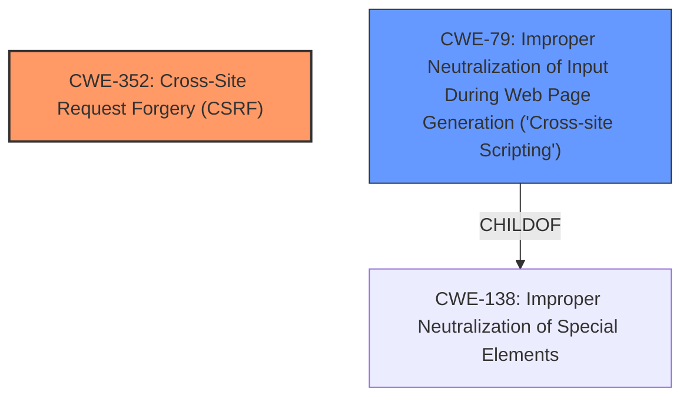

# Raw Analyzer Response for CVE-2022-0875

# Summary
| CWE ID    | CWE Name                                                                             | Confidence | CWE Abstraction Level | CWE-Vulnerability Mapping Label | CWE-Vulnerability Mapping Notes |
| --------- | ------------------------------------------------------------------------------------ | ---------- | --------------------- | ----------------------------- | ------------------------------- |
| CWE-352   | Cross-Site Request Forgery (CSRF)                                                    | 1.0        | Compound              | Primary                       | Allowed                         |
| CWE-79    | Improper Neutralization of Input During Web Page Generation ('Cross-site Scripting') | 1.0        | Base                  | Secondary                     | Allowed                         |

## Evidence and Confidence

*   **Confidence Score:** 1.0
*   **Evidence Strength:** HIGH

## Relationship Analysis
The primary weakness is the **lack of CSRF check**, which directly maps to CWE-352. The secondary weakness, Cross-Site Scripting (XSS), arises due to **improper input sanitization**, which maps to CWE-79. CWE-352 and CWE-79 are related in that the **lack of CSRF protection** can allow attackers to inject malicious scripts if input validation is also missing. While CWE-79 is a child of CWE-138 (Improper Neutralization of Special Elements), CWE-79 is more specific to web page generation, making it a better fit.

## Vulnerability Chain
The vulnerability chain starts with the **lack of CSRF check (CWE-352)**, which allows an attacker to potentially submit malicious requests. Coupled with **improper input sanitization (CWE-79)**, this leads to Cross-Site Scripting (XSS) vulnerability.

## Summary of Analysis
The analysis is based on the provided vulnerability description and keyphrases. The primary **root cause** is the **lack of CSRF check**, which directly maps to CWE-352. The secondary issue is **improper input sanitization**, leading to XSS, which maps to CWE-79.

The evidence supporting this is:
*   "The Google Authenticator WordPress plugin before 1.0.5 does not have CSRF check when saving its settings, and does not sanitise as well as escape them, allowing attackers to make a logged in admin change them and perform Cross-Site Scripting attacks"

CWE-352 is the most specific CWE for the **lack of CSRF protection**. CWE-79 is a base-level CWE that accurately represents the **improper neutralization of input** leading to XSS.

Relevant CWE Information:

# Enhanced Context (25 CWEs)
The following CWEs were identified as potentially relevant to this vulnerability:

## CWE-352: Cross-Site Request Forgery (CSRF)
**Abstraction Level**: Compound
**Similarity Score**: 0.73
**Source**: dense

**Description**:
The web application does not, or can not, sufficiently verify whether a well-formed, valid, consistent request was intentionally provided by the user who submitted the request.

**Mapping Guidance**:
- Usage: Allowed
- Rationale: This is a well-known Composite of multiple weaknesses that must all occur simultaneously, although it is attack-oriented in nature.

*Technical Explanation for CWE-352:*
The Google Authenticator WordPress plugin lacks a CSRF check, meaning an attacker can trick a logged-in administrator into performing actions, such as changing plugin settings, without their knowledge or consent. This occurs because the application **does not sufficiently verify** whether the request was intentionally provided by the user.

*Security Implications and Potential Impact:*
An attacker can exploit this by crafting a malicious request and tricking an administrator into executing it. This can lead to unauthorized changes to the plugin settings or other sensitive actions, potentially compromising the entire WordPress installation.

*Relationship Analysis:*
CWE-352 is a compound weakness, which means it's a combination of multiple underlying issues. In this case, it's the **lack of a CSRF token** and the **failure to validate the origin** of the request.

*MITRE Mapping Guidance Influence:*
The MITRE mapping guidance allows for the use of CWE-352, and the description aligns perfectly with the vulnerability.

## CWE-79: Improper Neutralization of Input During Web Page Generation ('Cross-site Scripting')
**Abstraction Level**: base
**Similarity Score**: 5.47
**Source**: graph

**Description**:
CWE-79: Improper Neutralization of Input During Web Page Generation ('Cross-site Scripting')

**Mapping Guidance**:
- Usage: Allowed
- Rationale: This CWE entry is at the Base level of abstraction, which is a preferred level of abstraction for mapping to the root causes of vulnerabilities.

**Relationships**:
- PARENTOF -> CWE-87
- PARENTOF -> CWE-86
- PARENTOF -> CWE-85
- PARENTOF -> CWE-84
- PARENTOF -> CWE-83

*Technical Explanation for CWE-79:*
The plugin **does not properly sanitize or escape** the settings before saving them. This means that an attacker can inject malicious scripts into the settings, which will then be executed when the settings are displayed in a web page.

*Security Implications and Potential Impact:*
This can lead to Cross-Site Scripting (XSS) attacks, where an attacker can execute arbitrary JavaScript code in the context of the victim's browser. This can be used to steal cookies, redirect the user to a malicious website, or deface the website.

*Relationship Analysis:*
CWE-79 is related to CWE-116 (Improper Encoding or Escaping of Output) and CWE-80 (Improper Neutralization of Script-Related HTML Tags in a Web Page (Basic XSS)). However, CWE-79 is a more general CWE that covers all types of XSS vulnerabilities, while CWE-80 is specific to basic XSS, and CWE-116 is a class.

*MITRE Mapping Guidance Influence:*
The MITRE mapping guidance allows for the use of CWE-79, and the description aligns perfectly with the vulnerability.

*Other CWEs Considered But Not Used:*
CWE-862 (Missing Authorization): While the **lack of CSRF** could be seen as a form of missing authorization, CWE-352 is more specific to the **CSRF vulnerability**.
CWE-116 (Improper Encoding or Escaping of Output): This is a class-level CWE and less specific than CWE-79, which directly addresses the XSS aspect.
CWE-434 (Unrestricted Upload of File with Dangerous Type) and CWE-89 (Improper Neutralization of Special Elements used in an SQL Command ('SQL Injection')): These are not relevant to the vulnerability description.