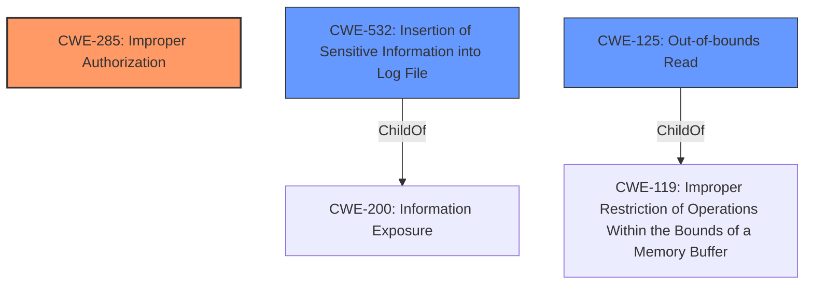

# Enhanced Analysis for CVE-2022-0882

# Summary
| CWE ID | CWE Name | Confidence | CWE Abstraction Level | CWE Vulnerability Mapping Label | CWE-Vulnerability Mapping Notes |
|---|---|---|---|---|---|
| CWE-285 | Improper Authorization | 0.8 | Class | Primary | Discouraged |
| CWE-532 | Insertion of Sensitive Information into Log File | 0.6 | Base | Secondary | Allowed |
| CWE-125 | Out-of-bounds Read | 0.5 | Base | Secondary | Allowed |

## Evidence and Confidence

*   **Confidence Score:** 0.7
*   **Evidence Strength:** MEDIUM

## Relationship Analysis
The primary relationship influencing the selection is the hierarchical one. CWE-285 is a Class-level CWE, and there are more specific children that could be considered, like CWE-862 (Missing Authorization) or CWE-863 (Incorrect Authorization). Additionally, the data being read is a kernel log, which could be seen as sensitive information. This leads to considering CWE-532. An out-of-bounds read (CWE-125) is also possible given the exposed kernel addresses and ability to read kernel logs without proper authorization.



## Vulnerability Chain
The chain of events starts with the **weakness** that **an attacker can read the kernel log** without the required authorization. This could potentially involve reading sensitive information intended to be protected. The exposed Zircon kernel addresses serve as the vector.

## Summary of Analysis
The initial assessment points towards **CWE-285 (Improper Authorization)** as the primary weakness because the attacker can read the kernel log without the required capability. The **weakness** is that **an attacker can read the kernel log** through exposed Zircon kernel addresses without the required capability ZX_RSRC_KIND_ROOT. This directly implies an authorization issue.

The retriever results also list CWE-532 (Insertion of Sensitive Information into Log File) as a potential candidate. While reading the kernel log itself isn't necessarily "insertion", the kernel log *contains* sensitive information. This makes CWE-532 a secondary consideration. It depends on whether the logs themselves are considered the primary vulnerability or the unauthorized access to them.

CWE-125 (Out-of-bounds Read) is also a possible secondary CWE, as the exposed kernel addresses could allow for reading memory outside the intended boundaries.

CWE-285 is a Class level CWE, which the mapping guidelines discourage. However, without more information about how the authorization is missing or incorrect, it's difficult to choose a more specific CWE. The evidence is somewhat lacking in providing specific details of the **root cause**.

Therefore, **CWE-285** is selected as the primary weakness, with **CWE-532** and **CWE-125** as secondary considerations. The assessment is based on the evidence that the attacker can bypass authorization checks and read kernel logs.

Other CWEs Considered:
*   CWE-822 (Untrusted Pointer Dereference): This was considered but rejected as there's no explicit mention of pointer dereferencing in the vulnerability description.
*   CWE-362 (Concurrent Execution using Shared Resource with Improper Synchronization ('Race Condition')): This was considered but rejected because there is no mention of concurrency or synchronization issues.
*   CWE-1285 (Improper Validation of Specified Index, Position, or Offset in Input): This was considered but rejected because there is no mention of issues with indexing or offsets.
*   CWE-1284 (Improper Validation of Specified Quantity in Input): This was considered but rejected because there is no mention of any quantity being validated.
*   CWE-197 (Numeric Truncation Error): This was considered but rejected as there is no mention of numeric truncation.
*   CWE-367 (Time-of-check Time-of-use (TOCTOU) Race Condition): This was considered but rejected as there is no mention of TOCTOU.


## CWE Relationship Analysis

Current CWEs represent these abstraction levels: .


### Vulnerability Chain Analysis

**Chain starting from CWE-862:**
- 862 (Missing Authorization) - ROOT


**Chain starting from CWE-200:**
- 200 (Exposure of Sensitive Information to an Unauthorized Actor) - ROOT


### CWE Relationship Diagram

```mermaid
graph TD
    classDef primary fill:#f96,stroke:#333,stroke-width:2px
    classDef secondary fill:#69f,stroke:#333
    classDef tertiary fill:#9e9,stroke:#333
```