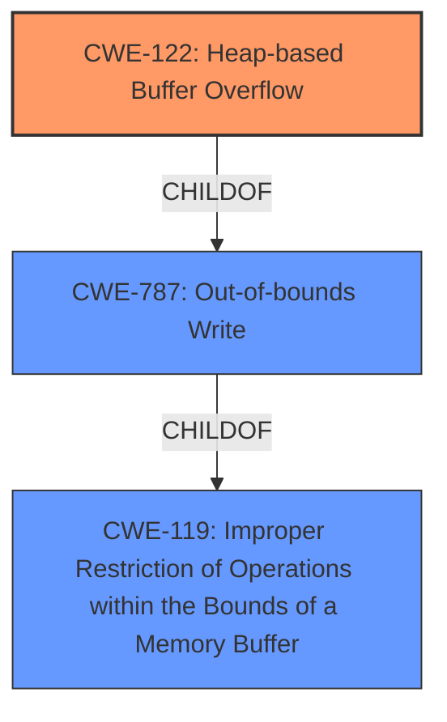

# Raw Analyzer Response for CVE-2022-0891

# Summary
| CWE ID  | CWE Name                                                               | Confidence | CWE Abstraction Level | CWE Vulnerability Mapping Label | CWE-Vulnerability Mapping Notes |
| :-------- | :--------------------------------------------------------------------- | :--------- | :---------------------- | :------------------------------ | :------------------------------ |
| CWE-122   | Heap-based Buffer Overflow                                             | 0.9        | Variant               | Primary CWE                    | Allowed                       |
| CWE-787   | Out-of-bounds Write                                                    | 0.7        | Base                  | Secondary CWE                  | Allowed                       |
| CWE-119   | Improper Restriction of Operations within the Bounds of a Memory Buffer | 0.5        | Class                   | Secondary CWE                  | Discouraged                    |

## Evidence and Confidence

*   **Confidence Score:** 0.8
*   **Evidence Strength:** HIGH

## Relationship Analysis
The primary weakness is a heap-based buffer overflow (CWE-122), a variant of out-of-bounds write (CWE-787), which itself is a type of improper restriction of operations within the bounds of a memory buffer (CWE-119).
The vulnerability chain involves writing beyond the allocated buffer on the heap, leading to potential application crash or information disclosure. Selecting CWE-122 offers the most specific classification, while CWE-787 and CWE-119 represent progressively broader categories.

## Vulnerability Chain
The chain of events is as follows:
1.  A crafted TIFF image file is processed by `tiffcrop`.
2.  A **heap buffer overflow** occurs in the `ExtractImageSection` function.
3.  This leads to an out-of-bounds write on the heap.
4.  The impact is an application crash and potential information disclosure.

## Summary of Analysis
The primary CWE is CWE-122 (Heap-based Buffer Overflow) because the vulnerability description explicitly mentions a **heap buffer overflow**. The "CVE Reference Links Content Summary" section reinforces this by stating: "Heap buffer overflow in the `extractImageSection` function within `/tools/tiffcrop.c`." This provides strong evidence for selecting CWE-122. The retriever also lists CWE-122 as a candidate, though with a lower score, which is reasonable considering the alternate_terms retriever favored more general terms.

CWE-787 (Out-of-bounds Write) is a parent of CWE-122 and represents the more general class of writing data outside the intended buffer. Because the description specifically mentions a heap buffer, CWE-122 is more precise.

CWE-119 (Improper Restriction of Operations within the Bounds of a Memory Buffer) is a more general class that encompasses both out-of-bounds reads and writes. While technically correct, it's less specific than CWE-122 or CWE-787. Additionally, the mapping guidance for CWE-119 discourages its use when more specific CWEs are available.

Therefore, CWE-122 is the optimal choice due to the explicit mention of a heap-based buffer overflow in the vulnerability description and supporting evidence.

Relevant CWE Information:

# Enhanced Context (25 CWEs)

## CWE-131: Incorrect Calculation of Buffer Size
**Abstraction Level**: Base
**Similarity Score**: 0.77
**Source**: dense

**Description**:
The product does not correctly calculate the size to be used when allocating a buffer, which could lead to a buffer overflow.
**Rationale for not selecting**: While an incorrect buffer size calculation could lead to a heap buffer overflow, the provided information doesn't explicitly mention this. The focus is on the overflow itself, not necessarily the calculation.

## CWE-191: Integer Underflow (Wrap or Wraparound)
**Abstraction Level**: Base
**Similarity Score**: 0.77
**Source**: dense

**Description**:
The product subtracts one value from another, such that the result is less than the minimum allowable integer value, which produces a value that is not equal to the correct result.
**Rationale for not selecting**: Integer underflow is not mentioned in the vulnerability description.

## CWE-126: Buffer Over-read
**Abstraction Level**: Variant
**Similarity Score**: 0.76
**Source**: dense

**Description**:
The product reads from a buffer using buffer access mechanisms such as indexes or pointers that reference memory locations after the targeted buffer.
**Rationale for not selecting**: The vulnerability is about a **heap buffer overflow**, which is a write, not a read.

## CWE-125: Out-of-bounds Read
**Abstraction Level**: Base
**Similarity Score**: 0.76
**Source**: dense

**Description**:
The product reads data past the end, or before the beginning, of the intended buffer.
**Rationale for not selecting**: The vulnerability is about a **heap buffer overflow**, which is a write, not a read.

## CWE-789: Memory Allocation with Excessive Size Value
**Abstraction Level**: Variant
**Similarity Score**: 0.76
**Source**: dense

**Description**:
The product allocates memory based on an untrusted, large size value, but it does not ensure that the size is within expected limits, allowing arbitrary amounts of memory to be allocated.
**Rationale for not selecting**: While this could be a contributing factor, the core issue is the **heap buffer overflow** itself.

## CWE-124: Buffer Underwrite ('Buffer Underflow')
**Abstraction Level**: Base
**Similarity Score**: 0.76
**Source**: dense

**Description**:
The product writes to a buffer using an index or pointer that references a memory location prior to the beginning of the buffer.
**Rationale for not selecting**: The description specifies a **heap buffer overflow**, indicating a write past the end of the buffer, not before the beginning.

## CWE-190: Integer Overflow or Wraparound
**Abstraction Level**: Base
**Similarity Score**: 0.75
**Source**: dense

**Description**:
The product performs a calculation that can produce an integer overflow or wraparound when the logic assumes that the resulting value will always be larger than the original value.
**Rationale for not selecting**: Integer overflow isn't explicitly mentioned in the vulnerability details.

## CWE-193: Off-by-one Error
**Abstraction Level**: Base
**Similarity Score**: 0.75
**Source**: dense

**Description**:
A product calculates or uses an incorrect maximum or minimum value that is 1 more, or 1 less, than the correct value.
**Rationale for not selecting**: There is no mention of an off-by-one error in the vulnerability description.

## CWE-129: Improper Validation of Array Index
**Abstraction Level**: Variant
**Similarity Score**: 0.75
**Source**: dense

**Description**:
The product uses untrusted input when calculating or using an array index, but the product does not validate or incorrectly validates the index to ensure the index references a valid position within the array.
**Rationale for not selecting**: The vulnerability doesn't directly relate to array index validation.

## CWE-805: Buffer Access with Incorrect Length Value
**Abstraction Level**: Base
**Similarity Score**: 0.75
**Source**: dense

**Description**:
The product uses a sequential operation to read or write a buffer, but it uses an incorrect length value that causes it to access memory that is outside of the bounds of the buffer.
**Rationale for not selecting**: While an incorrect length value could contribute, the description focuses on the **heap buffer overflow** itself.

## CWE-190: Integer Overflow or Wraparound
**Abstraction Level**: Base
**Similarity Score**: 6883.02
**Source**: sparse

**Description**:
The product performs a calculation that can produce an integer overflow or wraparound when the logic assumes that the resulting value will always be larger than the original value.
**Rationale for not selecting**: Integer overflow isn't explicitly mentioned in the vulnerability details.

## CWE-125: Out-of-bounds Read
**Abstraction Level**: Base
**Similarity Score**: 6416.02
**Source**: sparse

**Description**:
The product reads data past the end, or before the beginning, of the intended buffer.
**Rationale for not selecting**: The vulnerability is about a **heap buffer overflow**, which is a write, not a read.

## CWE-1284: Improper Validation of Specified Quantity in Input
**Abstraction Level**: Base
**Similarity Score**: 6265