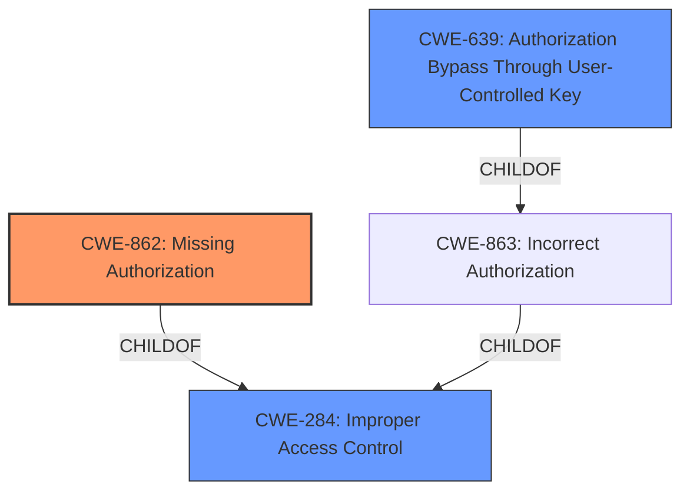

# Raw Analyzer Response for CVE-2022-0905

# Summary
| CWE ID  | CWE Name                      | Confidence | CWE Abstraction Level | CWE Vulnerability Mapping Label | CWE-Vulnerability Mapping Notes |
|---------|-------------------------------|------------|-----------------------|---------------------------------|---------------------------------|
| CWE-862 | Missing Authorization         | 0.9        | Class                 | Primary                           | Allowed-with-Review             |
| CWE-284 | Improper Access Control       | 0.7        | Pillar                  | Secondary                         | Discouraged                     |
| CWE-639 | Authorization Bypass Through User-Controlled Key | 0.6        | Base                  | Secondary                         | Allowed                     |

## Evidence and Confidence

*   **Confidence Score:** 0.9
*   **Evidence Strength:** HIGH

## Relationship Analysis
The primary CWE is CWE-862 **Missing Authorization**, a Class-level CWE. It is a child of CWE-284 **Improper Access Control**, which is a Pillar-level CWE. CWE-639 **Authorization Bypass Through User-Controlled Key** is a Base-level CWE and a child of CWE-863 **Incorrect Authorization**, which is also a child of CWE-284. The relationship that impacted the decision was primarily the parent-child relationship between CWE-862 and CWE-284, which helped narrow down the selection from the more general **Improper Access Control** to the more specific **Missing Authorization**. While CWE-639 is relevant, the description does not explicitly describe the bypass happening through user-controlled key, so it is a weaker match.

## Vulnerability Chain
The vulnerability chain starts with the **missing authorization** check in the go-gitea/gitea application. This leads to a potential access control issue, where unauthorized users can perform actions or access resources they should not be able to. The absence of the authorization check is the root cause, and the resulting unauthorized access is the impact.

## Summary of Analysis
The initial analysis identified the **missing authorization** as the primary weakness. The huntr.dev content and commit message confirm the security fix related to PAM authentication. The code changes now take the PAM returned username after authentication, addressing the vulnerability. The retriever results also highlight CWE-862 **Missing Authorization** and CWE-284 **Improper Access Control** as relevant.

The final decision is based on the evidence that the application **fails to perform an authorization check** (**missing authorization**).

*   The vulnerability description states: "**Missing Authorization** in GitHub repository go-gitea/gitea prior to 1.16.4."
*   The huntr.dev content indicates the root cause related to how PAM was being used, but the **underlying issue is still the missing authorization check** after the PAM module returns a transformed username.

The selection of CWE-862 is at the optimal level of specificity because it directly addresses the root cause of the vulnerability, which is the absence of an authorization check. CWE-284 is a more general category and is therefore less specific.
CWE-639 is related to authorization bypass through user-controlled key, which is not explicitly stated in the vulnerability description, making CWE-862 the most appropriate choice.

Relevant CWE Information:

# Enhanced Context (25 CWEs)

## CWE-212: Improper Removal of Sensitive Information Before Storage or Transfer
**Abstraction Level**: Base
**Similarity Score**: 0.78
**Source**: dense
This CWE is not relevant as it deals with the removal of sensitive information, and the vulnerability is about authorization.

## CWE-538: Insertion of Sensitive Information into Externally-Accessible File or Directory
**Abstraction Level**: Base
**Similarity Score**: 0.77
**Source**: dense
This CWE is not relevant as it deals with the insertion of sensitive information, and the vulnerability is about authorization.

## CWE-226: Sensitive Information in Resource Not Removed Before Reuse
**Abstraction Level**: Base
**Similarity Score**: 0.76
**Source**: dense
This CWE is not relevant as it deals with the removal of sensitive information, and the vulnerability is about authorization.

## CWE-668: Exposure of Resource to Wrong Sphere
**Abstraction Level**: Class
**Similarity Score**: 0.75
**Source**: dense
This CWE is too general and is discouraged. The vulnerability is specifically about authorization, and more specific CWEs are available.

## CWE-639: Authorization Bypass Through User-Controlled Key
**Abstraction Level**: Base
**Similarity Score**: 0.75
**Source**: dense
This CWE is a possible candidate, as it relates to authorization bypass. However, the description does not explicitly mention that the bypass is through a user-controlled key.

## CWE-807: Reliance on Untrusted Inputs in a Security Decision
**Abstraction Level**: Base
**Similarity Score**: 0.75
**Source**: dense
This CWE is not directly related to the described vulnerability, as the issue is not about relying on untrusted inputs but rather the **absence of an authorization check**.

## CWE-345: Insufficient Verification of Data Authenticity
**Abstraction Level**: Class
**Similarity Score**: 0.75
**Source**: dense
This CWE is not directly related to the described vulnerability, as the issue is not about data authenticity but rather the **absence of an authorization check**.

## CWE-203: Observable Discrepancy
**Abstraction Level**: Base
**Similarity Score**: 0.74
**Source**: dense
This CWE is not relevant as it relates to observable discrepancies and not authorization.

## CWE-41: Improper Resolution of Path Equivalence
**Abstraction Level**: Base
**Similarity Score**: 0.74
**Source**: dense
This CWE is not relevant as it relates to path equivalence and not authorization.

## CWE-319: Cleartext Transmission of Sensitive Information
**Abstraction Level**: Base
**Similarity Score**: 0.74
**Source**: dense
This CWE is not relevant as it relates to cleartext transmission and not authorization.

## CWE-639: Authorization Bypass Through User-Controlled Key
**Abstraction Level**: Base
**Similarity Score**: 6626.78
**Source**: sparse
This CWE is a possible candidate, as it relates to authorization bypass. However, the description does not explicitly mention that the bypass is through a user-controlled key.

## CWE-863: Incorrect Authorization
**Abstraction Level**: Class
**Similarity Score**: 6426.57
**Source**: sparse
This CWE is a possible candidate. However, the vulnerability is about **missing authorization**, not an incorrect one.

## CWE-285: Improper Authorization
**Abstraction Level**: Class
**Similarity Score**: 6303.21
**Source**: sparse
This CWE is discouraged as it's high-level. The vulnerability is specifically about **missing authorization**, and more specific CWEs are available.

## CWE-201: Insertion of Sensitive Information Into Sent Data
**Abstraction Level**: Base
**Similarity Score**: 6035.47
**Source**: sparse
This CWE is not relevant as it relates to sensitive information in sent data and not authorization.

## CWE-287: Improper Authentication
**Abstraction Level**: Class
**Similarity Score**: 6029.67
**Source**: sparse
This CWE is not directly related to the described vulnerability, as the issue is about **missing authorization**, not authentication.

## CWE-178: Improper Handling of Case Sensitivity
**Abstraction Level**: base
**Similarity Score**: 3.76
**Source**: graph
This CWE is not relevant as it relates to case sensitivity and not authorization.

## CWE-202: Exposure of Sensitive Information Through Data Queries
**Abstraction Level**: base
**Similarity Score**: 3.64
**Source**: graph
This CWE is not relevant as it relates to data queries and not authorization.

## CWE-1289: Improper Validation of Unsafe Equivalence in Input
**Abstraction Level**: base
**Similarity Score**: 3.64
**Source**: graph
This CWE is not directly related to the described vulnerability, as the issue is not about input validation but rather the **absence of an authorization check**.

## CWE-201: Insertion of Sensitive Information Into Sent Data
**Abstraction Level**: Base
**Similarity Score**: 3.32
**Source**: graph
This