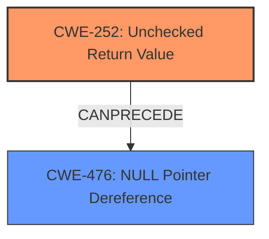

# Enhanced Analysis for CVE-2022-0907

# Summary
| CWE ID | CWE Name | Confidence | CWE Abstraction Level | CWE Vulnerability Mapping Label | CWE-Vulnerability Mapping Notes |
|---|---|---|---|---|---|
| CWE-252 | Unchecked Return Value | 1.0 | Base | Allowed | Primary CWE |
| CWE-476 | NULL Pointer Dereference | 1.0 | Base | Allowed | Secondary Candidate |

## Evidence and Confidence

*   **Confidence Score:** 1.0
*   **Evidence Strength:** HIGH

## Relationship Analysis
The primary weakness is CWE-252 [Unchecked Return Value], which can lead to CWE-476 [NULL Pointer Dereference]. The relationship is that the unchecked return value (failure to check if memory allocation was successful) results in a NULL pointer being used later in the code. CWE-252 is a parent of CWE-476 in that a missing check can cause the pointer to be used when NULL.



## Vulnerability Chain
The vulnerability chain starts with the **failure to check the return value** of a memory allocation function. This **unchecked return value** leads to the use of a NULL pointer, and the subsequent dereference of this NULL pointer causes a denial-of-service.

## Summary of Analysis
The initial assessment based on the vulnerability description indicates that the primary weakness is due to an **unchecked return value** which then leads to a **NULL pointer dereference**.

The vulnerability description states: "**Unchecked Return Value to NULL Pointer Dereference** in tiffcrop in libtiff 4.3.0 allows attackers to cause a denial-of-service via a crafted tiff file."

The CVE Reference Links Content Summary states that the root cause is due to memory allocation failing and a NULL pointer being used in `_TIFFmemset`, triggered by a specially crafted TIFF file and the `-H` option. This means the return value of the memory allocation was not checked.

The Retriever Results also show both CWE-252 [Unchecked Return Value] and CWE-476 [NULL Pointer Dereference] as top candidates. CWE-690 [Unchecked Return Value to NULL Pointer Dereference] is also a candidate but is discouraged in favor of mapping the separate weaknesses in the chain.

The selection of CWE-252 [Unchecked Return Value] as the primary CWE is appropriate because the root cause lies in the **failure to check the return value** of a function, in this case a memory allocation. This omission leads directly to the subsequent **NULL pointer dereference**, which is the impact.
CWE-476 [NULL Pointer Dereference] is appropriate as a secondary CWE as it follows as a result of the **unchecked return value**.

The selected CWEs are at the optimal level of specificity (Base) as they directly address the root cause and the subsequent error condition.

Other CWEs considered but not used:

*   CWE-690: Unchecked Return Value to NULL Pointer Dereference - This is a compound CWE and is discouraged in favor of mapping to each separate weakness in the chain.
*   CWE-824: Access of Uninitialized Pointer - This is not the primary issue, as the pointer becomes NULL due to a failed allocation, not due to a lack of initialization.
*   CWE-789: Memory Allocation with Excessive Size Value, CWE-1325: Improperly Controlled Sequential Memory Allocation: While excessive memory allocation could be a contributing factor, the core issue is the failure to check the return value of the allocation, making these less relevant.
*   CWE-190: Integer Overflow or Wraparound, CWE-191: Integer Underflow (Wrap or Wraparound): These CWEs are about arithmetic errors and are not relevant here.
* CWE-120: Buffer Copy without Checking Size of Input ('Classic Buffer Overflow'), CWE-787: Out-of-bounds Write: These relate to buffer overflows and out-of-bounds writes, which are not the primary concern in this vulnerability description.
* CWE-89: Improper Neutralization of Special Elements used in an SQL Command ('SQL Injection'): This is for SQL Injection.
* CWE-617: Reachable Assertion: The DOS is a crash and not specifically triggered by an assert.


## CWE Relationship Analysis

Current CWEs represent these abstraction levels: .


### Vulnerability Chain Analysis

**Chain starting from CWE-190:**
- 190 (Integer Overflow or Wraparound) - ROOT


**Chain starting from CWE-1325:**
- 1325 (Improperly Controlled Sequential Memory Allocation) - ROOT


### CWE Relationship Diagram

```mermaid
graph TD
    classDef primary fill:#f96,stroke:#333,stroke-width:2px
    classDef secondary fill:#69f,stroke:#333
    classDef tertiary fill:#9e9,stroke:#333
```