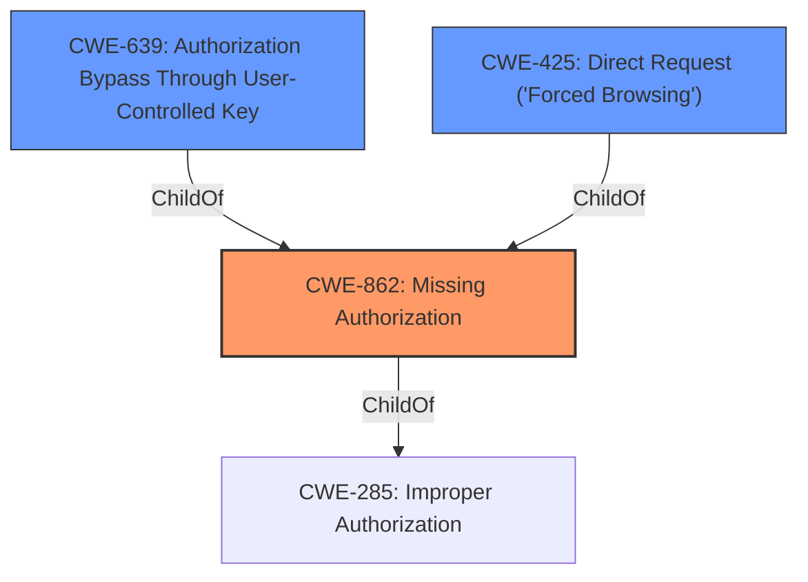

# Raw Analyzer Response for CVE-2022-0920

# Summary
| CWE ID | CWE Name | Confidence | CWE Abstraction Level | CWE Vulnerability Mapping Label | CWE-Vulnerability Mapping Notes |
|---|---|---|---|---|---|
| CWE-862 | Missing Authorization | 0.9 | Class | Primary | Allowed-with-Review |
| CWE-639 | Authorization Bypass Through User-Controlled Key | 0.7 | Base | Secondary | Allowed |
| CWE-425 | Direct Request ('Forced Browsing') | 0.6 | Base | Secondary | Allowed |

## Evidence and Confidence

*   **Confidence Score:** 0.8
*   **Evidence Strength:** HIGH

## Relationship Analysis
The primary CWE is CWE-862, indicating a **lack of authorization**. CWE-862 is a child of CWE-285 (Improper Authorization), which is a more general class. CWE-639 and CWE-425 are both base-level CWEs that can contribute to authorization bypass. CWE-639 highlights that the system's authorization **fails to prevent unauthorized access** through manipulation of user-controlled keys. CWE-425 arises when the web application **fails to enforce authorization** on restricted URLs and files.

## Vulnerability Chain
The chain starts with the **lack of proper authorization** (CWE-862) in the plugin's API endpoints. This allows customers to bypass authorization (CWE-639) and directly request (CWE-425) resources they should not have access to, leading to the unauthorized disclosure of all bookings and customer data.

## Summary of Analysis
The vulnerability is primarily due to the **missing authorization** checks in certain API endpoints of the Salon booking system WordPress plugin. This **allows customers to access all bookings and other customers' data**, which they should not be able to access.

The vulnerability description states that the plugin "**do not have proper authorisation** in some of its endpoints, which could allow customers to access all bookings and other customers data". The CVE Reference Links Content Summary states that the **root cause of the vulnerability** is that "The plugin **lacks proper authorization checks** in some of its API endpoints". It also confirms the **weaknesses/vulnerabilities** are "Incorrect authorization, broken access control. Specifically, customer accounts can access all bookings and other customer data".

The retriever results suggested CWE-863 (Incorrect Authorization), CWE-862 (Missing Authorization), CWE-639 (Authorization Bypass Through User-Controlled Key) and CWE-425 (Direct Request ('Forced Browsing')).

CWE-862 is selected as the primary CWE because the vulnerability description explicitly mentions a **lack of proper authorization**. CWE-862's description states "The product does not perform an authorization check when an actor attempts to access a resource or perform an action." which is a direct match. The Usage for CWE-862 is Allowed-with-Review because it is a Class.

CWE-639 is a secondary CWE because it indicates that a user can gain access to another user's data by modifying the key value identifying the data. This is likely how the customers are accessing other customers' data.

CWE-425 is also included, as it explains that the application "does not adequately enforce appropriate authorization on all restricted URLs, scripts, or files.". This is confirmed in the CVE Reference Links Content Summary by the fact that the vulnerability can be exploited via the plugin's REST API endpoints `/salon/api/v1/bookings/` and `/salon/api/v1/customers/`.

CWE-863 was considered but not selected as the primary because while authorization is "incorrect", the more fundamental problem is that it is **missing**.

Relevant CWE Information:

# Enhanced Context (25 CWEs)
The following CWEs were identified as potentially relevant to this vulnerability:

## CWE-23: Relative Path Traversal
**Abstraction Level**: Base
**Similarity Score**: 0.80
**Source**: dense

**Description**:
The product uses external input to construct a pathname that should be within a restricted directory, but it does not properly neutralize sequences such as ".." that can resolve to a location that is outside of that directory.

**Mapping Guidance**:
- Usage: Allowed
- Rationale: This CWE entry is at the Base level of abstraction, which is a preferred level of abstraction for mapping to the root causes of vulnerabilities.

## CWE-36: Absolute Path Traversal
**Abstraction Level**: Base
**Similarity Score**: 0.79
**Source**: dense

**Description**:
The product uses external input to construct a pathname that should be within a restricted directory, but it does not properly neutralize absolute path sequences such as "/abs/path" that can resolve to a location that is outside of that directory.

**Mapping Guidance**:
- Usage: Allowed
- Rationale: This CWE entry is at the Base level of abstraction, which is a preferred level of abstraction for mapping to the root causes of vulnerabilities.

## CWE-41: Improper Resolution of Path Equivalence
**Abstraction Level**: Base
**Similarity Score**: 0.79
**Source**: dense

**Description**:
The product is vulnerable to file system contents disclosure through path equivalence. Path equivalence involves the use of special characters in file and directory names. The associated manipulations are intended to generate multiple names for the same object.

**Mapping Guidance**:
- Usage: Allowed
- Rationale: This CWE entry is at the Base level of abstraction, which is a preferred level of abstraction for mapping to the root causes of vulnerabilities.

## CWE-425: Direct Request ('Forced Browsing')
**Abstraction Level**: Base
**Similarity Score**: 0.78
**Source**: dense

**Description**:
The web application does not adequately enforce appropriate authorization on all restricted URLs, scripts, or files.

**Mapping Guidance**:
- Usage: Allowed
- Rationale: This CWE entry is at the Base level of abstraction, which is a preferred level of abstraction for mapping to the root causes of vulnerabilities.

## CWE-639: Authorization Bypass Through User-Controlled Key
**Abstraction Level**: Base
**Similarity Score**: 0.77
**Source**: dense

**Description**:
The system's authorization functionality does not prevent one user from gaining access to another user's data or record by modifying the key value identifying the data.

**Mapping Guidance**:
- Usage: Allowed
- Rationale: This CWE entry is at the Base level of abstraction, which is a preferred level of abstraction for mapping to the root causes of vulnerabilities.

## CWE-552: Files or Directories Accessible to External Parties
**Abstraction Level**: Base
**Similarity Score**: 0.77
**Source**: dense

**Description**:
The product makes files or directories accessible to unauthorized actors, even though they should not be.

**Mapping Guidance**:
- Usage: Allowed
- Rationale: This CWE entry is at the Base level of abstraction, which is a preferred level of abstraction for mapping to the root causes of vulnerabilities.

## CWE-73: External Control of File Name or Path
**Abstraction Level**: Base
**Similarity Score**: 0.76
**Source**: dense

**Description**:
The product allows user input to control or influence paths or file names that are used in filesystem operations.

**Mapping Guidance**:
- Usage: Allowed
- Rationale: This CWE entry is at the Base level of abstraction, which is a preferred level of abstraction for mapping to the root causes of vulnerabilities.

## CWE-59: Improper Link Resolution Before File Access ('Link Following')
**Abstraction Level**: Base
**Similarity Score**: 0.76
**Source**: dense

**Description**:
The product attempts to access a file based on the filename, but it does not properly prevent that filename from identifying a link or shortcut that resolves to an unintended resource.

**Mapping Guidance**:
- Usage: Allowed
- Rationale: This CWE entry is at the Base level of abstraction, which is a preferred level of abstraction for mapping to the root causes of vulnerabilities.

## CWE-472: External Control of Assumed-Immutable Web Parameter
**Abstraction Level**: Base
**Similarity Score**: 0.76
**Source**: dense

**Description**:
The web application does not sufficiently verify inputs that are assumed to be immutable but are actually externally controllable, such as hidden form fields.

**Mapping Guidance**:
- Usage: Allowed
- Rationale: This CWE entry is at the Base level