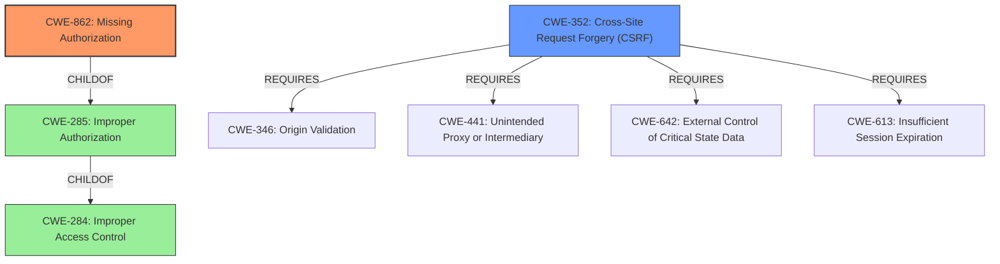

# Analysis Report for CVE-2022-0952

# Vulnerability Analysis Report: CVE-2022-0952

## Description


## Analysis (with Relationship Data)

# Summary
| CWE ID  | CWE Name                                                                        | Confidence | CWE Abstraction Level | CWE Vulnerability Mapping Label | CWE-Vulnerability Mapping Notes |
| :-------- | :------------------------------------------------------------------------------ | :--------- | :---------------------- | :------------------------------ | :------------------------------ |
| CWE-862   | Missing Authorization                                                         | 0.9        | Class                   | Primary                         | Allowed-with-Review             |
| CWE-352   | Cross-Site Request Forgery (CSRF)                                             | 0.8        | Compound                | Secondary                       | Allowed                         |

## Evidence and Confidence

*   **Confidence Score:** 0.85
*   **Evidence Strength:** HIGH

## Relationship Analysis

The primary weakness is the **lack of authorization** checks (CWE-862) on a REST endpoint. This means that the application doesn't verify if the user has the necessary permissions to perform the requested action, which is updating options. In addition, the **lack of CSRF checks** (CWE-352) makes it possible for an attacker to craft a malicious request and trick an authenticated user into executing it without their knowledge or consent. CWE-862 is a child of CWE-285 (Improper Authorization) and CWE-284 (Improper Access Control), but CWE-862 is more specific. CWE-352 requires other CWEs to be effective: CWE-346 (Origin Validation), CWE-441 (Unintended Proxy or Intermediary), CWE-642 (External Control of Critical State Data) and CWE-613 (Insufficient Session Expiration).



## Vulnerability Chain

The vulnerability chain starts with the **lack of authorization** and CSRF checks, leading to the ability to change arbitrary blog options, and ultimately allowing an attacker to create a new admin account and take over the blog.

**Chain:**

1.  **Missing Authorization (CWE-862)**: The plugin **does not perform an authorization check** when updating options via a REST endpoint.
2.  **Cross-Site Request Forgery (CWE-352)**: There is a **lack of CSRF checks**.
3.  **Change Arbitrary Blog Options**: Unauthenticated attackers can **change arbitrary blog options**.
4.  **Create New Admin Account and Take Over Blog**: Attackers can create a new admin account and **take over the blog**.

## Summary of Analysis

The primary weakness is the **lack of authorization** checks (CWE-862), which allows unauthenticated attackers to access sensitive functionality. The secondary weakness is the **lack of CSRF protection** (CWE-352), which allows attackers to potentially exploit authenticated users.

The vulnerability description clearly states the **rootcause** as a "**lack of authorization and CSRF checks**". The "CVE Reference Links Content Summary" reinforces this by mentioning "**missing authorization checks** for the REST endpoint" and "**lack of CSRF protection**".

CWE-862 (Missing Authorization) is the most appropriate primary CWE because it directly addresses the **lack of authorization** checks. The description of CWE-862 states: "The product **does not perform an authorization check** when an actor attempts to access a resource or perform an action." This aligns perfectly with the vulnerability description.

CWE-352 (Cross-Site Request Forgery (CSRF)) is a relevant secondary CWE because the vulnerability description also mentions the **lack of CSRF checks**. This allows attackers to potentially exploit authenticated users by crafting malicious requests.

CWE-284 (Improper Access Control) and CWE-285 (Improper Authorization) were considered but are too high-level. CWE-862 is a child of both of these and is more specific to the **missing authorization** aspect of the vulnerability.

CWE-425 (Direct Request ('Forced Browsing')) was considered, but it is less relevant than CWE-862 because the main issue is the **missing authorization** check, not necessarily the direct access to the endpoint. While the endpoint is directly accessible, the core problem is the absence of authorization.

CWE-306 (Missing Authentication for Critical Function) was considered, but the vulnerability description does not indicate that authentication is entirely missing, only that authorization checks are missing after authentication (if any) has occurred.

CWE-471 (Modification of Assumed-Immutable Data (MAID)) was considered, but the evidence does not suggest the modification of assumed-immutable data. The issue is more about the **lack of authorization** to perform actions.

CWE-434 (Unrestricted Upload of File with Dangerous Type) was not relevant as the vulnerability does not involve file uploads.

CWE-862 is at the Class level, which is acceptable as there isn't a more specific Base or Variant CWE that directly addresses the **missing authorization** issue. CWE-352 is at the Compound level, which is also acceptable as it describes a combination of weaknesses leading to CSRF.


## CWE Relationship Analysis

Current CWEs represent these abstraction levels: .


### Vulnerability Chain Analysis

**Chain starting from CWE-862:**
- 862 (Missing Authorization) - ROOT


**Chain starting from CWE-425:**
- 425 (Direct Request ('Forced Browsing')) - ROOT


### CWE Relationship Diagram

```mermaid
graph TD
    classDef primary fill:#f96,stroke:#333,stroke-width:2px
    classDef secondary fill:#69f,stroke:#333
    classDef tertiary fill:#9e9,stroke:#333
```


*Report generated on 2025-03-30 13:09:55*
