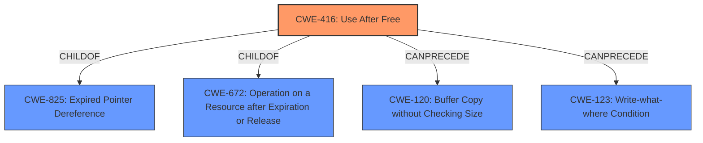

# Enhanced Analysis for CVE-2022-0971

# Summary
| CWE ID | CWE Name | Confidence | CWE Abstraction Level | CWE Vulnerability Mapping Label | CWE-Vulnerability Mapping Notes |
|---|---|---|---|---|---|
| CWE-416 | Use After Free | 1.0 | Variant | Allowed | Primary CWE |

## Evidence and Confidence

*   **Confidence Score:** 1.0
*   **Evidence Strength:** HIGH

## Relationship Analysis
The primary relationship that influenced the selection of CWE-416 is its Variant status, offering a specific classification for the **use-after-free** condition. The `CANPRECEDE` relationship to CWE-120 (Buffer Copy without Checking Size) and CWE-123 (Write-What-Where Condition) highlight potential attack vectors that could lead to the **use-after-free**. CWE-416 is also a child of CWE-825 (Expired Pointer Dereference) and CWE-672 (Operation on a Resource after Expiration or Release), placing it within the broader context of memory management issues.



## Vulnerability Chain
The vulnerability chain begins with the **use-after-free** condition (CWE-416) in the Blink Layout component. The exploitation involves a crafted HTML page, leading to potential **heap corruption**.

## Summary of Analysis
The vulnerability description clearly indicates a **use-after-free** (**rootcause**) condition in Blink Layout. The primary evidence supporting this is the "Vulnerability Description Key Phrases" which has "**rootcause:** **use after free**" and the "CVE Reference Links Content Summary" which states "The vulnerability is a "Use after free" error within the Blink Layout component of Chromium." The **weakness** is identified as **heap corruption**.

The selection of CWE-416 (Use After Free) is based on the direct match with the vulnerability description and the retriever results. The retriever results ranked CWE-416 as the top candidate. The CWE-416 description, "The product reuses or references memory after it has been freed," aligns perfectly with the **use-after-free** condition. The "Mapping Guidance" for CWE-416 specifies "Usage: Allowed" and "Rationale: This CWE entry is at the Variant level of abstraction, which is a preferred level of abstraction for mapping to the root causes of vulnerabilities."

CWE-787 (Out-of-bounds Write) was considered, as it is often a consequence of memory corruption; however, the initial **rootcause** is the **use-after-free**, making CWE-416 the more appropriate primary mapping. Other CWEs like CWE-366 (Race Condition within a Thread) and CWE-843 (Access of Resource Using Incompatible Type) were deemed less relevant as the description does not explicitly point to these conditions.


## CWE Relationship Analysis

Current CWEs represent these abstraction levels: .


### Vulnerability Chain Analysis

**Chain starting from CWE-825:**
- 825 (Expired Pointer Dereference) - ROOT


**Chain starting from CWE-672:**
- 672 (Operation on a Resource after Expiration or Release) - ROOT


### CWE Relationship Diagram

```mermaid
graph TD
    classDef primary fill:#f96,stroke:#333,stroke-width:2px
    classDef secondary fill:#69f,stroke:#333
    classDef tertiary fill:#9e9,stroke:#333
```