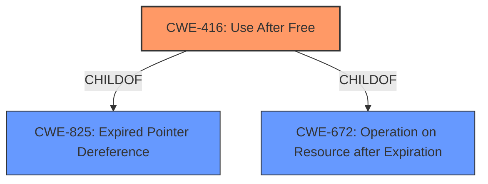

# Raw Analyzer Response for CVE-2022-0972

# Summary
| CWE ID | CWE Name | Confidence | CWE Abstraction Level | CWE Vulnerability Mapping Label | CWE-Vulnerability Mapping Notes |
|---|---|---|---|---|---|
| CWE-416 | Use After Free | 1.0 | Variant | Allowed | Primary CWE |

## Evidence and Confidence

*   **Confidence Score:** 1.0
*   **Evidence Strength:** HIGH

## Relationship Analysis
The primary identified CWE is CWE-416, which is a Variant of CWE-825 (Expired Pointer Dereference) and CWE-672 (Operation on Resource after Expiration). The vulnerability description explicitly mentions "use after free," making CWE-416 the most direct and specific match. No other relationships strongly influence the selection, as the primary focus is on the root cause directly described.

## Vulnerability Chain
The chain of events is as follows:
1.  **Root Cause:** CWE-416 (**Use After Free**) occurs in the Extensions component of Google Chrome.
2.  The attacker convinces a user to install a malicious extension.
3.  The attacker crafts a malicious HTML page.
4.  The crafted HTML page triggers the **use-after-free**, leading to **heap corruption**.

## Summary of Analysis
The analysis is primarily based on the explicit mention of "**use after free**" in both the vulnerability description and the "CVE Reference Links Content Summary". The primary CWE match from similar CVE descriptions is CWE-416 (**Use After Free**), and the retriever results also list CWE-416 as the top candidate.

The description for CWE-416 states: "The product reuses or references memory after it has been freed...Any operations using the original pointer are no longer valid." This aligns directly with the vulnerability description.

The provided evidence strongly supports the selection of CWE-416 as the primary weakness. The other CWEs were considered but were not selected because they did not directly match the root cause described in the vulnerability. For instance, CWE-366 (**Race Condition within a Thread**) and CWE-362 (**Concurrent Execution using Shared Resource with Improper Synchronization ('Race Condition')**) were considered due to their appearance in the retriever results, but there is no mention of concurrency or threading issues in the vulnerability description. Similarly, CWE-122 (**Heap-based Buffer Overflow**) was considered due to the mention of "heap corruption," but the root cause is clearly identified as "**use after free**," not a buffer overflow.
The selection of CWE-416 is at the optimal level of specificity (Variant) as it directly describes the **use-after-free** condition.

Relevant CWE Information:

# Enhanced Context (25 CWEs)

## CWE-416: Use After Free
**Abstraction:** Variant
**Status:** Stable

### Description
The product reuses or references memory after it has been freed. At some point afterward, the memory may be allocated again and saved in another pointer, while the original pointer references a location somewhere within the new allocation. Any operations using the original pointer are no longer valid because the memory "belongs" to the code that operates on the new pointer.

### Extended Description
Not provided

### Alternative Terms
Dangling pointer: a pointer that no longer points to valid memory, often after it has been freed
UAF: commonly used acronym for Use After Free
Use-After-Free

### Relationships
ChildOf -> CWE-825
ChildOf -> CWE-672
ChildOf -> CWE-672
ChildOf -> CWE-672
CanPrecede -> CWE-120
CanPrecede -> CWE-123

### Mapping Guidance
**Usage:** Allowed
**Rationale:** This CWE entry is at the Variant level of abstraction, which is a preferred level of abstraction for mapping to the root causes of vulnerabilities.
**Comments:** Carefully read both the name and description to ensure that this mapping is an appropriate fit. Do not try to 'force' a mapping to a lower-level Base/Variant simply to comply with this preferred level of abstraction.
**Reasons:**
- Acceptable-Use

### Observed Examples
- **CVE-2022-20141:** Chain: an operating system kernel has insufficent resource locking (CWE-413) leading to a use after free (CWE-416).
- **CVE-2022-2621:** Chain: two threads in a web browser use the same resource (CWE-366), but one of those threads can destroy the resource before the other has completed (CWE-416).
- **CVE-2021-0920:** Chain: mobile platform race condition (CWE-362) leading to use-after-free (CWE-416), as exploited in the wild per CISA KEV.