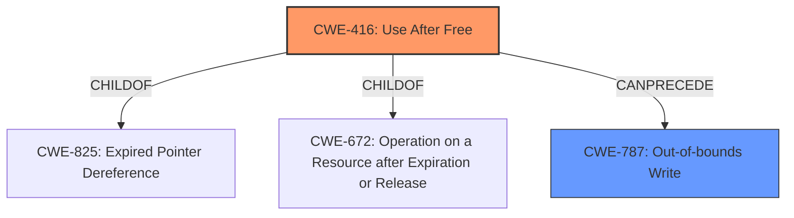

# Raw Analyzer Response for CVE-2022-0974

# Summary
| CWE ID | CWE Name | Confidence | CWE Abstraction Level | CWE Vulnerability Mapping Label | CWE-Vulnerability Mapping Notes |
|---|---|---|---|---|---|
| CWE-416 | Use After Free | 1.0 | Variant | Allowed | Primary CWE |
| CWE-787 | Out-of-bounds Write | 0.5 | Base | Allowed | Secondary Candidate |

## Evidence and Confidence

*   **Confidence Score:** 0.8
*   **Evidence Strength:** HIGH

## Relationship Analysis
The primary relationship considered was the hierarchical structure of CWEs, specifically the ChildOf relationship. CWE-416 is a Variant, making it more specific than its parent CWEs, but in this case, the description focuses on the **use after free** condition, and not on what caused it, so selecting the Variant is appropriate. CWE-787 was considered because **heap corruption** can often lead to out-of-bounds writes.

## Vulnerability Chain
The vulnerability chain starts with a crafted HTML page leading to a **use after free** condition in the Splitscreen component of Google Chrome, which then allows for potential **heap corruption**.

## Summary of Analysis
The initial analysis strongly pointed towards CWE-416 due to the explicit mention of "**use after free**" in both the vulnerability description and the CVE Reference Links Content Summary. The primary CWE match from similar CVE descriptions also reinforced this choice.

The evidence:
- Vulnerability Description Key Phrases:
  - **rootcause:** **use after free**
  - **weakness:** **heap corruption**
- CVE Reference Links Content Summary:
  - "root_cause": "Use after free in Splitscreen."
  - "weaknesses": ["Use after free"]

The graph relationships and the retriever results further solidified the selection of CWE-416.

CWE-787 was considered as a potential secondary CWE due to the mention of "**heap corruption**," which can often lead to out-of-bounds writes. However, the primary focus of the description is on the **use after free** condition, so CWE-416 is the more appropriate primary classification.

The selection of CWE-416 as the primary CWE is at the optimal level of specificity because it directly reflects the **root cause** of the vulnerability as described in the provided information.

Relevant CWE Information:

# Enhanced Context (25 CWEs)

## CWE-226: Sensitive Information in Resource Not Removed Before Reuse
**Abstraction Level**: Base
**Similarity Score**: 0.77
**Source**: dense
This CWE was not selected because the vulnerability does not pertain to sensitive information being present in reused memory, but to the memory being freed and then reused.

## CWE-665: Improper Initialization
**Abstraction Level**: Class
**Similarity Score**: 0.77
**Source**: dense
This CWE was not selected because the vulnerability does not pertain to resources not being initialized correctly.

## CWE-404: Improper Resource Shutdown or Release
**Abstraction Level**: Class
**Similarity Score**: 0.77
**Source**: dense
This CWE was not selected because the vulnerability is not about improper shutdown or release, but about using memory after it has been freed.

## CWE-667: Improper Locking
**Abstraction Level**: Class
**Similarity Score**: 0.76
**Source**: dense
This CWE was not selected because the vulnerability does not pertain to improper locking of resources.

## CWE-366: Race Condition within a Thread
**Abstraction Level**: Base
**Similarity Score**: 0.76
**Source**: dense
This CWE was not selected because the vulnerability does not appear to be a race condition.

## CWE-662: Improper Synchronization
**Abstraction Level**: Class
**Similarity Score**: 0.75
**Source**: dense
This CWE was not selected because the vulnerability does not pertain to synchronization issues.

## CWE-909: Missing Initialization of Resource
**Abstraction Level**: Class
**Similarity Score**: 0.75
**Source**: dense
This CWE was not selected because the vulnerability does not pertain to missing initialization of resources.

## CWE-754: Improper Check for Unusual or Exceptional Conditions
**Abstraction Level**: Class
**Similarity Score**: 0.74
**Source**: dense
This CWE was not selected because the vulnerability does not pertain to checking for unusual conditions.

## CWE-356: Product UI does not Warn User of Unsafe Actions
**Abstraction Level**: Base
**Similarity Score**: 0.74
**Source**: dense
This CWE was not selected because the vulnerability does not pertain to unsafe actions and UI warnings.

## CWE-653: Improper Isolation or Compartmentalization
**Abstraction Level**: Class
**Similarity Score**: 0.74
**Source**: dense
This CWE was not selected because the vulnerability does not pertain to improper isolation.

## CWE-364: Signal Handler Race Condition
**Abstraction Level**: Base
**Similarity Score**: 6887.80
**Source**: sparse
This CWE was not selected because the vulnerability does not pertain to signal handlers.

## CWE-362: Concurrent Execution using Shared Resource with Improper Synchronization ('Race Condition')
**Abstraction Level**: Class
**Similarity Score**: 5946.06
**Source**: sparse
This CWE was not selected because the vulnerability does not appear to be a race condition.

## CWE-415: Double Free
**Abstraction Level**: Variant
**Similarity Score**: 5864.57
**Source**: sparse
This CWE was not selected because the vulnerability is a use after free, not a double free.

## CWE-828: Signal Handler with Functionality that is not Asynchronous-Safe
**Abstraction Level**: Variant
**Similarity Score**: 5725.42
**Source**: sparse
This CWE was not selected because the vulnerability does not pertain to signal handlers.

## CWE-667: Improper Locking
**Abstraction Level**: Class
**Similarity Score**: 5641.21
**Source**: sparse
This CWE was not selected because the vulnerability does not pertain to improper locking.

## CWE-123: Write-what-where Condition
**Abstraction Level**: base
**Similarity Score**: 5.03
**Source**: graph
This CWE was not selected because it's a consequence of other weaknesses, not the primary weakness described.

## CWE-416: Use After Free
**Abstraction Level**: variant
**Similarity Score**: 4.53
**Source**: graph
This CWE was selected as the primary CWE as described above.

## CWE-415: Double Free
**Abstraction Level**: variant
**Similarity Score**: 4.53
**Source**: graph
This CWE was not selected because the vulnerability is a use after free, not a double free.

## CWE-364: Signal Handler Race Condition
**Abstraction Level**: base
**Similarity Score**: 4.33
**Source**: graph
This CWE was not selected because the vulnerability does not pertain to signal handlers.

## CWE-120: Buffer Copy without Checking Size of Input ('Classic Buffer Overflow')
**Abstraction Level**: base
**Similarity Score**: 4.33
**Source**: graph
This CWE was not selected because the vulnerability is not a buffer overflow.

## CWE-825: Expired Pointer Dereference
**Abstraction Level**: base
**Similarity Score**: 4.33
**Source**: graph
This CWE was not selected directly but is related as a parent of CWE-416.

## CWE-476: NULL Pointer Dereference
**Abstraction Level**: base
**Similarity Score**: 4.33
**Source**: graph
This CWE was not selected because the vulnerability is not a null pointer dereference.

## CWE-787: Out-of-bounds Write
**Abstraction Level**: base
**Similarity Score**: 4.33
**Source**: graph
This CWE was considered as a secondary CWE due to the potential for heap corruption leading to out-of-bounds writes.

## CWE-170: Improper Null Termination
**Abstraction Level**: base
**Similarity Score**: 4.33
**Source**: graph
This CWE was not selected because the vulnerability does not pertain to null termination issues.

## CWE-1341: Multiple Releases of Same Resource or Handle
**Abstraction Level**: base
**Similarity Score**: 4.33
**Source