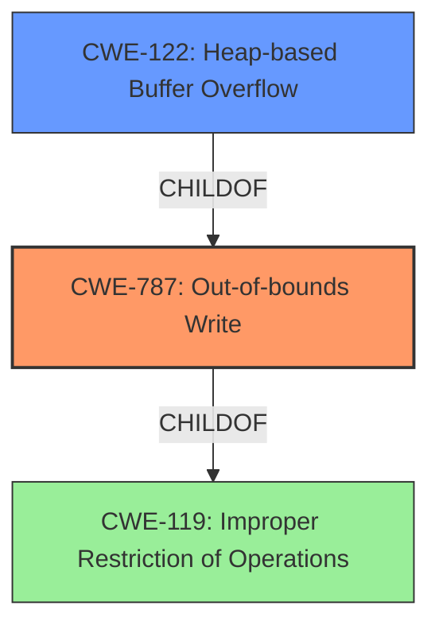

# Raw Analyzer Response for CVE-2022-0976

# Summary
| CWE ID | CWE Name | Confidence | CWE Abstraction Level | CWE Vulnerability Mapping Label | CWE-Vulnerability Mapping Notes |
|---|---|---|---|---|---|
| CWE-787 | Out-of-bounds Write | 1.0 | Base | Primary | Allowed |
| CWE-122 | Heap-based Buffer Overflow | 0.8 | Variant | Secondary | Allowed |
| CWE-119 | Improper Restriction of Operations within the Bounds of a Memory Buffer | 0.6 | Class | Secondary | Discouraged |

## Evidence and Confidence

*   **Confidence Score:** 0.9
*   **Evidence Strength:** HIGH

## Relationship Analysis
The primary CWE is CWE-787, which is a base-level CWE. CWE-122 is a variant of CWE-787, specifying that the out-of-bounds write occurs on the heap. CWE-119 is a class-level CWE representing a general improper restriction of operations within memory bounds. CWE-787 is a child of CWE-119, providing more specific details about the vulnerability.

## Vulnerability Chain
The vulnerability chain starts with a crafted HTML page leading to a **heap buffer overflow** (CWE-787), which results in heap corruption.

## Summary of Analysis
The analysis indicates a heap **buffer overflow** vulnerability in Google Chrome's GPU component. The primary evidence for this is the **Vulnerability Description** which states "Heap **buffer overflow** in GPU in Google Chrome prior to 99.0.4844.74 allowed a remote attacker to potentially exploit heap corruption via a crafted HTML page." Also the **CVE Reference Links Content Summary** confirms the "**root_cause**" as "Heap buffer overflow in GPU."

Given the description and the root cause, CWE-787 (Out-of-bounds Write) is the most appropriate primary CWE. CWE-122 (Heap-based Buffer Overflow) provides more specific context as a variant of CWE-787, indicating that the **buffer overflow** occurs on the heap. While CWE-119 (Improper Restriction of Operations within the Bounds of a Memory Buffer) is a broader classification, the specific nature of the **buffer overflow** justifies the selection of the more specific CWE-787 and CWE-122.

CWE-787 is selected because the vulnerability involves writing data past the end of the allocated buffer. The vulnerability description clearly indicates a "heap **buffer overflow**," which directly corresponds to the characteristics of CWE-787.

CWE-122 is considered as a secondary CWE as it specifies that the **buffer overflow** is heap-based, providing additional context to the vulnerability.

CWE-119 is considered, but discouraged because it is too general. It doesn't provide the specific details of an out-of-bounds write, but rather a general improper restriction.

Other CWEs considered but not used:

*   CWE-190 and CWE-191 (Integer Overflow/Underflow): While integer issues can sometimes lead to **buffer overflows**, there's no explicit mention of integer overflows or underflows in the vulnerability description or CVE details.
*   CWE-416 (Use After Free): There is no evidence of memory being freed and then reused.
*   CWE-120 (Buffer Copy without Checking Size): While this could describe a **buffer overflow**, the description doesn't explicitly mention a copy operation.
*   CWE-125 (Out-of-bounds Read) and CWE-124 (Buffer Underwrite): The description focuses on a **buffer overflow**, which implies writing out of bounds, not reading.

Relevant CWE Information:

# Enhanced Context (25 CWEs)
The following CWEs were identified as potentially relevant to this vulnerability:

## CWE-124: Buffer Underwrite ('Buffer Underflow')
**Abstraction Level**: Base
**Similarity Score**: 0.79
**Source**: dense

**Description**:
The product writes to a buffer using an index or pointer that references a memory location prior to the beginning of the buffer.

**Mapping Guidance**:
- Usage: Allowed
- Rationale: This CWE entry is at the Base level of abstraction, which is a preferred level of abstraction for mapping to the root causes of vulnerabilities.

## CWE-805: Buffer Access with Incorrect Length Value
**Abstraction Level**: Base
**Similarity Score**: 0.79
**Source**: dense

**Description**:
The product uses a sequential operation to read or write a buffer, but it uses an incorrect length value that causes it to access memory that is outside of the bounds of the buffer.

**Mapping Guidance**:
- Usage: Allowed
- Rationale: This CWE entry is at the Base level of abstraction, which is a preferred level of abstraction for mapping to the root causes of vulnerabilities.

## CWE-191: Integer Underflow (Wrap or Wraparound)
**Abstraction Level**: Base
**Similarity Score**: 0.78
**Source**: dense

**Description**:
The product subtracts one value from another, such that the result is less than the minimum allowable integer value, which produces a value that is not equal to the correct result.

**Mapping Guidance**:
- Usage: Allowed
- Rationale: This CWE entry is at the Base level of abstraction, which is a preferred level of abstraction for mapping to the root causes of vulnerabilities.

## CWE-127: Buffer Under-read
**Abstraction Level**: Variant
**Similarity Score**: 0.78
**Source**: dense

**Description**:
The product reads from a buffer using buffer access mechanisms such as indexes or pointers that reference memory locations prior to the targeted buffer.

**Mapping Guidance**:
- Usage: Allowed
- Rationale: This CWE entry is at the Variant level of abstraction, which is a preferred level of abstraction for mapping to the root causes of vulnerabilities.

## CWE-131: Incorrect Calculation of Buffer Size
**Abstraction Level**: Base
**Similarity Score**: 0.78
**Source**: dense

**Description**:
The product does not correctly calculate the size to be used when allocating a buffer, which could lead to a buffer overflow.

**Mapping Guidance**:
- Usage: Allowed
- Rationale: This CWE entry is at the Base level of abstraction, which is a preferred level of abstraction for mapping to the root causes of vulnerabilities.

## CWE-126: Buffer Over-read
**Abstraction Level**: Variant
**Similarity Score**: 0.77
**Source**: dense

**Description**:
The product reads from a buffer using buffer access mechanisms such as indexes or pointers that reference memory locations after the targeted buffer.

**Mapping Guidance**:
- Usage: Allowed
- Rationale: This CWE entry is at the Variant level of abstraction, which is a preferred level of abstraction for mapping to the root causes of vulnerabilities.

## CWE-786: Access of Memory Location Before Start of Buffer
**Abstraction Level**: Base
**Similarity Score**: 0.77
**Source**: dense

**Description**:
The product reads or writes to a buffer using an index or pointer that references a memory location prior to the beginning of the buffer.

**Mapping Guidance**:
- Usage: Discouraged
- Rationale: The CWE entry might be misused when lower-level CWE entries might be available. It also overlaps existing CWE entries and might be deprecated in the future.

## CWE-366: Race Condition within a Thread
**Abstraction Level**: Base
**Similarity Score**: 0.76
**Source**: dense

**Description**:
If two threads of execution use a resource simultaneously, there exists the possibility that resources may be used while invalid, in turn making the state of execution undefined.

**Mapping Guidance**:
- Usage: Allowed
- Rationale: This CWE entry is at the Base level of abstraction, which is a preferred level of abstraction for mapping to the root causes of vulnerabilities.

## CWE-125: Out-of-bounds Read
**Abstraction Level**: Base
**Similarity Score**: 0.76
**Source**: dense

**Description**:
The product reads data past the end, or before the beginning, of the intended buffer.

**Mapping Guidance**:
- Usage: Allowed
- Rationale: This CWE entry is at the Base level of abstraction, which is a preferred level of abstraction for mapping to the root causes of vulnerabilities.

## CWE-823: Use of Out-of-range Pointer Offset
**Abstraction Level**: Base
**Similarity Score**: 0.76
**Source**: dense