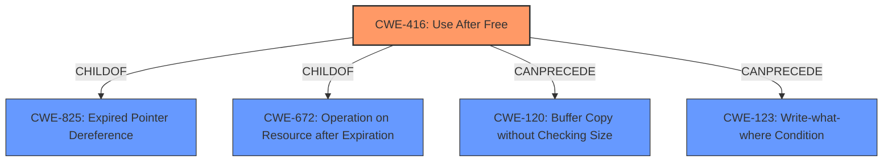

# Raw Analyzer Response for CVE-2022-0978

# Summary
| CWE ID | CWE Name | Confidence | CWE Abstraction Level | CWE Vulnerability Mapping Label | CWE-Vulnerability Mapping Notes |
|---|---|---|---|---|---|
| CWE-416 | Use After Free | 1.0 | Variant | Allowed | Primary CWE |

## Evidence and Confidence

*   **Confidence Score:** 1.0
*   **Evidence Strength:** HIGH

## Relationship Analysis
The primary relationship that influenced the decision was the direct match of the **rootcause** in the vulnerability description to the CWE-416 description. The description mentions the **"Use after free"** condition directly, aligning with the core definition of CWE-416. Other relationships like ChildOf and CanPrecede were examined but didn't directly apply to the evidence provided. The Abstraction Level (Variant) is appropriate as it's a specific type of memory error.



## Vulnerability Chain
The vulnerability chain is relatively simple in this case. It starts with a **"Use after free"** condition (CWE-416), which leads to heap corruption. The full chain identified from the vulnerability description is:
  - **Root Cause:** Use After Free (CWE-416)
  - **Impact:** Heap Corruption

## Summary of Analysis
The initial analysis identified CWE-416 as the primary candidate based on the **rootcause** "Use after free". The "CWE for similar CVE Descriptions" section confirms that CWE-416 is the primary match for similar vulnerabilities. The "CVE Reference Links Content Summary" section provides supporting evidence that the **weakness** is indeed a "Use after free".

The retriever results also list CWE-416 as the top combined result, which supports the initial assessment.
```
{
  "vulnerability_details": [
    {
      "cve_id": "CVE-2022-0978",
      "root_cause": "Use after free",
      "weaknesses": [
        "Use after free"
      ],
      "impact": "Remote code execution",
      "attack_vectors": [
        "Exploitation of a use-after-free vulnerability in ANGLE"
      ],
       "required_attacker_capabilities": "The specific method of exploitation and required attacker capabilities/position is not detailed in the provided content."
    }
  ]
}
```
The mapping guidance for CWE-416 indicates that it's allowed and at the preferred Variant level of abstraction. Given the direct match and supporting evidence, CWE-416 is the most appropriate and specific classification.

Other CWEs like CWE-787 (Out-of-bounds Write), CWE-362 (Race Condition), and CWE-415 (Double Free) were considered but ultimately rejected because they did not directly match the **rootcause** described in the vulnerability description. While these could be potential consequences or related issues, the primary **weakness** is the "Use after free" condition.