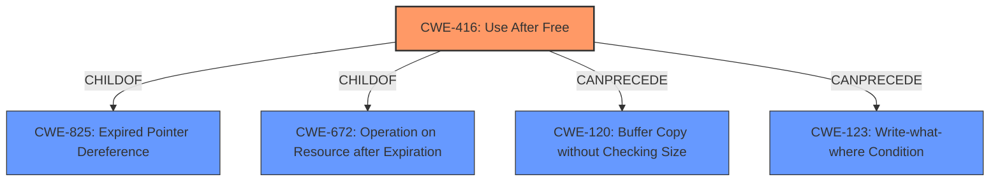

# Raw Analyzer Response for CVE-2022-0979

# Summary
| CWE ID | CWE Name | Confidence | CWE Abstraction Level | CWE Vulnerability Mapping Label | CWE-Vulnerability Mapping Notes |
|---|---|---|---|---|---|
| CWE-416 | Use After Free | 1 | Variant | Allowed | Primary CWE |

## Evidence and Confidence

*   **Confidence Score:** 1
*   **Evidence Strength:** HIGH

## Relationship Analysis
The primary relationship considered was the parent-child relationship between CWE-416 (**Use After Free**) and its parents, as well as its relationships in chains such as `CanPrecede`. CWE-416 is a variant, which is the preferred level of abstraction. The chains involving CWE-416 like `CanPrecede -> CWE-123 (Write-what-where Condition)` helped to contextualize potential impacts.

## Vulnerability Chain
The vulnerability chain starts with the **use after free** (**CWE-416**) condition in the Safe Browsing component of Google Chrome on Android. This can lead to **heap corruption**, potentially allowing a remote attacker to exploit the vulnerability by crafting a malicious HTML page.

## Summary of Analysis
The primary vulnerability is a **use after free** (**CWE-416**) in the Safe Browsing component of Google Chrome on Android. This allows a remote attacker to potentially exploit **heap corruption** via a crafted HTML page. The vulnerability description clearly indicates the **rootcause** as "use after free," and the description of CVE-2022-0979 in the "CVE Reference Links Content Summary" confirms this.

The selection of **CWE-416** is based on the following evidence:
*   The **Vulnerability Description Key Phrases** includes "**rootcause: use after free**".
*   The **Vulnerability Description** states "**Use after free** in Safe Browsing".
*   The **CVE Reference Links Content Summary** states "**Root cause of vulnerability: Use-after-free** in Safe Browsing."

The CWEs considered but not selected include:
*   CWE-366 (Race Condition within a Thread): Although race conditions can sometimes lead to use-after-free vulnerabilities, there is no explicit mention of a race condition in this vulnerability description.
*   CWE-122 (Heap-based Buffer Overflow): The vulnerability results in **heap corruption**, but the **rootcause** is **use after free**, not a buffer overflow.
*   CWE-787 (Out-of-bounds Write): While **heap corruption** could involve out-of-bounds writes, the **rootcause** is specifically a **use after free** condition.
*   CWE-123 (Write-what-where Condition): This could be a consequence of the **use after free**, but is not the **rootcause**.
*   CWE-415 (Double Free): Similar to the above, the **rootcause** is specifically a **use after free** condition.

The provided evidence strongly supports the selection of **CWE-416** as the primary CWE. It is at the Variant level of abstraction, which is preferred, and it directly reflects the stated **rootcause** of the vulnerability.