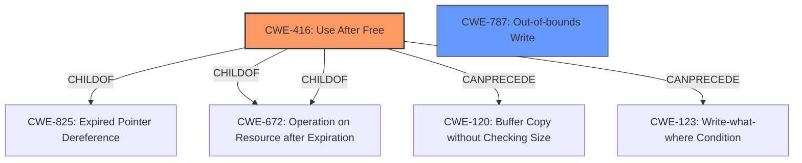

# Analysis Report for CVE-2022-0980

# Vulnerability Analysis Report: CVE-2022-0980

## Description


## Analysis (with Relationship Data)

# Summary
| CWE ID | CWE Name | Confidence | CWE Abstraction Level | CWE Vulnerability Mapping Label | CWE-Vulnerability Mapping Notes |
|---|---|---|---|---|---|
| CWE-416 | Use After Free | 1.0 | Variant | Allowed | Primary CWE |
| CWE-787 | Out-of-bounds Write | 0.5 | Base | Allowed | Secondary Candidate |

## Evidence and Confidence

*   **Confidence Score:** 0.8
*   **Evidence Strength:** HIGH

## Relationship Analysis
The primary CWE is CWE-416 (**Use After Free**) which is a variant level CWE. CWE-416 is **ChildOf** CWE-825 (**Expired Pointer Dereference**), CWE-672 (**Operation on Resource after Expiration**), and CWE-672 (**Operation on Resource after Expiration**). CWE-416 can **CanPrecede** CWE-120 (**Buffer Copy without Checking Size**) and CWE-123 (**Write-What-Where Condition**). The secondary CWE is CWE-787 (**Out-of-bounds Write**), which is a base level CWE.



## Vulnerability Chain
The vulnerability chain starts with a **Use After Free** (CWE-416), which then leads to **heap corruption**. This **heap corruption** can cause an **Out-of-bounds Write** (CWE-787).
  - The initial flaw is a **Use After Free**.
  - This leads to **heap corruption**.
  - This results in a potential **Out-of-bounds Write**.

## Summary of Analysis
The vulnerability description clearly states that there is a "**use after free**" in the New Tab Page in Google Chrome. The **Vulnerability Description Key Phrases** also states "**rootcause:** **use after free**" and "**weakness:** **heap corruption**". The **CVE Reference Links Content Summary** confirms this with "**root_cause:** Use after free" and "**weaknesses:** Use after free".

The primary CWE is CWE-416 (**Use After Free**) because the vulnerability description, key phrases, and CVE reference links all indicate a **use after free** condition. The retriever results also lists CWE-416 as the top combined result.

The secondary CWE is CWE-787 (**Out-of-bounds Write**) because the vulnerability description mentions "**heap corruption**" which can lead to an out-of-bounds write. The "**heap corruption**" occurs because of the "**use after free**".

The CWEs selected are at the optimal level of specificity because CWE-416 is a variant and CWE-787 is a base.

CWEs considered but not used:

*   CWE-366 (**Race Condition within a Thread**): While a race condition could potentially contribute to a use-after-free, there is no specific mention of a race condition in the provided description. Therefore, CWE-366 is not selected.
*   CWE-122 (**Heap-based Buffer Overflow**): While heap corruption is mentioned, there's no explicit mention of a buffer overflow. Therefore, CWE-122 is not chosen as the primary CWE, although heap corruption could cause a buffer overflow.
*   CWE-843 (**Access of Resource Using Incompatible Type**): There is no mention of incompatible types in the description, so this CWE is not selected.
*   CWE-362 (**Concurrent Execution using Shared Resource with Improper Synchronization ('Race Condition')**): Similar to CWE-366, there's no explicit evidence of a race condition.
*   CWE-1022 (**Use of Web Link to Untrusted Target with window.opener Access**): This is specific to web links and is not relevant to the described vulnerability.
*   CWE-364 (**Signal Handler Race Condition**): This is specific to signal handlers and is not relevant to the described vulnerability.
*   CWE-415 (**Double Free**): While double free is related to memory management issues, the description specifically mentions use-after-free, making CWE-416 a more accurate fit.
*   CWE-665 (**Improper Initialization**): Improper initialization is not mentioned in the vulnerability description.
*   CWE-451 (**User Interface (UI) Misrepresentation of Critical Information**): The vulnerability is related to heap corruption and use-after-free, not UI misrepresentation.


## CWE Relationship Analysis

Current CWEs represent these abstraction levels: .


### Vulnerability Chain Analysis

**Chain starting from CWE-825:**
- 825 (Expired Pointer Dereference) - ROOT


**Chain starting from CWE-843:**
- 843 (Access of Resource Using Incompatible Type ('Type Confusion')) - ROOT


### CWE Relationship Diagram

```mermaid
graph TD
    classDef primary fill:#f96,stroke:#333,stroke-width:2px
    classDef secondary fill:#69f,stroke:#333
    classDef tertiary fill:#9e9,stroke:#333
```


*Report generated on 2025-03-30 19:33:19*
