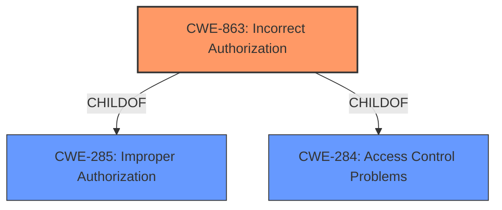

# Analysis Report for CVE-2022-0984

# Vulnerability Analysis Report: CVE-2022-0984

## Description


## Analysis (with Relationship Data)

# Summary
| CWE ID | CWE Name | Confidence | CWE Abstraction Level | CWE Vulnerability Mapping Label | CWE-Vulnerability Mapping Notes |
|---|---|---|---|---|---|
| CWE-863 | Incorrect Authorization | 0.9 | Class | Allowed-with-Review | Primary CWE. The product performs an authorization check when an actor attempts to access a resource or perform an action, but it does not correctly perform the check. |
| CWE-472 | External Control of Assumed-Immutable Web Parameter | 0.6 | Base | Allowed | Secondary candidate. The web application does not sufficiently verify inputs that are assumed to be immutable but are actually externally controllable, such as hidden form fields. |

## Evidence and Confidence

*   **Confidence Score:** 0.8
*   **Evidence Strength:** HIGH

## Relationship Analysis
The primary CWE is CWE-863, Incorrect Authorization, which is a Class-level CWE. While it is desirable to have a Base-level CWE, the available information does not permit identifying a more specific CWE.
CWE-863 is related to CWE-285 (Improper Authorization) and CWE-284 (Access Control Problems), as it is a child of both. This indicates that authorization is a form of access control.



## Vulnerability Chain
The vulnerability chain involves the following sequence:
1.  **Root Cause:** **Incorrect authorization** allows users with the capability to configure badge criteria to configure course badges with profile field criteria, which should only be available for site badges.
2.  **Weakness:** The **incorrect access control** on the criteria available when configuring course badges.
3.  **Impact:** Users can configure course badges to depend on profile fields.

## Summary of Analysis
The initial analysis focused on identifying the root cause of the vulnerability. The description indicates an **incorrect authorization** issue where users with specific privileges can perform actions beyond their intended scope. The primary CWE selected, CWE-863 (Incorrect Authorization), aligns with this root cause.

The retriever results and complete CWE specifications were reviewed to find a more specific CWE, but none provided a better match than CWE-863. CWE-863 is a Class-level CWE, and the mapping guidance suggests examining child CWEs for a better fit. However, the provided information does not allow for a more precise classification.

The selection of CWE-863 is primarily based on the following evidence:

*   Vulnerability Description: "Users with the capability to configure badge criteria (teachers and managers by default) were able to configure course badges with profile field criteria, which should only be available for site badges."
*   CVE Reference Links Content Summary: "**Incorrect Access Control:** The vulnerability is due to a lack of proper access control on the criteria available when configuring course badges, allowing users to utilize profile field criteria that should be restricted to site badges."

These statements indicate that the authorization mechanism is not correctly implemented, leading to unauthorized access.

CWE-472 (External Control of Assumed-Immutable Web Parameter) was considered because the profile field criteria could be seen as externally controlled parameters. However, this CWE focuses more on tampering with parameters than on the initial authorization check, making it a less suitable primary classification. It could be considered a secondary contributing factor.

Other CWEs, such as CWE-668 (Exposure of Resource to Wrong Sphere), were deemed too high-level and not specific enough to the root cause. CWE-352 (Cross-Site Request Forgery (CSRF)) was not applicable because the vulnerability does not involve tricking a user into making unintended requests.

The final selection of CWE-863 is justified because it accurately represents the **incorrect authorization** that allows users to perform actions beyond their intended scope.


## CWE Relationship Analysis

Current CWEs represent these abstraction levels: .


### Vulnerability Chain Analysis

**Chain starting from CWE-472:**
- 472 (External Control of Assumed-Immutable Web Parameter) - ROOT


**Chain starting from CWE-668:**
- 668 (Exposure of Resource to Wrong Sphere) - ROOT


### CWE Relationship Diagram

```mermaid
graph TD
    classDef primary fill:#f96,stroke:#333,stroke-width:2px
    classDef secondary fill:#69f,stroke:#333
    classDef tertiary fill:#9e9,stroke:#333
```


*Report generated on 2025-03-31 10:14:07*
