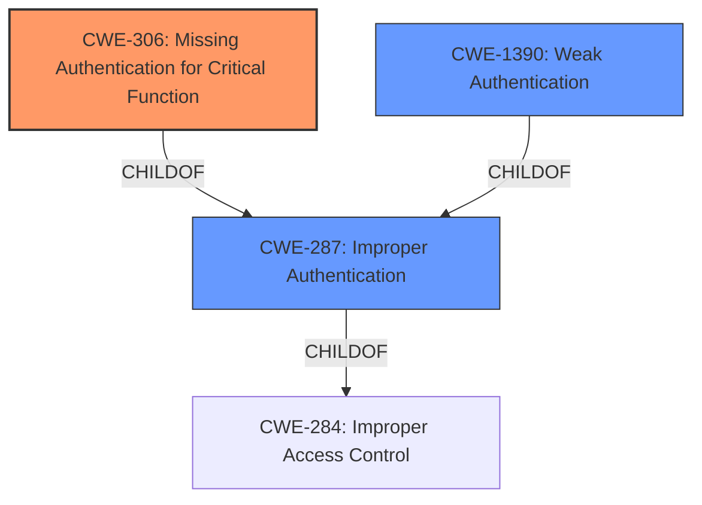

# Raw Analyzer Response for CVE-2022-0992

# Summary
| CWE ID | CWE Name | Confidence | CWE Abstraction Level | CWE Vulnerability Mapping Label | CWE-Vulnerability Mapping Notes |
|---|---|---|---|---|---|
| CWE-306 | Missing Authentication for Critical Function | 1 | Base | Primary | Allowed |
| CWE-287 | Improper Authentication | 0.7 | Class | Secondary | Discouraged |
| CWE-1390 | Weak Authentication | 0.7 | Class | Secondary | Allowed-with-Review |

## Evidence and Confidence

*   **Confidence Score:** 0.8
*   **Evidence Strength:** HIGH

## Relationship Analysis
The primary CWE selected is CWE-306, a Base level CWE that is a child of CWE-287. CWE-287 is a Class level CWE that represents a more general form of authentication issues. CWE-1390 is also a child of CWE-287 and represents a weakening of the authentication process. These hierarchical relationships help to define the most accurate classification for the vulnerability.

## Vulnerability Chain
The chain of events starts with the **missing identity verification on initial 2FA set-up** (CWE-306), leading to an **authentication bypass** that allows unauthenticated users to log in as administrative users.

## Summary of Analysis
The initial analysis strongly points to an authentication issue, specifically the **missing identity verification on initial 2FA set-up**. The evidence lies in the vulnerability description's key phrases and the CVE reference summary, both highlighting the absence of proper authentication during the 2FA configuration process.

The vulnerability description states: "The SiteGround Security plugin for WordPress is vulnerable to **authentication bypass** that allows unauthenticated users to log in as administrative users due to **missing identity verification on initial 2FA set-up** that allows unauthenticated and unauthorized users to configure 2FA for pending accounts."

The CVE Reference Links Content Summary confirms this, stating: "root_cause: Missing identity verification on initial 2FA set-up."

The retriever results listed CWE-306, CWE-1390 and CWE-287 as high ranking.

CWE-306 "Missing Authentication for Critical Function" is the best fit, as it describes a scenario where "The product does not perform any authentication for functionality that requires a provable user identity". Here, the critical function is the initial setup of 2FA, which lacks identity verification, allowing unauthorized configuration.

CWE-287 "Improper Authentication" and CWE-1390 "Weak Authentication" are also relevant because the vulnerability involves bypassing authentication mechanisms. However, CWE-306 is more specific because it explicitly addresses the absence of authentication during a critical function (2FA setup).

I am using CWE-306, because it is a base level weakness and the most accurate in describing the vulnerability.

Relevant CWE Information:

# Enhanced Context (25 CWEs)
The following CWEs were identified as potentially relevant to this vulnerability:

## CWE-602: Client-Side Enforcement of Server-Side Security
**Abstraction Level**: Class
**Similarity Score**: 0.80
**Source**: dense

**Description**:
The product is composed of a server that relies on the client to implement a mechanism that is intended to protect the server.
**Rationale for not using:** The vulnerability doesn't seem to rely on client-side enforcement.

## CWE-807: Reliance on Untrusted Inputs in a Security Decision
**Abstraction Level**: Base
**Similarity Score**: 0.77
**Source**: dense

**Description**:
The product uses a protection mechanism that relies on the existence or values of an input, but the input can be modified by an untrusted actor in a way that bypasses the protection mechanism.
**Rationale for not using:** While untrusted input is involved (sg-user-id parameter), the core issue is the missing verification, not directly the reliance on untrusted input for a security decision.

## CWE-603: Use of Client-Side Authentication
**Abstraction Level**: Base
**Similarity Score**: 0.77
**Source**: dense

**Description**:
A client/server product performs authentication within client code but not in server code, allowing server-side authentication to be bypassed via a modified client that omits the authentication check.
**Rationale for not using:** This doesn't fit since the 2FA setup is server-side, not client-side.

## CWE-1390: Weak Authentication
**Abstraction Level**: Class
**Similarity Score**: 0.77
**Source**: dense

**Description**:
The product uses an authentication mechanism to restrict access to specific users or identities, but the mechanism does not sufficiently prove that the claimed identity is correct.
**Rationale for using (secondary):** Could be considered as a more general classification since the 2FA setup process doesn't properly verify the user's identity.

## CWE-303: Incorrect Implementation of Authentication Algorithm
**Abstraction Level**: Base
**Similarity Score**: 0.77
**Source**: dense

**Description**:
The requirements for the product dictate the use of an established authentication algorithm, but the implementation of the algorithm is incorrect.
**Rationale for not using:** The issue is not an incorrect implementation, but a missing step in the authentication process.

## CWE-1391: Use of Weak Credentials
**Abstraction Level**: Class
**Similarity Score**: 0.77
**Source**: dense

**Description**:
The product uses weak credentials (such as a default key or hard-coded password) that can be calculated, derived, reused, or guessed by an attacker.
**Rationale for not using:** Weak credentials aren't the primary issue. The problem is the ability to bypass the initial authentication step entirely.

## CWE-472: External Control of Assumed-Immutable Web Parameter
**Abstraction Level**: Base
**Similarity Score**: 0.76
**Source**: dense

**Description**:
The web application does not sufficiently verify inputs that are assumed to be immutable but are actually externally controllable, such as hidden form fields.
**Rationale for not using:** The vulnerability relies on a missing verification step, not the modification of assumed-immutable parameters.

## CWE-657: Violation of Secure Design Principles
**Abstraction Level**: Class
**Similarity Score**: 0.76
**Source**: dense

**Description**:
The product violates well-established principles for secure design.
**Rationale for not using:** Too broad, a more specific CWE is more appropriate.

## CWE-319: Cleartext Transmission of Sensitive Information
**Abstraction Level**: Base
**Similarity Score**: 0.76
**Source**: dense

**Description**:
The product transmits sensitive or security-critical data in cleartext in a communication channel that can be sniffed by unauthorized actors.
**Rationale for not using:** Not relevant to this vulnerability.

## CWE-639: Authorization Bypass Through User-Controlled Key
**Abstraction Level**: Base
**Similarity Score**: 0.76
**Source**: dense

**Description**:
The system's authorization functionality does not prevent one user from gaining access to another user's data or record by modifying the key value identifying the data.
**Rationale for not using:** While it leads to unauthorized access, the core issue is the missing authentication step before authorization.

## CWE-863: Incorrect Authorization
**Abstraction Level**: Class
**Similarity Score**: 4630.93
**Source**: sparse

**Description**:
The product performs an authorization check when an actor attempts to access a resource or perform an action, but it does not correctly perform the check.
**Rationale for not using:** The authorization issue is a consequence of the missing authentication.

## CWE-287: Improper Authentication
**Abstraction Level**: Class
**Similarity Score**: 4601.94
**Source**: sparse

**Description**:
When an actor claims to have a given identity, the product does not prove or insufficiently proves that the claim is correct.
**Rationale for using (secondary):** This is a more general categorization of the authentication issue.

## CWE-285: Improper Authorization
**Abstraction Level**: Class
**Similarity Score**: 4568.42
**Source**: sparse

**Description**:
The product does not perform or incorrectly performs an authorization check when an actor attempts to access a resource or perform an action.
**Rationale for not using:** The authorization issue is