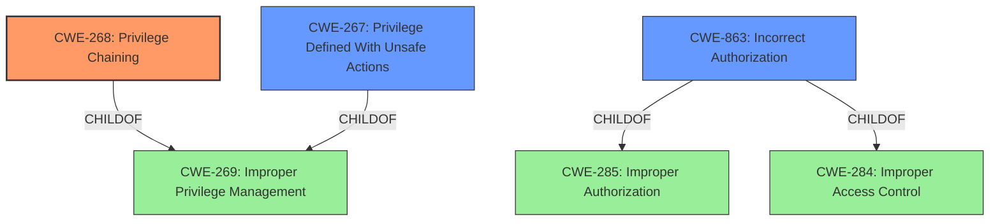

# Analysis for CVE-2022-1003

# Summary
| CWE ID | CWE Name | Confidence | CWE Abstraction Level | CWE Vulnerability Mapping Label | CWE-Vulnerability Mapping Notes |
|---|---|---|---|---|---|
| CWE-268 | Privilege Chaining | 0.8 | Base | Allowed | Primary CWE |
| CWE-863 | Incorrect Authorization | 0.6 | Class | Allowed-with-Review | Secondary Candidate |
| CWE-267 | Privilege Defined With Unsafe Actions | 0.5 | Base | Allowed | Secondary Candidate |

## Evidence and Confidence

*   **Confidence Score:** 0.8
*   **Evidence Strength:** MEDIUM

## Relationship Analysis
The primary CWE, CWE-268, is at the Base level, which is preferred. It describes a situation where two distinct privileges can be combined to perform unsafe actions. CWE-863, Incorrect Authorization, is a Class-level CWE that could be a parent. However, CWE-268 is more specific to the described scenario. CWE-267, Privilege Defined With Unsafe Actions, is another base-level CWE that highlights that a privilege, even when correctly assigned, allows unsafe actions. The relationships are:
  - CWE-268 (Privilege Chaining) ChildOf CWE-269 (Improper Privilege Management)
  - CWE-863 (Incorrect Authorization) ChildOf CWE-285 (Improper Authorization) and CWE-284 (Improper Access Control)
  - CWE-267 (Privilege Defined With Unsafe Actions) ChildOf CWE-269 (Improper Privilege Management)

## Vulnerability Chain
The vulnerability chain starts with a **failure to properly protect permissions**, leading to system administrators being able to combine privileges to override configurations.
  - Root Cause: **Fails to properly protect the permissions**
  - Weakness: Privilege Chaining (CWE-268)
  - Impact: Override restricted configurations

## Summary of Analysis
The initial assessment, based on the description, points towards a privilege management issue. The key phrase "**fails to properly protect the permissions**" indicates a problem with how privileges are handled. The fact that administrators can "combine the two distinct privileges/capabilities" directly aligns with CWE-268 (Privilege Chaining).

The description states "allows them to override certain restricted configurations like EnableUploads" implying that the combined privileges bypass intended restrictions.

CWE-863 (Incorrect Authorization) was considered, but it is a more general class. While applicable, CWE-268 provides a more specific representation of the vulnerability.

CWE-267 (Privilege Defined With Unsafe Actions) was also considered. While it's possible that the individual privileges themselves allow unsafe actions, the description emphasizes the combination of privileges.

The selection of CWE-268 is based on the direct match to the "privilege chaining" concept described in the vulnerability. The provided evidence, although limited, strongly supports this classification. The relationship analysis shows that while other CWEs could be related, CWE-268 is the most accurate and specific representation of the **rootcause**.
The selected CWE is at the optimal level of specificity (Base) as it directly addresses the combination of privileges leading to the vulnerability.

Relevant CWE Information:

## CWE-268: Privilege Chaining
**Technical Explanation:** The vulnerability description states that administrators can combine two distinct privileges to override configurations. This matches the description of CWE-268, where two distinct privileges can be combined to perform unsafe actions.
**Security Implications:** This allows system administrators to bypass intended restrictions, potentially leading to unauthorized access or modification of system settings.
**Relationship:** CWE-268 is a Base-level CWE, providing a specific description of the vulnerability. It's a child of CWE-269 (Improper Privilege Management), which is a more general class.
**Primary/Secondary:** Primary
**Mapping Guidance:** The usage is "Allowed" and the rationale supports using the Base level of abstraction.

## CWE-863: Incorrect Authorization
**Technical Explanation:** The vulnerability description mentions that permissions are not properly protected, which could be interpreted as an authorization issue.
**Security Implications:** Could lead to unauthorized access or modification of resources.
**Relationship:** CWE-863 is a Class-level CWE.
**Primary/Secondary:** Secondary
**Mapping Guidance:** Usage is "Allowed-with-Review", suggesting to look for more specific children.

## CWE-267: Privilege Defined With Unsafe Actions
**Technical Explanation:** It is possible that one or both of the privileges could be defined to have unsafe actions.
**Security Implications:** Could lead to unauthorized access or modification of resources.
**Relationship:** CWE-267 is a Base-level CWE.
**Primary/Secondary:** Secondary
**Mapping Guidance:** Usage is "Allowed".