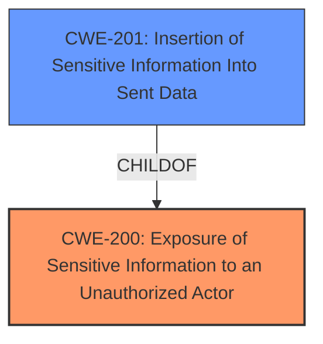

# Analysis for CVE-2022-1004

# Summary
| CWE ID | CWE Name | Confidence | CWE Abstraction Level | CWE Vulnerability Mapping Label | CWE-Vulnerability Mapping Notes |
|---|---|---|---|---|---|
| CWE-200 | Exposure of Sensitive Information to an Unauthorized Actor | 0.8 | Class | Primary | Discouraged, but chosen as the most fitting high-level classification due to **information disclosure** and lack of proper sanitization |
| CWE-201 | Insertion of Sensitive Information Into Sent Data | 0.6 | Base | Secondary | Allowed, considered because the accounted time is being **sent** in the Ticket Detail View |

## Evidence and Confidence

*   **Confidence Score:** 0.7
*   **Evidence Strength:** MEDIUM

## Relationship Analysis
The primary relationship impacting the decision is the ChildOf relationship between CWE-201 and CWE-200. CWE-201 is more specific, but requires that the data is sent to another actor which may or may not be the case here. CWE-200 is a more general case of exposing sensitive information which fits the **impact** better, even if it is discouraged.

## Vulnerability Chain
The vulnerability chain starts with the **improper** configuration setting enforcement, leading to **information disclosure** and ultimately a confidentiality breach.

## Summary of Analysis
Initially, the analysis focused on finding a precise CWE that captures the **root cause** of the vulnerability: the system's failure to properly enforce the `ExternalFrontend::TicketDetailView###AccountedTimeDisplay` configuration setting. The evidence suggests that the intended behavior was to prevent the display of accounted time, but the system **failed** to do so.

The Retriever Results pointed towards CWE-200 (Exposure of Sensitive Information to an Unauthorized Actor) and its child, CWE-201 (Insertion of Sensitive Information Into Sent Data). While CWE-201 seemed initially promising, the description indicates it's about data being **sent** to another actor, and it's unclear whether merely displaying the information counts as "sending".

CWE-200 is a high-level Class, and the guidance **discourages** its use, recommending more specific CWEs. However, given the **information disclosure** aspect and the **lack** of a lower-level CWE that perfectly captures the **root cause** (the configuration setting enforcement failure), CWE-200 seems like the most appropriate choice. The vulnerability description explicitly mentions that the system displays accounted time even when it's supposed to be disabled, indicating a failure to properly prevent **unauthorized access** to this information.

*   "Accounted time is shown in the Ticket Detail View (External Interface), even if ExternalFrontendTicketDetailView###AccountedTimeDisplay is disabled."

The **impact** is a "Confidentiality Breach," as the vulnerability leads to the leakage of potentially sensitive information.

Other considered CWEs:

*   CWE-359 (Exposure of Private Personal Information to an Unauthorized Actor): Considered, but the "accounted time" may not always be "private personal information".
*   CWE-863 (Incorrect Authorization): Too focused on authorization checks.

Ultimately, the selection of CWE-200 as the primary CWE, despite the discouragement, is based on the evidence of **information disclosure** combined with the **failure** to enforce the intended configuration.
The more specific CWE-201 has been added as the secondary candidate because it closely matches the **impact** of data in the Ticket Detail View being **sent** to another actor.

Relevant CWE Information:

# Enhanced Context (25 CWEs)

## CWE-538: Insertion of Sensitive Information into Externally-Accessible File or Directory
**Abstraction Level**: Base
**Similarity Score**: 0.77
**Source**: dense

**Description**:
The product places sensitive information into files or directories that are accessible to actors who are allowed to have access to the files, but not to the sensitive information.

**Mapping Guidance**:
- Usage: Allowed
- Rationale: This CWE entry is at the Base level of abstraction, which is a preferred level of abstraction for mapping to the root causes of vulnerabilities.

## CWE-668: Exposure of Resource to Wrong Sphere
**Abstraction Level**: Class
**Similarity Score**: 0.76
**Source**: dense

**Description**:
The product exposes a resource to the wrong control sphere, providing unintended actors with inappropriate access to the resource.

**Mapping Guidance**:
- Usage: Discouraged
- Rationale: CWE-668 is high-level and is often misused as a catch-all when lower-level CWE IDs might be applicable. It is sometimes used for low-information vulnerability reports [REF-1287]. It is a level-1 Class (i.e., a child of a Pillar). It is not useful for trend analysis.

## CWE-807: Reliance on Untrusted Inputs in a Security Decision
**Abstraction Level**: Base
**Similarity Score**: 0.76
**Source**: dense

**Description**:
The product uses a protection mechanism that relies on the existence or values of an input, but the input can be modified by an untrusted actor in a way that bypasses the protection mechanism.

**Mapping Guidance**:
- Usage: Allowed
- Rationale: This CWE entry is at the Base level of abstraction, which is a preferred level of abstraction for mapping to the root causes of vulnerabilities.

## CWE-212: Improper Removal of Sensitive Information Before Storage or Transfer
**Abstraction Level**: Base
**Similarity Score**: 0.76
**Source**: dense

**Description**:
The product stores, transfers, or shares a resource that contains sensitive information, but it does not properly remove that information before the product makes the resource available to unauthorized actors.

**Mapping Guidance**:
- Usage: Allowed
- Rationale: This CWE entry is at the Base level of abstraction, which is a preferred level of abstraction for mapping to the root causes of vulnerabilities.

## CWE-267: Privilege Defined With Unsafe Actions
**Abstraction Level**: Base
**Similarity Score**: 0.75
**Source**: dense

**Description**:
A particular privilege, role, capability, or right can be used to perform unsafe actions that were not intended, even when it is assigned to the correct entity.

**Mapping Guidance**:
- Usage: Allowed
- Rationale: This CWE entry is at the Base level of abstraction, which is a preferred level of abstraction for mapping to the root causes of vulnerabilities.

## CWE-639: Authorization Bypass Through User-Controlled Key
**Abstraction Level**: Base
**Similarity Score**: 0.75
**Source**: dense

**Description**:
The system's authorization functionality does not prevent one user from gaining access to another user's data or record by modifying the key value identifying the data.

**Mapping Guidance**:
- Usage: Allowed
- Rationale: This CWE entry is at the Base level of abstraction, which is a preferred level of abstraction for mapping to the root causes of vulnerabilities.

## CWE-266: Incorrect Privilege Assignment
**Abstraction Level**: Base
**Similarity Score**: 0.75
**Source**: dense

**Description**:
A product incorrectly assigns a privilege to a particular actor, creating an unintended sphere of control for that actor.

**Mapping Guidance**:
- Usage: Allowed
- Rationale: This CWE entry is at the Base level of abstraction, which is a preferred level of abstraction for mapping to the root causes of vulnerabilities.

## CWE-497: Exposure of Sensitive System Information to an Unauthorized Control Sphere
**Abstraction Level**: Base
**Similarity Score**: 0.75
**Source**: dense

**Description**:
The product does not properly prevent sensitive system-level information from being accessed by unauthorized actors who do not have the same level of access to the underlying system as the product does.

**Mapping Guidance**:
- Usage: Allowed
- Rationale: This CWE entry is at the Base level of abstraction, which is a preferred level of abstraction for mapping to the root causes of vulnerabilities.

## CWE-274: Improper Handling of Insufficient Privileges
**Abstraction Level**: Base
**Similarity Score**: 0.75
**Source**: dense

**Description**:
The product does not handle or incorrectly handles when it has insufficient privileges to perform an operation, leading to resultant weaknesses.

**Mapping Guidance**:
- Usage: Discouraged
- Rationale: This CWE entry could be deprecated in a future version of CWE.

## CWE-226: Sensitive Information in Resource Not Removed Before Reuse
**Abstraction Level**: Base
**Similarity Score**: 0.74
**Source**: dense

**Description**:
The product releases a resource such as memory or a file so that it can be made available for reuse, but it does not clear or "zeroize" the information contained in the