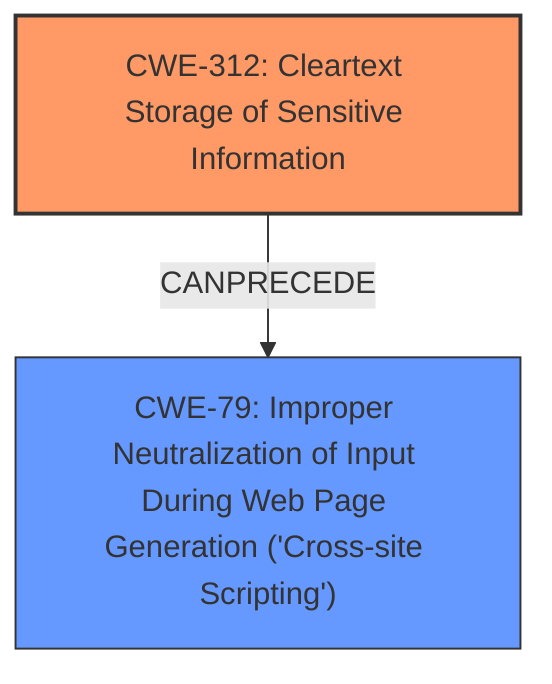

# Analysis Report for CVE-2022-1021

# Vulnerability Analysis Report: CVE-2022-1021

## Description


## Analysis (with Relationship Data)

# Summary
| CWE ID | CWE Name | Confidence | CWE Abstraction Level | CWE Vulnerability Mapping Label | CWE-Vulnerability Mapping Notes |
|---|---|---|---|---|---|
| CWE-312 | Cleartext Storage of Sensitive Information | 0.9 | Base | Allowed | Primary CWE. The application stores the referer URL in cleartext in the `additional_attributes` field of the `Conversation` model. |
| CWE-79 | Improper Neutralization of Input During Web Page Generation ('Cross-site Scripting') | 0.7 | Base | Allowed | Secondary CWE. The stored referer URL, if not properly validated, can lead to Stored XSS. |

## Evidence and Confidence

*   **Confidence Score:** 0.8
*   **Evidence Strength:** HIGH

## Relationship Analysis
The primary CWE is CWE-312, representing the **insecure storage of sensitive information** in cleartext. This is a base-level CWE. CWE-79 is a secondary CWE, representing a potential impact (Stored XSS) resulting from **lack of proper validation** and storage of malicious URLs. There is no parent-child relationship between CWE-312 and CWE-79, but there is a possible chain where **insecure storage** leads to XSS.



## Vulnerability Chain
The vulnerability chain starts with the **lack of proper validation** of the `referer` URL. This leads to the storage of the malicious URL in cleartext (CWE-312). When this URL is displayed or used, it results in Stored XSS (CWE-79).

## Summary of Analysis
The initial assessment correctly identifies the **insecure storage of sensitive information** as a key element of the vulnerability. The commit `24b20c10cebd25e61de8d4266c63fde94772e889` mitigates this by validating the `referer` URL before storage. However, the vulnerability is not just about storing the URL, but also about the potential for XSS if the URL is malicious and later used without proper sanitization. Therefore, adding CWE-79 as a secondary CWE is crucial.

The evidence for CWE-312 is: "The application was accepting and storing arbitrary URLs, including those with malicious javascript, without sanitization."
The evidence for CWE-79 is: "By storing malicious URLs in the database (through the `additional_attributes` field), the application became susceptible to Cross-Site Scripting (XSS) attacks."

The selection of CWE-312 is at the optimal level of specificity. While CWE-311 (Missing Encryption of Sensitive Data) is a parent, CWE-312 is more precise, because the information is stored in cleartext.

Relevant CWE Information:

# Enhanced Context (25 CWEs)
The following CWEs were identified as potentially relevant to this vulnerability:

## CWE-312: Cleartext Storage of Sensitive Information
**Abstraction Level**: Base
**Similarity Score**: 0.80
**Source**: dense

**Description**:
The product stores sensitive information in cleartext within a resource that might be accessible to another control sphere.

**Mapping Guidance**:
- Usage: Allowed
- Rationale: This CWE entry is at the Base level of abstraction, which is a preferred level of abstraction for mapping to the root causes of vulnerabilities.
## CWE-79: Improper Neutralization of Input During Web Page Generation ('Cross-site Scripting')

**CWE-79 is added as a secondary CWE because of the risk of Stored XSS.**

## CWEs Considered but Not Used:

*   **CWE-639: Authorization Bypass Through User-Controlled Key:** While this CWE was highly ranked by the retriever, it is not applicable because the vulnerability doesn't directly involve bypassing authorization through a user-controlled key. The vulnerability focuses on the **lack of proper validation** and storage of potentially malicious URLs.
*   **CWE-922: Insecure Storage of Sensitive Information:** This is a Class-level CWE and CWE-312 (Cleartext Storage of Sensitive Information) is a more specific Base-level CWE which more accurately describes the **insecure storage of the referer URL in cleartext**.
*   **CWE-214: Invocation of Process Using Visible Sensitive Information:** This CWE is not relevant because the vulnerability does not involve invoking a process with sensitive information visible to other processes.
*   **CWE-212: Improper Removal of Sensitive Information Before Storage or Transfer:** While the application **fails to remove** (validate/sanitize) the malicious content, the core issue is that the malicious content is stored as is. Hence CWE-312 and CWE-79 are more relevant.
*   **CWE-614: Sensitive Cookie in HTTPS Session Without 'Secure' Attribute:** This CWE is not relevant as the vulnerability does not concern cookies.
*   **CWE-359: Exposure of Private Personal Information to an Unauthorized Actor:** This CWE might be applicable depending on the type of information the `referer` contains, but the more fundamental issue is the storage of unvalidated information which could lead to XSS.
*   **CWE-489: Active Debug Code:** This CWE is not relevant because the vulnerability is not related to debug code being left in the application.
*   **CWE-311: Missing Encryption of Sensitive Data:** This CWE is a parent of CWE-312, so CWE-312 is more specific.
*   **CWE-313: Cleartext Storage in a File or on Disk:** This is a more specific variant of CWE-312, but the storage is not necessarily limited to a file or disk. It could be in a database.


## CWE Relationship Analysis

Current CWEs represent these abstraction levels: .


### Vulnerability Chain Analysis

**Chain starting from CWE-922:**
- 922 (Insecure Storage of Sensitive Information) - ROOT


**Chain starting from CWE-311:**
- 311 (Missing Encryption of Sensitive Data) - ROOT


### CWE Relationship Diagram

```mermaid
graph TD
    classDef primary fill:#f96,stroke:#333,stroke-width:2px
    classDef secondary fill:#69f,stroke:#333
    classDef tertiary fill:#9e9,stroke:#333
```


*Report generated on 2025-03-30 20:10:36*
