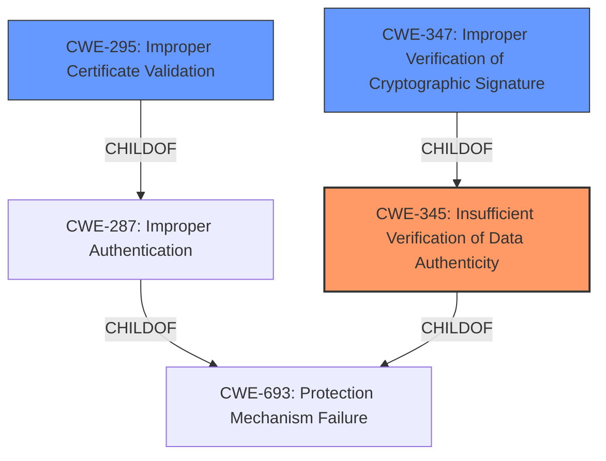

# Raw Analyzer Response for CVE-2022-1053

# Summary

| CWE ID   | CWE Name                                                                     | Confidence | CWE Abstraction Level | CWE Vulnerability Mapping Label | CWE-Vulnerability Mapping Notes |
| :------- | :--------------------------------------------------------------------------- | :--------- | :-------------------- | :------------------------------ | :------------------------------ |
| CWE-345  | Insufficient Verification of Data Authenticity                               | 0.85       | Class                 | Primary                         | Allowed-with-Review             |
| CWE-295  | Improper Certificate Validation                                               | 0.60       | Base                  | Secondary                       | Allowed                         |

## Evidence and Confidence

*   **Confidence Score:** 0.75
*   **Evidence Strength:** MEDIUM

## Relationship Analysis

The primary relationship influencing the decision is the parent-child relationship where CWE-345 is a parent to CWE-347 (Improper Verification of Cryptographic Signature). The vulnerability description describes a **failure to ensure the registrar data is the same**, which aligns well with the broader concept of **insufficient verification of data authenticity**. The retriever results included CWE-295 (Improper Certificate Validation) which is a related authentication issue.

## Vulnerability Chain

The vulnerability chain starts with **Keylime not enforcing consistent registrar data** (root cause), leading to the **possibility of using a software TPM's AK for verification** (weakness), and ultimately resulting in **a broken chain of trust** (impact).

## Summary of Analysis

The initial analysis focused on identifying the root cause of the vulnerability based on the provided description. The core issue is that **"Keylime does not enforce that the agent registrar data is the same when the tenant uses it for validation of the EK and identity quote and the verifier for validating the integrity quote."** This statement highlights a **lack of proper verification of data authenticity**, making CWE-345 (Insufficient Verification of Data Authenticity) a strong candidate.

The CVE Reference Links Content Summary further supports this by stating, **"The vulnerability stems from a design flaw in Keylime where the Tenant and Verifier might not use the same registrar data."** It also mentions **"Data Inconsistency: The core issue is the potential for the Verifier and Tenant to have differing views of the registrar data, particularly the AK and mTLS certificate."**

The retriever results also suggest CWE-295 (Improper Certificate Validation) and CWE-347 (Improper Verification of Cryptographic Signature). While these are related, CWE-345 provides a higher-level classification that encompasses the broader issue of data authenticity. Since the registrar data also includes certificates, CWE-295 is also included as a secondary CWE.

The selected CWEs are at the optimal level of specificity. CWE-345 is a Class-level CWE, but it directly addresses the core issue.

Relevant CWE Information:

# Enhanced Context (25 CWEs)

## CWE-345: Insufficient Verification of Data Authenticity
**Abstraction Level**: Class
**Similarity Score**: 0.78
**Source**: dense

**Description**:
The product does not sufficiently verify the origin or authenticity of data, in a way that causes it to accept invalid data.

**Mapping Guidance**:
- Usage: Discouraged
- Rationale: This CWE entry is a level-1 Class (i.e., a child of a Pillar). It might have lower-level children that would be more appropriate

## CWE-295: Improper Certificate Validation
**Abstraction Level**: Base
**Similarity Score**: 6138.95
**Source**: sparse

**Description**:
The product does not validate, or incorrectly validates, a certificate.

**Mapping Guidance**:
- Usage: Allowed
- Rationale: This CWE entry is at the Base level of abstraction, which is a preferred level of abstraction for mapping to the root causes of vulnerabilities.