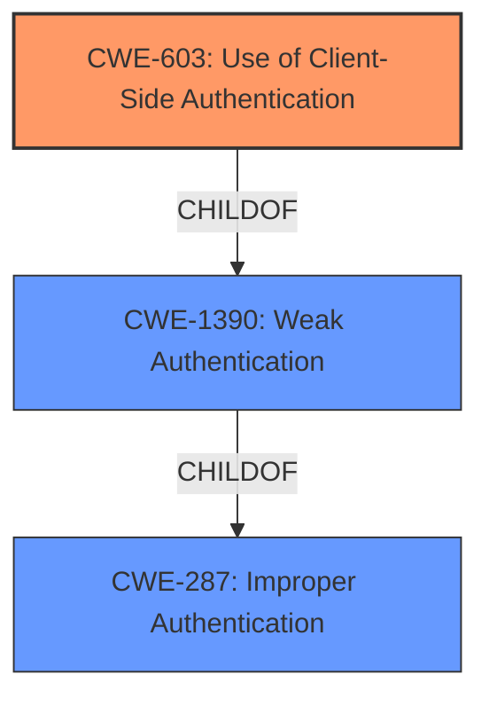

# Analysis Report for CVE-2022-1065

# Vulnerability Analysis Report: CVE-2022-1065

## Description


## Analysis (with Relationship Data)

# Summary
| CWE ID | CWE Name | Confidence | CWE Abstraction Level | CWE Vulnerability Mapping Label | CWE-Vulnerability Mapping Notes |
|---|---|---|---|---|---|
| CWE-603 | Use of Client-Side Authentication | 0.9 | Base | Allowed | Primary CWE |
| CWE-287 | Improper Authentication | 0.6 | Class | Discouraged | Secondary Candidate |
| CWE-1390 | Weak Authentication | 0.6 | Class | Allowed-with-Review | Secondary Candidate |

## Evidence and Confidence

*   **Confidence Score:** 0.9
*   **Evidence Strength:** HIGH

## Relationship Analysis
The primary CWE, CWE-603, is a Base level CWE that is a child of both CWE-1390 and CWE-602. CWE-1390 is a Class level CWE and parent of CWE-603, representing a broader category of authentication issues. CWE-287 is also a Class level CWE and a parent of CWE-1390. The relationship shows a hierarchy from general authentication failures (CWE-287) to weak authentication mechanisms (CWE-1390) to the specific flaw of client-side authentication (CWE-603).



## Vulnerability Chain
The vulnerability chain starts with the **flawed authentication process** in Abacus ERP. The core issue is the **lack of backend validation** for multi-factor authentication (MFA), relying solely on the frontend. This leads to the **MFA bypass**, granting **unauthorized access** to attackers with valid credentials.

## Summary of Analysis
The primary CWE selected is CWE-603 (Use of Client-Side Authentication). This is because the vulnerability description and the CVE Reference Links Content Summary explicitly state that the MFA verification is only performed on the frontend and not on the backend. This aligns perfectly with the CWE-603 description, which states that the server-side authentication can be bypassed if the authentication is only performed on the client-side.

The evidence supporting this decision is:
- "The vulnerability lies in the authentication process of Abacus ERP software, specifically in how multi-factor authentication (MFA) is handled. The backend does not validate the MFA status, relying solely on the frontend." (CVE Reference Links Content Summary)
- "Frontend validation: The verification of the MFA request is only performed on the frontend of the application and not on the backend." (CVE Reference Links Content Summary)

CWE-287 (Improper Authentication) and CWE-1390 (Weak Authentication) were also considered, but were deemed less specific than CWE-603. While the authentication process is indeed flawed and weak, the root cause is the reliance on client-side authentication, which CWE-603 captures directly. Also, the Mapping Guidance for CWE-287 suggests using its children such as CWE-1390.

The selected CWE is at the optimal level of specificity (Base) as it accurately represents the weakness without being overly generic (Class) or overly specific (Variant).

Relevant CWE Information:

# Enhanced Context (25 CWEs)

## CWE-603: Use of Client-Side Authentication
**Abstraction:** Base
**Status:** Draft

### Description
A client/server product performs authentication within client code but not in server code, allowing server-side authentication to be bypassed via a modified client that omits the authentication check.

### Extended Description
Client-side authentication is extremely weak and may be breached easily. Any attacker may read the source code and reverse-engineer the authentication mechanism to access parts of the application which would otherwise be protected.

### Relationships
ChildOf -> CWE-1390
ChildOf -> CWE-602
PeerOf -> CWE-300
PeerOf -> CWE-656

### Mapping Guidance
**Usage:** Allowed
**Rationale:** This CWE entry is at the Base level of abstraction, which is a preferred level of abstraction for mapping to the root causes of vulnerabilities.
**Comments:** Carefully read both the name and description to ensure that this mapping is an appropriate fit. Do not try to 'force' a mapping to a lower-level Base/Variant simply to comply with this preferred level of abstraction.

## CWE-287: Improper Authentication
**Abstraction:** Class
**Status:** Draft

### Description
When an actor claims to have a given identity, the product does not prove or insufficiently proves that the claim is correct.

### Relationships
ChildOf -> CWE-284
ChildOf -> CWE-284

### Mapping Guidance
**Usage:** Discouraged
**Rationale:** This CWE entry might be misused when lower-level CWE entries are likely to be applicable. It is a level-1 Class (i.e., a child of a Pillar).
**Comments:** Consider children or descendants, beginning with CWE-1390: Weak Authentication or CWE-306: Missing Authentication for Critical Function.

## CWE-1390: Weak Authentication
**Abstraction:** Class
**Status:** Incomplete

### Description
The product uses an authentication mechanism to restrict access to specific users or identities, but the mechanism does not sufficiently prove that the claimed identity is correct.

### Relationships
ChildOf -> CWE-287

### Mapping Guidance
**Usage:** Allowed-with-Review
**Rationale:** This CWE entry is a Class and might have Base-level children that would be more appropriate
**Comments:** Examine children of this entry to see if there is a better fit


## CWE Relationship Analysis

Current CWEs represent these abstraction levels: .


### Vulnerability Chain Analysis

**Chain starting from CWE-300:**
- 300 (Channel Accessible by Non-Endpoint) - ROOT


**Chain starting from CWE-1390:**
- 1390 (Weak Authentication) - ROOT


### CWE Relationship Diagram

```mermaid
graph TD
    classDef primary fill:#f96,stroke:#333,stroke-width:2px
    classDef secondary fill:#69f,stroke:#333
    classDef tertiary fill:#9e9,stroke:#333
```


*Report generated on 2025-03-30 17:57:44*
