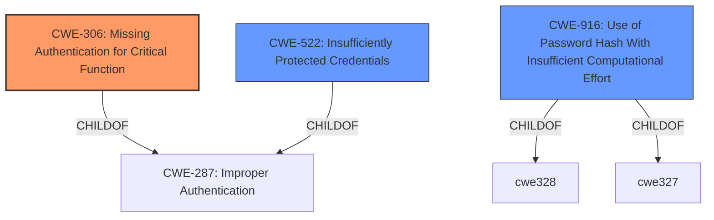

# Analysis for CVE-2022-1070

# Summary
| CWE ID | CWE Name | Confidence | CWE Abstraction Level | CWE Vulnerability Mapping Label | CWE-Vulnerability Mapping Notes |
|---|---|---|---|---|---|
| CWE-306 | Missing Authentication for Critical Function | 0.9 | Base | Primary | Allowed |
| CWE-522 | Insufficiently Protected Credentials | 0.6 | Class | Secondary | Allowed-with-Review |
| CWE-916 | Use of Password Hash With Insufficient Computational Effort | 0.5 | Base | Secondary | Allowed |

## Evidence and Confidence

*   **Confidence Score:** 0.7
*   **Evidence Strength:** MEDIUM

## Relationship Analysis
The primary CWE is CWE-306, which is a base-level CWE indicating a **missing authentication** check. CWE-522, Insufficiently Protected Credentials, and CWE-916, Use of Password Hash With Insufficient Computational Effort, are related but less directly applicable. CWE-306 is a child of CWE-287 (Improper Authentication), which is a more general class. Given the unauthenticated access, CWE-306 is a more precise classification than its parent.

## Vulnerability Chain
The vulnerability chain starts with the **missing authentication** (CWE-306) on the websocket channel. This allows an unauthenticated attacker to access the hashed user credentials, potentially indicating **insufficient protection of credentials** (CWE-522) and/or the use of **insufficient computational effort for password hashing** (CWE-916). The impact is full control of the robots, leading to potential denial of service.

## Summary of Analysis
The initial assessment focused on the **missing authentication** aspect, which is the root cause for allowing unauthorized access to hashed user credentials. The evidence from the CVE Reference Links Content Summary explicitly states the **lack of proper access control** on the websocket communication channel.

The retriever results indicated CWE-306 as a strong candidate. The description of CWE-306 perfectly matches the vulnerability: "The product does not perform any authentication for functionality that requires a provable user identity or consumes a significant amount of resources."

CWE-522, Insufficiently Protected Credentials, is a plausible secondary weakness since the impact involves accessing hashed credentials. However, the primary issue is the **missing authentication**, not necessarily the method of storing or transmitting the credentials.

CWE-916, Use of Password Hash With Insufficient Computational Effort, is another secondary candidate. While the vulnerability allows access to *hashed* credentials, there's no explicit information indicating the hashing algorithm's weakness. This is an assumption based on the impact.

The graph relationships show that CWE-306 is a child of CWE-287 (Improper Authentication), confirming its role in authentication-related vulnerabilities.

The final decision prioritizes CWE-306 as the primary weakness because it directly addresses the root cause: the **missing authentication** on the websocket channel. The other CWEs are considered secondary possibilities based on the impact and potential underlying issues with credential storage.

Relevant CWE Information:

# Enhanced Context (25 CWEs)

## CWE-522: Insufficiently Protected Credentials
**Abstraction:** Class
**Similarity Score**: 0.038
**Source**: sparse

**Description**:
The product transmits or stores authentication credentials, but it uses an insecure method that is susceptible to unauthorized interception and/or retrieval.

**Mapping Guidance**:
- Usage: Allowed-with-Review
- Rationale: This CWE entry is a Class and might have Base-level children that would be more appropriate

## CWE-306: Missing Authentication for Critical Function
**Abstraction:** Base
**Similarity Score**: 0.476
**Source**: dense

**Description**:
The product does not perform any authentication for functionality that requires a provable user identity or consumes a significant amount of resources.

**Mapping Guidance**:
- Usage: Allowed
- Rationale: This CWE entry is at the Base level of abstraction, which is a preferred level of abstraction for mapping to the root causes of vulnerabilities.

## CWE-916: Use of Password Hash With Insufficient Computational Effort
**Abstraction:** Base
**Similarity Score**: 0.035
**Source**: sparse

**Description**:
The product generates a hash for a password, but it uses a scheme that does not provide a sufficient level of computational effort that would make password cracking attacks infeasible or expensive.

**Mapping Guidance**:
- Usage: Allowed
- Rationale: This CWE entry is at the Base level of abstraction, which is a preferred level of abstraction for mapping to the root causes of vulnerabilities.