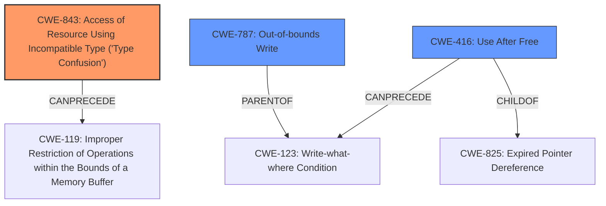

# Raw Analyzer Response for CVE-2022-1096

# Summary
| CWE ID    | CWE Name                                                          | Confidence | CWE Abstraction Level | CWE Vulnerability Mapping Label | CWE-Vulnerability Mapping Notes |
| --------- | ----------------------------------------------------------------- | ---------- | --------------------- | ------------------------------- | ----------------------------- |
| CWE-843   | Access of Resource Using Incompatible Type ('Type Confusion')       | 1          | Base                  | Primary                         | Allowed                       |
| CWE-787   | Out-of-bounds Write                                               | 0.6        | Base                  | Secondary                       | Allowed                       |
| CWE-416   | Use After Free                                                    | 0.4        | Variant               | Secondary                       | Allowed                       |

## Evidence and Confidence

*   **Confidence Score:** 0.8
*   **Evidence Strength:** HIGH

## Relationship Analysis
The primary CWE selected is CWE-843 [Access of Resource Using Incompatible Type ('Type Confusion')] because the vulnerability description explicitly mentions "**type confusion**".

CWE-843 can precede CWE-119 [Improper Restriction of Operations within the Bounds of a Memory Buffer].

CWE-787 [Out-of-bounds Write] and CWE-416 [Use After Free] were also considered as secondary CWEs due to the potential for memory corruption. CWE-787 is a parent of CWE-123 [Write-what-where Condition]. CWE-416 is a child of CWE-825 [Expired Pointer Dereference] and can precede CWE-123.

## Vulnerability Chain
The vulnerability chain starts with "**type confusion**" (CWE-843), which can lead to memory corruption, potentially resulting in an out-of-bounds write (CWE-787) or use-after-free (CWE-416). The end result is heap corruption.

## Summary of Analysis
The initial analysis correctly identified the primary weakness as **type confusion** (CWE-843) based on the vulnerability description and the "CWE for similar CVE Descriptions" section. The "CVE Reference Links Content Summary" also supports this by stating that the "**Root Cause**" is a **type confusion** error within the V8 JavaScript engine.

The final selection of CWE-843 as the primary CWE is justified because it directly reflects the root cause of the vulnerability. The retriever results and similar CVE descriptions also support this selection. CWE-787 and CWE-416 are included as secondary weaknesses due to the potential for memory corruption, but they are not as directly linked to the root cause as CWE-843.

Relevant CWE Information:

# Enhanced Context (25 CWEs)

## CWE-843: Access of Resource Using Incompatible Type ('Type Confusion')
**Abstraction Level**: Base
**Similarity Score**: 0.78
**Source**: dense

**Description**:
The product allocates or initializes a resource such as a pointer, object, or variable using one type, but it later accesses that resource using a type that is incompatible with the original type.

**Mapping Guidance**:
- Usage: Allowed
- Rationale: This CWE entry is at the Base level of abstraction, which is a preferred level of abstraction for mapping to the root causes of vulnerabilities.

## CWE-787: Out-of-bounds Write
**Abstraction Level**: base
**Similarity Score**: 4.33
**Source**: graph

**Description**:
CWE-787: Out-of-bounds Write

**Mapping Guidance**:
- Usage: Allowed
- Rationale: This CWE entry is at the Base level of abstraction, which is a preferred level of abstraction for mapping to the root causes of vulnerabilities.

## CWE-416: Use After Free
**Abstraction Level**: variant
**Similarity Score**: 4.53
**Source**: graph

**Description**:
CWE-416: Use After Free

**Mapping Guidance**:
- Usage: Allowed
- Rationale: This CWE entry is at the Variant level of abstraction, which is a preferred level of abstraction for mapping to the root causes of vulnerabilities.

CWEs considered but not used:
*   CWE-120, CWE-122, CWE-125, CWE-129, CWE-131, CWE-170, CWE-190, CWE-191, CWE-195, CWE-356, CWE-404, CWE-415, CWE-451, CWE-667, CWE-681, CWE-823, CWE-825, CWE-1284, CWE-1289, CWE-1341: These CWEs were not selected because the description focuses on the **type confusion** aspect of the vulnerability. The description mentions "heap corruption" as the impact, and not the root cause.