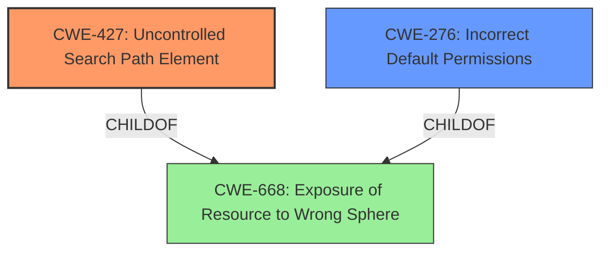

# Enhanced Analysis for CVE-2022-1098

# Summary
| CWE ID | CWE Name | Confidence | CWE Abstraction Level | CWE Vulnerability Mapping Label | CWE-Vulnerability Mapping Notes |
|---|---|---|---|---|---|
| CWE-427 | Uncontrolled Search Path Element | 1.0 | Base | Allowed | Primary CWE |
| CWE-276 | Incorrect Default Permissions | 0.7 | Base | Allowed | Secondary CWE |

## Evidence and Confidence

*   **Confidence Score:** 0.9
*   **Evidence Strength:** HIGH

## Relationship Analysis
The primary CWE is CWE-427, which is a Base level CWE. The vulnerability involves DLL hijacking due to an uncontrolled search path. This is directly supported by the vulnerability description and the CVE Reference Links. CWE-427 is a child of CWE-668 (Exposure of Resource to Wrong Sphere), but CWE-427 is more specific and therefore more appropriate.

CWE-276 is a secondary CWE. The CVE Reference Links Content Summary mentions **Incorrect Default Permissions (CWE-276)** as enabling the attacker to place malicious DLLs.



## Vulnerability Chain
The vulnerability chain starts with **Incorrect Default Permissions (CWE-276)**, which allows an attacker to write files to a directory. Then **Uncontrolled Search Path Element (CWE-427)** causes the application to load a malicious DLL from that attacker-controlled directory, resulting in privilege escalation.

## Summary of Analysis
The initial analysis and conclusion are strongly supported by the provided evidence. The vulnerability description mentions **DLL hijacking**, and the CVE Reference Links Content Summary explicitly states that the **root cause** is **Uncontrolled Search Path Element (CWE-427)**. Furthermore, it says, "The DIAEnergie software is vulnerable to DLL hijacking" and "The application loads DLLs from an uncontrolled search path." This provides a direct link to CWE-427. The **incorrect default permissions** is also listed which allows the placement of the malicious DLL.

The graph relationships helped confirm that CWE-427 is a more specific child of CWE-668 and that it is the primary weakness.

The selected CWEs are at the optimal level of specificity because CWE-427 is a Base level CWE that directly describes the **root cause** of the DLL hijacking vulnerability.

Relevant CWE Information:

# Enhanced Context (25 CWEs)

## CWE-427: Uncontrolled Search Path Element
**Abstraction Level**: Base
**Similarity Score**: 9358.19
**Source**: sparse

**Description**:
The product uses a fixed or controlled search path to find resources, but one or more locations in that path can be under the control of unintended actors.

**Mapping Guidance**:
- Usage: Allowed
- Rationale: This CWE entry is at the Base level of abstraction, which is a preferred level of abstraction for mapping to the root causes of vulnerabilities.

## CWE-276: Incorrect Default Permissions
**Abstraction Level**: Base
**Similarity Score**: 0.226
**Source**: sparse

**Description**:
During installation, installed file permissions are set to allow anyone to modify those files.

**Mapping Guidance**:
- Usage: Allowed
- Rationale: This CWE entry is at the Base level of abstraction, which is a preferred level of abstraction for mapping to the root causes of vulnerabilities.

CWE-732 (Incorrect Permission Assignment for Critical Resource) was considered but not used because the vulnerability is about the *default* permissions being incorrect (CWE-276), not a more general incorrect permission assignment.

CWE-22 (Improper Limitation of a Pathname to a Restricted Directory) was considered but not used because it applies to path traversal vulnerabilities, which is not the case here. The application is loading DLLs from an uncontrolled location, not traversing directories in an unsafe manner.

CWE-269 (Improper Privilege Management) was considered but not used because it is a high-level Class that is often misused. The more specific CWE-427 and CWE-276 more accurately represent the **root causes** of this vulnerability.


## CWE Relationship Analysis

Current CWEs represent these abstraction levels: .


### Vulnerability Chain Analysis

**Chain starting from CWE-276:**
- 276 (Incorrect Default Permissions) - ROOT


**Chain starting from CWE-668:**
- 668 (Exposure of Resource to Wrong Sphere) - ROOT


### CWE Relationship Diagram

```mermaid
graph TD
    classDef primary fill:#f96,stroke:#333,stroke-width:2px
    classDef secondary fill:#69f,stroke:#333
    classDef tertiary fill:#9e9,stroke:#333
```