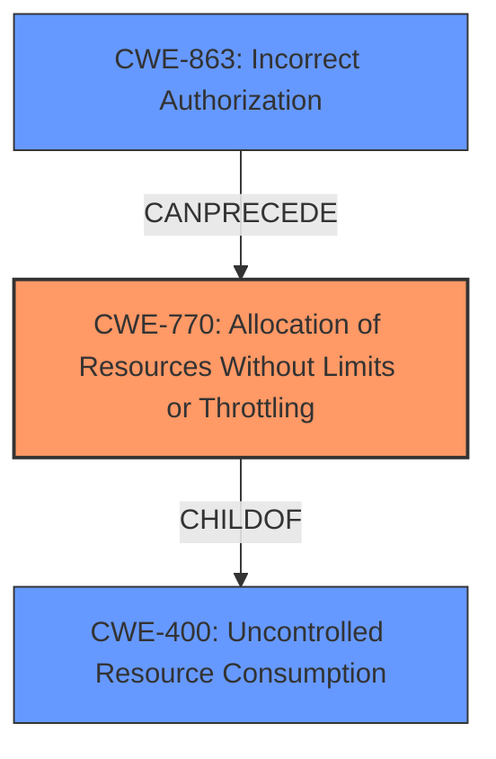

# Raw Analyzer Response for CVE-2022-1099

# Summary

| CWE ID   | CWE Name                                                        | Confidence | CWE Abstraction Level | CWE Vulnerability Mapping Label | CWE-Vulnerability Mapping Notes |
| :-------- | :-------------------------------------------------------------- | :--------- | :-------------------- | :------------------------------ | :------------------------------ |
| CWE-770 | Allocation of Resources Without Limits or Throttling | 0.85      | Base      | Allowed | Primary CWE |
| CWE-400   | Uncontrolled Resource Consumption                               | 0.70       | Class                 | Discouraged                    | Secondary candidate           |
| CWE-863   | Incorrect Authorization                                         | 0.60       | Class                 | Allowed-with-Review           | Secondary candidate           |

## Evidence and Confidence

*   **Confidence Score:** 0.75
*   **Evidence Strength:** MEDIUM

## Relationship Analysis

The primary relationship influencing the CWE selection is the parent-child relationship between CWE-400 (Uncontrolled Resource Consumption) and CWE-770 (Allocation of Resources Without Limits or Throttling). CWE-770 is a more specific Base-level CWE that better represents the **root cause** of the vulnerability than the more general Class-level CWE-400. CWE-400 is often misused, so the more specific CWE-770 is a better fit. The problem description mentions that adding a very large number of tags to a runner **impacts performance**, which is related to the resource consumption.

## Vulnerability Chain

The chain of weaknesses starts with the allocation of resources without proper limits (CWE-770). This leads to uncontrolled resource consumption (CWE-400) which in turn **impacts the performance** of the GitLab server. This could also potentially be related to **improper authorization** (CWE-863) if the ability to add a large number of tags is not properly controlled based on user roles or permissions.

## Summary of Analysis

The initial analysis considered CWE-400 due to the **impact on performance** resulting from adding many tags. However, CWE-770 is a more specific Base-level CWE that directly addresses the **root cause**: the **allocation of resources without limits or throttling**. This aligns with the vulnerability description indicating that a large number of tags can be added, **impacting the performance** of GitLab.

The decision to use CWE-770 is based on the following evidence:

*   The vulnerability description states: "Adding a very large number of tags to a runner in GitLab CE/EE...allows an attacker to **impact the performance** of GitLab."
*   CWE-770 description: "Allocation of Resources Without Limits or Throttling"

The retriever results also suggested CWE-400, but the mapping guidance for CWE-400 discourages its use when more specific mappings are available. CWE-770 is a child of CWE-400 and is therefore a better fit.

CWE-863 was considered because the "problemtype" in the CVE JSON data indicates "Improper Authorization". However, the description of the vulnerability does not explicitly state that this is an authorization issue. It is possible that adding tags should be limited by authorization, but the primary **root cause** appears to be the lack of resource limits, not an authorization failure.

The selected CWEs are at the optimal level of specificity because CWE-770 directly addresses the **root cause** of the vulnerability (lack of resource limits), while CWE-400 describes the general category of the weakness (uncontrolled resource consumption).

Relevant CWE Information:

# Enhanced Context (25 CWEs)

## CWE-668: Exposure of Resource to Wrong Sphere
**Abstraction Level**: Class
**Similarity Score**: 0.74
**Source**: dense

**Description**:
The product exposes a resource to the wrong control sphere, providing unintended actors with inappropriate access to the resource.

**Mapping Guidance**:
- Usage: Discouraged
- Rationale: CWE-668 is high-level and is often misused as a catch-all when lower-level CWE IDs might be applicable. It is sometimes used for low-information vulnerability reports [REF-1287]. It is a level-1 Class (i.e., a child of a Pillar). It is not useful for trend analysis.

## CWE-639: Authorization Bypass Through User-Controlled Key
**Abstraction Level**: Base
**Similarity Score**: 0.74
**Source**: dense

**Description**:
The system's authorization functionality does not prevent one user from gaining access to another user's data or record by modifying the key value identifying the data.

**Mapping Guidance**:
- Usage: Allowed
- Rationale: This CWE entry is at the Base level of abstraction, which is a preferred level of abstraction for mapping to the root causes of vulnerabilities.

## CWE-226: Sensitive Information in Resource Not Removed Before Reuse
**Abstraction Level**: Base
**Similarity Score**: 0.74
**Source**: dense

**Description**:
The product releases a resource such as memory or a file so that it can be made available for reuse, but it does not clear or "zeroize" the information contained in the resource before the product performs a critical state transition or makes the resource available for reuse by other entities.

**Mapping Guidance**:
- Usage: Allowed
- Rationale: This CWE entry is at the Base level of abstraction, which is a preferred level of abstraction for mapping to the root causes of vulnerabilities.

## CWE-807: Reliance on Untrusted Inputs in a Security Decision
**Abstraction Level**: Base
**Similarity Score**: 0.74
**Source**: dense

**Description**:
The product uses a protection mechanism that relies on the existence or values of an input, but the input can be modified by an untrusted actor in a way that bypasses the protection mechanism.

**Mapping Guidance**:
- Usage: Allowed
- Rationale: This CWE entry is at the Base level of abstraction, which is a preferred level of abstraction for mapping to the root causes of vulnerabilities.

## CWE-404: Improper Resource Shutdown or Release
**Abstraction Level**: Class
**Similarity Score**: 0.74
**Source**: dense

**Description**:
The product does not release or incorrectly releases a resource before it is made available for re-use.

**Mapping Guidance**:
- Usage: Allowed-with-Review
- Rationale: This CWE entry is a Class and might have Base-level children that would be more appropriate

## CWE-1390: Weak Authentication
**Abstraction Level**: Class
**Similarity Score**: 0.73
**Source**: dense

**Description**:
The product uses an authentication mechanism to restrict access to specific users or identities, but the mechanism does not sufficiently prove that the claimed identity is correct.

**Mapping Guidance**:
- Usage: Allowed-with-Review
- Rationale: This CWE entry is a Class and might have Base-level children that would be more appropriate

## CWE-1289: Improper Validation of Unsafe Equivalence in Input
**Abstraction Level**: Base
**Similarity Score**: 0.73
**Source**: dense

**Description**:
The product receives an input value that is used as a resource identifier or other type of reference, but it does not validate or incorrectly validates that the input is equivalent to a potentially-unsafe value.

**Mapping Guidance**:
- Usage: Allowed
- Rationale: This CWE entry is at the Base level of abstraction, which is a preferred level of abstraction for mapping to the root causes of vulnerabilities.

## CWE-74: Improper Neutralization of Special Elements in Output Used by a Downstream Component ('Injection')
**Abstraction Level**: Class
**Similarity Score**: 0.73
**Source**: dense

**Description**:
The product constructs all or part of a command, data structure, or record using externally-influenced input from an upstream component, but it does not neutralize or incorrectly neutralizes special elements that could modify how it is parsed or interpreted when it is sent to a downstream component.

**Mapping Guidance**:
- Usage: Discouraged
- Rationale: CWE-74 is high-level and often misused when lower-level weaknesses are more appropriate.

## CWE-212: Improper Removal of Sensitive Information Before Storage or Transfer
**Abstraction Level**: Base
**Similarity Score**: 0.73
**Source**: dense

**Description**:
The product stores, transfers, or shares a resource that contains sensitive information, but it does not properly remove that information before the product makes the resource available to unauthorized actors.

**Mapping Guidance**:
- Usage: