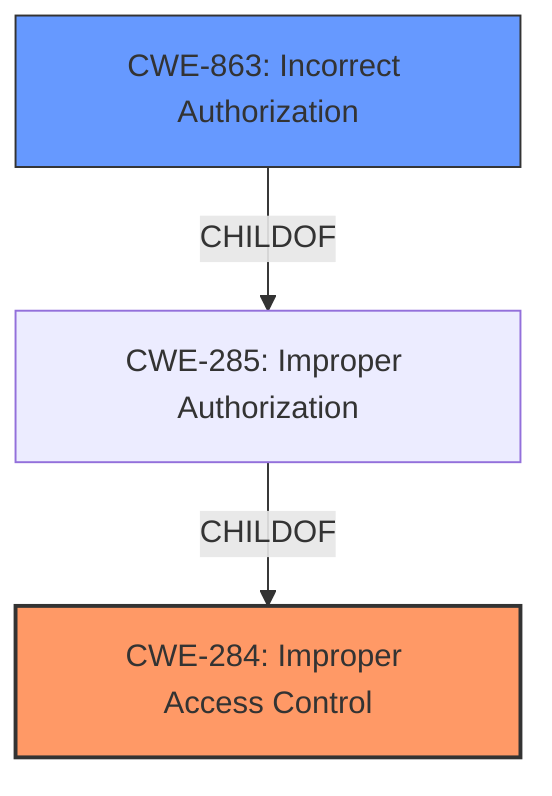

# Raw Analyzer Response for CVE-2022-1105

# Summary
| CWE ID | CWE Name | Confidence | CWE Abstraction Level | CWE Vulnerability Mapping Label | CWE-Vulnerability Mapping Notes |
|---|---|---|---|---|---|
| CWE-284 | Improper Access Control | 0.75 | Pillar | Primary | Discouraged |
| CWE-863 | Incorrect Authorization | 0.65 | Class | Secondary | Allowed-with-Review |

## Evidence and Confidence

*   **Confidence Score:** 0.70
*   **Evidence Strength:** MEDIUM

## Relationship Analysis
The primary CWE, CWE-284, is a Pillar, indicating a high-level category. CWE-863 is a child of CWE-285 (Improper Authorization), which is in turn a child of CWE-284. This hierarchical relationship suggests that while CWE-284 broadly applies, CWE-863 offers a more specific classification if the authorization check is incorrectly performed, rather than entirely missing. The relationship influenced the decision to include CWE-863 as a secondary, more descriptive CWE.

## Vulnerability Chain
The chain of weaknesses begins with the **improper access control** (CWE-284) which leads to unauthorized access of pipeline analytics.

## Summary of Analysis
Initially, the description points directly to **improper access control**, which aligns with CWE-284. However, CWE-284 is a high-level Pillar, and the provided text and retriever results hint at more specific classifications. The retriever results suggest CWE-863 (Incorrect Authorization), CWE-639 (Authorization Bypass Through User-Controlled Key). Given the description, it's not that authorization is entirely missing (CWE-862), but that it's incorrectly implemented, allowing unauthorized access.

The evidence for **improper access control** comes directly from the **Vulnerability Description Key Phrases**: "rootcause: **improper access control**"

CWE-863 is chosen as a secondary CWE because the description states that an unauthorized user can access pipeline analytics even when public pipelines are disabled, implying that there is an authorization check, but it is **incorrect**.

CWE-639 isn't chosen because there's no specific evidence that a user-controlled key is being modified to bypass authorization, although it is a possible attack vector.

CWE-284 is used as the primary because the root cause is **improper access control**.
CWE-863 is used as a secondary because the authorization check is incorrectly performed. These are the most specific and accurate classifications based on the provided evidence.

Relevant CWE Information:

# Enhanced Context (25 CWEs)

## CWE-284: Improper Access Control
**Abstraction:** Pillar
**Status:** Incomplete

### Description
The product does not restrict or incorrectly restricts access to a resource from an unauthorized actor.

### Extended Description
Access control involves the use of several protection mechanisms such as:

- Authentication (proving the identity of an actor)
- Authorization (ensuring that a given actor can access a resource), and
- Accountability (tracking of activities that were performed)

When any mechanism is not applied or otherwise fails, attackers can compromise the security of the product by gaining privileges, reading sensitive information, executing commands, evading detection, etc.

There are two distinct behaviors that can introduce access control weaknesses:

- Specification: incorrect privileges, permissions, ownership, etc. are explicitly specified for either the user or the resource (for example, setting a password file to be world-writable, or giving administrator capabilities to a guest user). This action could be performed by the program or the administrator.
- Enforcement: the mechanism contains errors that prevent it from properly enforcing the specified access control requirements (e.g., allowing the user to specify their own privileges, or allowing a syntactically-incorrect ACL to produce insecure settings). This problem occurs within the program itself, in that it does not actually enforce the intended security policy that the administrator specifies.

### Mapping Guidance
**Usage:** Discouraged
**Rationale:** CWE-284 is extremely high-level, a Pillar. Its name, "Improper Access Control," is often misused in low-information vulnerability reports or by active use of the OWASP Top Ten, such as "A01:2021-Broken Access Control". It is not useful for trend analysis.
**Comments:** Consider using descendants of CWE-284 that are more specific to the kind of access control involved, such as those involving authorization (Missing Authorization (CWE-862), Incorrect Authorization (CWE-863), Incorrect Permission Assignment for Critical Resource (CWE-732), etc.); authentication (Missing Authentication (CWE-306) or Weak Authentication (CWE-1390)); Incorrect User Management (CWE-286); Improper Restriction of Communication Channel to Intended Endpoints (CWE-923); etc.

## CWE-863: Incorrect Authorization
**Abstraction:** Class
**Status:** Incomplete

### Description
The product performs an authorization check when an actor attempts to access a resource or perform an action, but it does not correctly perform the check.

### Extended Description
Not provided

### Mapping Guidance
**Usage:** Allowed-with-Review
**Rationale:** This CWE entry is a Class and might have Base-level children that would be more appropriate
**Comments:** Examine children of this entry to see if there is a better fit