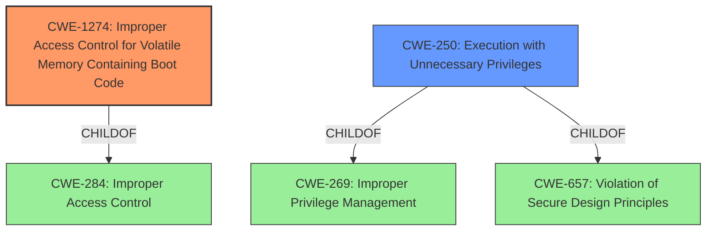

# Enhanced Analysis for CVE-2022-1107

# Summary
| CWE ID | CWE Name | Confidence | CWE Abstraction Level | CWE Vulnerability Mapping Label | CWE-Vulnerability Mapping Notes |
|---|---|---|---|---|---|
| CWE-1274 | Improper Access Control for Volatile Memory Containing Boot Code | 0.8 | Base | Allowed | Primary CWE |
| CWE-250 | Execution with Unnecessary Privileges | 0.6 | Base | Allowed | Secondary Candidate |

## Evidence and Confidence

*   **Confidence Score:** 0.7
*   **Evidence Strength:** MEDIUM

## Relationship Analysis
The primary relationship influencing the decision is the ChildOf relationship between CWE-1274 and CWE-284 (Improper Access Control). The vulnerability description points to the **use of Boot Services in the SmmOEMInt15 SMI handler** which indicates improper access control within the boot process. CWE-250 is considered due to the elevated privileges required to exploit the vulnerability, and its relationship as a child of CWE-269 (Privilege Issues) and CWE-657 (Violation of Secure Design Principles).



## Vulnerability Chain
The vulnerability chain starts with the **use of Boot Services in the SmmOEMInt15 SMI handler**, leading to **improper access control** of volatile memory containing boot code. This allows an attacker with elevated privileges to execute code. The root cause is the **improper access control**, and the impact is code execution.

## Summary of Analysis
The initial analysis focused on the **use of Boot Services in the SmmOEMInt15 SMI handler** as the root cause. The Retriever Results pointed to CWE-1274 (Improper Access Control for Volatile Memory Containing Boot Code) as a potential match. This CWE specifically addresses vulnerabilities in secure-boot processes where bootloader code in volatile memory lacks sufficient access control. The vulnerability description mentions code execution with elevated privileges, which aligns with the potential impact of CWE-1274. The evidence "During an internal product security audit a potential vulnerability due to **use of Boot Services in the SmmOEMInt15 SMI handler** was discovered in some ThinkPad models could be exploited by an attacker with elevated privileges that could allow for execution of code." is the root cause.

CWE-1274 is selected as the primary CWE because it directly addresses the vulnerability described: the lack of sufficient access control for volatile memory containing boot code. CWE-250 is a secondary concern, given the attacker needs elevated privileges.

The selected CWEs are at the optimal level of specificity because they accurately represent the root cause and contributing factors of the vulnerability.

Relevant CWE Information:

# Enhanced Context (25 CWEs)

## CWE-1274: Improper Access Control for Volatile Memory Containing Boot Code
**Abstraction:** Base
**Status:** Stable

### Description
The product conducts a secure-boot process that transfers bootloader code from Non-Volatile Memory (NVM) into Volatile Memory (VM), but it does not have sufficient access control or other protections for the Volatile Memory.

### Extended Description
Adversaries could bypass the secure-boot process and execute their own untrusted, malicious boot code.

### Relationships
ChildOf -> CWE-284

### Mapping Guidance
**Usage:** Allowed
**Rationale:** This CWE entry is at the Base level of abstraction, which is a preferred level of abstraction for mapping to the root causes of vulnerabilities.

## CWE-250: Execution with Unnecessary Privileges
**Abstraction:** Base
**Status:** Draft

### Description
The product performs an operation at a privilege level that is higher than the minimum level required, which creates new weaknesses or amplifies the consequences of other weaknesses.

### Relationships
ChildOf -> CWE-269
ChildOf -> CWE-657


## CWE Relationship Analysis

Current CWEs represent these abstraction levels: .


### Vulnerability Chain Analysis

**Chain starting from CWE-250:**
- 250 (Execution with Unnecessary Privileges) - ROOT


**Chain starting from CWE-1274:**
- 1274 (Improper Access Control for Volatile Memory Containing Boot Code) - ROOT


### CWE Relationship Diagram

```mermaid
graph TD
    classDef primary fill:#f96,stroke:#333,stroke-width:2px
    classDef secondary fill:#69f,stroke:#333
    classDef tertiary fill:#9e9,stroke:#333
```