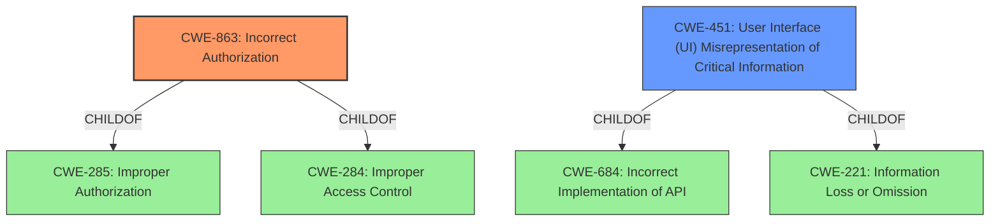

# Raw Analyzer Response for CVE-2022-1111

# Summary
| CWE ID | CWE Name | Confidence | CWE Abstraction Level | CWE Vulnerability Mapping Label | CWE-Vulnerability Mapping Notes |
|---|---|---|---|---|---|
| CWE-863 | Incorrect Authorization | 0.75 | Class | Allowed-with-Review | Primary CWE |
| CWE-451 | User Interface (UI) Misrepresentation of Critical Information | 0.6 | Class | Allowed-with-Review | Secondary Candidate |

## Evidence and Confidence

*   **Confidence Score:** 0.7
*   **Evidence Strength:** MEDIUM

## Relationship Analysis
The primary CWE is CWE-863, which is a child of CWE-285 (Improper Authorization) and CWE-284 (Improper Access Control). CWE-451 is a peer of CWE-346 (Reliance on Untrusted Inputs in a Security Decision) and a child of CWE-684 (Incorrect Implementation of API) and CWE-221 (Information Loss or Omission). The choice of CWE-863 reflects the specific authorization error, while CWE-451 addresses the UI misrepresentation aspect. The class level of abstraction is appropriate given the available information.

## Vulnerability Chain
The vulnerability chain starts with a **business logic error** which leads to **incorrect authorization**, culminating in **imported projects showing an incorrect user** in the project membership pages. This involves a flaw in how access is granted and displayed.
  - Business Logic Error -> Incorrect Authorization -> UI Misrepresentation

## Summary of Analysis
The initial assessment considered the provided vulnerability description and the retriever results. The primary focus was on identifying the root cause of the vulnerability and the specific weakness that allowed the issue to occur. The provided information highlights a **business logic error** that leads to incorrect authorization. The "CVE Reference Links Content Summary" section provides limited information, but it confirms that the content is related to the CVE. The final decision was based on a combination of the vulnerability description, the retriever results, and the CWE specifications.

The primary CWE, CWE-863 (Incorrect Authorization), is chosen because the vulnerability involves an authorization check being performed incorrectly, leading to users being assigned incorrect access permissions. This aligns well with the description of CWE-863. The evidence supporting this is the "Vulnerability Description" stating that the **business logic error** caused "imported projects to show an incorrect user in the Access Granted column."

CWE-451 (User Interface (UI) Misrepresentation of Critical Information) is considered as a secondary CWE because the incorrect user being displayed in the Access Granted column represents a misrepresentation of critical information to the user. This aligns with the description of CWE-451, which states that the "user interface (UI) does not properly represent critical information to the user."

The selection of CWE-863 and CWE-451 is at the optimal level of specificity. While CWE-285 (Improper Authorization) is a parent of CWE-863, CWE-863 provides a more precise description of the vulnerability. Similarly, while CWE-284 (Improper Access Control) is a parent of both CWE-285 and CWE-269, it is too high-level and does not provide enough detail about the specific weakness.

Relevant CWE Information:

# Enhanced Context (25 CWEs)
The following CWEs were identified as potentially relevant to this vulnerability:

## CWE-1220: Insufficient Granularity of Access Control
**Abstraction Level**: Base
**Similarity Score**: 0.76
**Source**: dense

**Description**:
The product implements access controls via a policy or other feature with the intention to disable or restrict accesses (reads and/or writes) to assets in a system from untrusted agents. However, implemented access controls lack required granularity, which renders the control policy too broad because it allows accesses from unauthorized agents to the security-sensitive assets.

**Mapping Guidance**:
- Usage: Allowed
- Rationale: This CWE entry is at the Base level of abstraction, which is a preferred level of abstraction for mapping to the root causes of vulnerabilities.

## CWE-274: Improper Handling of Insufficient Privileges
**Abstraction Level**: Base
**Similarity Score**: 0.75
**Source**: dense

**Description**:
The product does not handle or incorrectly handles when it has insufficient privileges to perform an operation, leading to resultant weaknesses.

**Mapping Guidance**:
- Usage: Discouraged
- Rationale: This CWE entry could be deprecated in a future version of CWE.

## CWE-664: Improper Control of a Resource Through its Lifetime
**Abstraction Level**: Pillar
**Similarity Score**: 0.75
**Source**: dense

**Description**:
The product does not maintain or incorrectly maintains control over a resource throughout its lifetime of creation, use, and release.

**Mapping Guidance**:
- Usage: Discouraged
- Rationale: This CWE entry is high-level when lower-level children are available.

## CWE-653: Improper Isolation or Compartmentalization
**Abstraction Level**: Class
**Similarity Score**: 0.75
**Source**: dense

**Description**:
The product does not properly compartmentalize or isolate functionality, processes, or resources that require different privilege levels, rights, or permissions.

**Mapping Guidance**:
- Usage: Allowed
- Rationale: This CWE entry is at the Base level of abstraction, which is a preferred level of abstraction for mapping to the root causes of vulnerabilities.

## CWE-639: Authorization Bypass Through User-Controlled Key
**Abstraction Level**: Base
**Similarity Score**: 0.75
**Source**: dense

**Description**:
The system's authorization functionality does not prevent one user from gaining access to another user's data or record by modifying the key value identifying the data.

**Mapping Guidance**:
- Usage: Allowed
- Rationale: This CWE entry is at the Base level of abstraction, which is a preferred level of abstraction for mapping to the root causes of vulnerabilities.

## CWE-280: Improper Handling of Insufficient Permissions or Privileges 
**Abstraction Level**: Base
**Similarity Score**: 0.74
**Source**: dense

**Description**:
The product does not handle or incorrectly handles when it has insufficient privileges to access resources or functionality as specified by their permissions. This may cause it to follow unexpected code paths that may leave the product in an invalid state.

**Mapping Guidance**:
- Usage: Allowed
- Rationale: This CWE entry is at the Base level of abstraction, which is a preferred level of abstraction for mapping to the root causes of vulnerabilities.

## CWE-668: Exposure of Resource to Wrong Sphere
**Abstraction Level**: Class
**Similarity Score**: 0.74
**Source**: dense

**Description**:
The product exposes a resource to the wrong control sphere, providing unintended actors with inappropriate access to the resource.

**Mapping Guidance**:
- Usage: Discouraged
- Rationale: CWE-668 is high-level and is often misused as a catch-all when lower-level CWE IDs might be applicable. It is sometimes used for low-information vulnerability reports [REF-1287]. It is a level-1 Class (i.e., a child of a Pillar). It is not useful for trend analysis.

## CWE-266: Incorrect Privilege Assignment
**Abstraction Level**: Base
**Similarity Score**: 0.73
**Source**: dense

**Description**:
A product incorrectly assigns a privilege to a particular actor, creating an unintended sphere of control for that actor.

**Mapping Guidance**:
- Usage: Allowed
- Rationale: This CWE entry is at the Base level of abstraction, which is a preferred level of abstraction for mapping to the root causes of vulnerabilities.

## CWE-404: Improper Resource Shutdown or Release
**Abstraction Level**: Class
**Similarity Score**: 0.73
**Source**: dense

**Description**:
The product does not release or incorrectly releases a resource before it is made available for re-use.

**Mapping Guidance**:
- Usage: Allowed-with-Review
- R