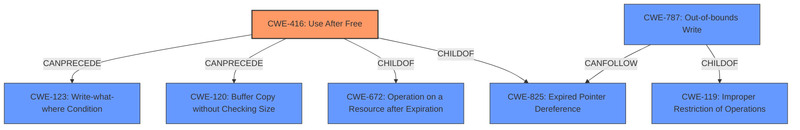

# Analysis Report for CVE-2022-1135

# Vulnerability Analysis Report: CVE-2022-1135

## Description


## Analysis (with Relationship Data)

# Summary
| CWE ID | CWE Name | Confidence | CWE Abstraction Level | CWE Vulnerability Mapping Label | CWE-Vulnerability Mapping Notes |
|---|---|---|---|---|---|
| CWE-416 | Use After Free | 1.0 | Variant | Allowed | Primary CWE |
| CWE-787 | Out-of-bounds Write | 0.6 | Base | Allowed | Secondary Candidate |

## Evidence and Confidence

*   **Confidence Score:** 0.9
*   **Evidence Strength:** HIGH

## Relationship Analysis
The primary CWE is CWE-416 **Use After Free**, which is a Variant level CWE. It is related to CWE-825 **Expired Pointer Dereference** and CWE-672 **Operation on a Resource after Expiration**. CWE-416 can precede CWE-120 **Buffer Copy without Checking Size of Input** or CWE-123 **Write-what-where Condition**.

CWE-787 **Out-of-bounds Write** is a Base level CWE. It is related to CWE-119 **Improper Restriction of Operations within the Bounds of a Memory Buffer** and can follow CWE-825 **Expired Pointer Dereference**.



## Vulnerability Chain
The vulnerability chain starts with the **use after free** (CWE-416). This can lead to heap corruption, which can be exploited to achieve remote code execution. The **use after free** can potentially result in an out-of-bounds write (CWE-787) if the freed memory is reallocated and then written to using the original pointer.

## Summary of Analysis
The primary weakness is a **use after free** in the Shopping Cart feature of Google Chrome. The vulnerability description and the CVE Reference Links Content Summary both explicitly state the **weakness** as "**use after free**". The retriever results also identify CWE-416 as the top candidate. Therefore, CWE-416 **Use After Free** is the most appropriate CWE.

The **use after free** could potentially lead to memory corruption and potentially an out-of-bounds write (CWE-787) if the freed memory is reallocated and overwritten. So it is added as a secondary candidate.

CWE-366 **Race Condition within a Thread** was considered due to the potential for concurrent access to the freed memory. However, the description does not explicitly mention a race condition, so it was not selected.

CWE-415 **Double Free** was also considered, but the vulnerability description does not indicate a double free condition. The **root cause** is the **use after free**, not a double free.

The selection of CWE-416 and CWE-787 is at the optimal level of specificity, as CWE-416 is a Variant and CWE-787 is a Base level CWE. These are the preferred levels of abstraction according to the CWE mapping guidance.


## CWE Relationship Analysis

Current CWEs represent these abstraction levels: .


### Vulnerability Chain Analysis

**Chain starting from CWE-825:**
- 825 (Expired Pointer Dereference) - ROOT


**Chain starting from CWE-672:**
- 672 (Operation on a Resource after Expiration or Release) - ROOT


### CWE Relationship Diagram

```mermaid
graph TD
    classDef primary fill:#f96,stroke:#333,stroke-width:2px
    classDef secondary fill:#69f,stroke:#333
    classDef tertiary fill:#9e9,stroke:#333
```


*Report generated on 2025-03-31 04:51:54*
