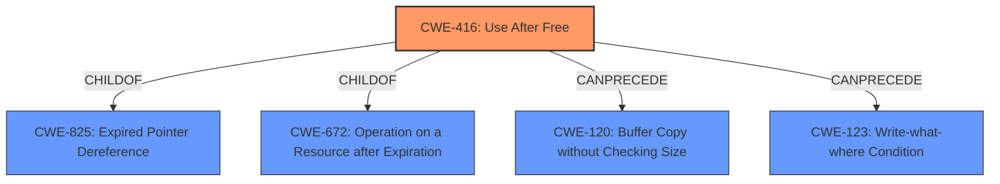

# Enhanced Analysis for CVE-2022-1136

# Summary

| CWE ID | CWE Name | Confidence | CWE Abstraction Level | CWE Vulnerability Mapping Label | CWE-Vulnerability Mapping Notes |
|---|---|---|---|---|---|
| CWE-416 | Use After Free | 1.0 | Variant | Allowed | Primary CWE |

## Evidence and Confidence

*   **Confidence Score:** 1.0
*   **Evidence Strength:** HIGH

## Relationship Analysis
The primary relationship that influenced the decision was the direct match of "**use after free**" in the vulnerability description to the CWE-416 name. While CWE-416 has parent relationships (ChildOf -> CWE-825, ChildOf -> CWE-672, ChildOf -> CWE-672, ChildOf -> CWE-672) and chain relationships (CanPrecede -> CWE-120, CanPrecede -> CWE-123), those are not relevant in this case as the root cause is already identified as **use after free**.



## Vulnerability Chain
The vulnerability chain starts with the **use after free** condition (CWE-416), which leads to **heap corruption**. The vulnerability description provides: "**Use after free** in Tab Strip in Google Chrome prior to 100.0.4896.60 allowed an attacker who convinced a user to install a malicious extension to potentially exploit **heap corruption** via specific set of user gestures."

## Summary of Analysis
The analysis is based on the provided evidence, which clearly indicates a **use after free** vulnerability. The vulnerability description and CVE Reference Links Content Summary both confirm this.

The primary CWE is CWE-416 (Use After Free), which directly addresses the root cause. The retriever results also list CWE-416 as the top candidate with a score of 0.427. The CWE description aligns with the vulnerability, where memory is reused after being freed, leading to potential **heap corruption**.

Other CWEs were considered, but not used:

*   CWE-366 (Race Condition within a Thread): While race conditions can sometimes lead to use-after-free vulnerabilities, there is no specific evidence of a race condition in this vulnerability description.
*   CWE-843 (Access of Resource Using Incompatible Type ('Type Confusion')): Type confusion could potentially lead to memory corruption, but the root cause here is the **use after free**, not the type confusion itself.
*   CWE-122 (Heap-based Buffer Overflow): While **heap corruption** is mentioned, the root cause is not a buffer overflow but a **use after free**.
*   CWE-362 (Concurrent Execution using Shared Resource with Improper Synchronization ('Race Condition')) and CWE-364 (Signal Handler Race Condition): As mentioned above, there is no direct evidence of a race condition in the provided description.
*   CWE-415 (Double Free): Similar to a use-after-free, but distinct. The description does not indicate a double free.
*   CWE-1021 (Improper Restriction of Rendered UI Layers or Frames) and CWE-451 (User Interface (UI) Misrepresentation of Critical Information): These are related to UI issues, but the root cause is a memory management issue.
*   CWE-404 (Improper Resource Shutdown or Release): This is a more general resource management issue, but the specific issue is a **use after free**.

The selection of CWE-416 is at the optimal level of specificity because it directly addresses the root cause of the vulnerability.


## CWE Relationship Analysis

Current CWEs represent these abstraction levels: .


### Vulnerability Chain Analysis

**Chain starting from CWE-825:**
- 825 (Expired Pointer Dereference) - ROOT


**Chain starting from CWE-672:**
- 672 (Operation on a Resource after Expiration or Release) - ROOT


### CWE Relationship Diagram

```mermaid
graph TD
    classDef primary fill:#f96,stroke:#333,stroke-width:2px
    classDef secondary fill:#69f,stroke:#333
    classDef tertiary fill:#9e9,stroke:#333
```