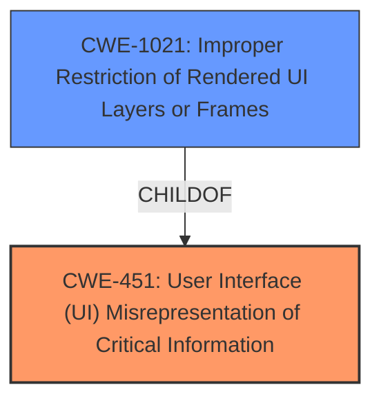

# Analysis for CVE-2022-1138

# Summary
| CWE ID | CWE Name | Confidence | CWE Abstraction Level | CWE Vulnerability Mapping Label | CWE-Vulnerability Mapping Notes |
|---|---|---|---|---|---|
| CWE-451 | User Interface (UI) Misrepresentation of Critical Information | 0.75 | Class | Primary | Allowed-with-Review |
| CWE-1021 | Improper Restriction of Rendered UI Layers or Frames | 0.65 | Base | Secondary | Allowed |

## Evidence and Confidence

*   **Confidence Score:** 0.70
*   **Evidence Strength:** MEDIUM

## Relationship Analysis
The primary relationship influencing the decision is that CWE-1021 is a ChildOf CWE-451. While CWE-1021 is more specific and at the Base level, the vulnerability description suggests a misrepresentation of critical information, but does not specifically describe that the vulnerability is due to the improper restriction of UI layers or frames, therefore using CWE-451 as the primary CWE covers the broader class of UI Misrepresentation.

## Vulnerability Chain
The vulnerability chain starts with an **inappropriate implementation** in the Web Cursor component, leading to the ability of a remote attacker to obscure the contents of the Omnibox (URL bar) via a crafted HTML page.

## Summary of Analysis
The initial analysis considered CWE-451 due to the vulnerability involving obscuring the URL bar, which falls under UI misrepresentation. However, CWE-1021 was also considered due to the mention of a crafted HTML page, which can involve frame manipulation.

The final decision leans towards CWE-451 as the primary CWE because the core issue is the obscuring of critical information in the UI. The evidence from the vulnerability description is: "allowed a remote attacker who had compromised the renderer process to **obscure the contents of the Omnibox (URL bar) via a crafted HTML page**." This clearly indicates a misrepresentation of the URL bar's contents, which is the critical information in this case.

CWE-1021 is included as a secondary CWE because the attack vector involves a crafted HTML page, suggesting a possible improper restriction of rendered UI layers or frames, where an attacker could use a malicious frame to obscure the actual URL.

The selected CWEs are at the optimal level of specificity. CWE-451 is a Class that covers the broad category of UI misrepresentation, while CWE-1021 is a Base that is a child of CWE-451, but is not specific enough to be the primary weakness.

Relevant CWE Information:

# Enhanced Context (25 CWEs)

## CWE-41: Improper Resolution of Path Equivalence
**Abstraction Level**: Base
**Similarity Score**: 0.80
**Source**: dense

**Description**:
The product is vulnerable to file system contents disclosure through path equivalence. Path equivalence involves the use of special characters in file and directory names. The associated manipulations are intended to generate multiple names for the same object.

**Mapping Guidance**:
- Usage: Allowed
- Rationale: This CWE entry is at the Base level of abstraction, which is a preferred level of abstraction for mapping to the root causes of vulnerabilities.

**Analysis:** This CWE is not relevant as the vulnerability does not involve file system path manipulation.

## CWE-451: User Interface (UI) Misrepresentation of Critical Information
**Abstraction Level**: Class
**Similarity Score**: 0.79
**Source**: dense

**Description**:
The user interface (UI) does not properly represent critical information to the user, allowing the information - or its source - to be obscured or spoofed. This is often a component in phishing attacks.

**Mapping Guidance**:
- Usage: Allowed-with-Review
- Rationale: This CWE entry is a Class and might have Base-level children that would be more appropriate

**Analysis:** This CWE is relevant as the vulnerability involves obscuring the contents of the Omnibox (URL bar). The Omnibox is part of the UI and displays critical information (the URL).

## CWE-668: Exposure of Resource to Wrong Sphere
**Abstraction Level**: Class
**Similarity Score**: 0.79
**Source**: dense

**Description**:
The product exposes a resource to the wrong control sphere, providing unintended actors with inappropriate access to the resource.

**Mapping Guidance**:
- Usage: Discouraged
- Rationale: CWE-668 is high-level and is often misused as a catch-all when lower-level CWE IDs might be applicable. It is sometimes used for low-information vulnerability reports [REF-1287]. It is a level-1 Class (i.e., a child of a Pillar). It is not useful for trend analysis.

**Analysis:** This CWE is too general and does not accurately describe the specific vulnerability.

## CWE-204: Observable Response Discrepancy
**Abstraction Level**: Base
**Similarity Score**: 0.78
**Source**: dense

**Description**:
The product provides different responses to incoming requests in a way that reveals internal state information to an unauthorized actor outside of the intended control sphere.

**Mapping Guidance**:
- Usage: Allowed
- Rationale: This CWE entry is at the Base level of abstraction, which is a preferred level of abstraction for mapping to the root causes of vulnerabilities.

**Analysis:** This CWE is not relevant as the vulnerability does not involve observable response discrepancies.

## CWE-23: Relative Path Traversal
**Abstraction Level**: Base
**Similarity Score**: 0.78
**Source**: dense

**Description**:
The product uses external input to construct a pathname that should be within a restricted directory, but it does not properly neutralize sequences such as ".." that can resolve to a location that is outside of that directory.

**Mapping Guidance**:
- Usage: Allowed
- Rationale: This CWE entry is at the Base level of abstraction, which is a preferred level of abstraction for mapping to the root causes of vulnerabilities.

**Analysis:** This CWE is not relevant as the vulnerability does not involve path traversal.

## CWE-1289: Improper Validation of Unsafe Equivalence in Input
**Abstraction Level**: Base
**Similarity Score**: 0.77
**Source**: dense

**Description**:
The product receives an input value that is used as a resource identifier or other type of reference, but it does not validate or incorrectly validates that the input is equivalent to a potentially-unsafe value.

**Mapping Guidance**:
- Usage: Allowed
- Rationale: This CWE entry is at the Base level of abstraction, which is a preferred level of abstraction for mapping to the root causes of vulnerabilities.

**Analysis:** This CWE is not relevant as the vulnerability does not involve improper validation of unsafe equivalence in input.

## CWE-59: Improper Link Resolution Before File Access ('Link Following')
**Abstraction Level**: Base
**Similarity Score**: 0.77
**Source**: dense

**Description**:
The product attempts to access a file based on the filename, but it does not properly prevent that filename from identifying a link or shortcut that resolves to an unintended resource.

**Mapping Guidance**:
- Usage: Allowed
- Rationale: This CWE entry is at the Base level of abstraction, which is a preferred level of abstraction for mapping to the root causes of vulnerabilities.

**Analysis:** This CWE is not relevant as the vulnerability does not involve improper link resolution.

## CWE-843: Access of Resource Using Incompatible Type ('Type Confusion')
**Abstraction Level**: Base
**Similarity Score**: 0.77
**Source**: dense

**Description**:
The product allocates or initializes a resource such as a pointer, object, or variable using one type, but it later accesses that resource using a type that is incompatible with the original type.

**Mapping Guidance**:
- Usage: Allowed
- Rationale: This CWE entry is at the Base level of abstraction, which is a preferred level of abstraction for mapping to the root causes of vulnerabilities.

**Analysis:** This CWE is not relevant as the vulnerability does not involve type confusion.

## CWE-610: Externally Controlled Reference to a Resource in Another Sphere
**Abstraction Level**: Class
**Similarity Score**: 0.77
**Source**: dense

**Description**:
The product uses an externally controlled name or reference that resolves to a resource that is outside of the intended control sphere.

**Mapping Guidance**:
- Usage: Discouraged
- Rationale: This CWE entry is a level-1 Class (i.e., a child of a Pillar). It might have lower-level children that would be more appropriate

**Analysis:** This CWE is too general and does not accurately describe the specific vulnerability.

## CWE-754: Improper Check for Unusual or Exceptional Conditions
**Abstraction Level**: Class
**Similarity Score**: 0.76
**Source**: dense

**Description**:
The product does not check or incorrectly checks