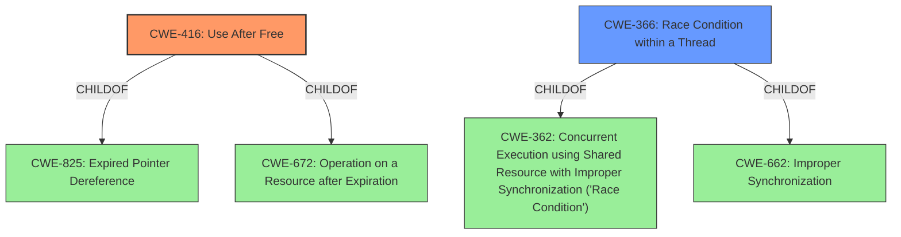

# Analysis for CVE-2022-1141

# Summary
| CWE ID | CWE Name | Confidence | CWE Abstraction Level | CWE Vulnerability Mapping Label | CWE-Vulnerability Mapping Notes |
|---|---|---|---|---|---|
| CWE-416 | Use After Free | 1.0 | Variant | Allowed | Primary CWE |
| CWE-366 | Race Condition within a Thread | 0.5 | Base | Allowed | Secondary Candidate |

## Evidence and Confidence

*   **Confidence Score:** 0.75
*   **Evidence Strength:** HIGH

## Relationship Analysis
The primary CWE selected is CWE-416, which is a Variant of CWE-825 (Expired Pointer Dereference) and CWE-672 (Operation on a Resource after Expiration). CWE-366 (Race Condition within a Thread) is a Base CWE and a child of CWE-362 (Concurrent Execution using Shared Resource with Improper Synchronization ('Race Condition')) and CWE-662 (Improper Synchronization).

## Vulnerability Chain
The vulnerability chain starts with a **use-after-free** condition in the File Manager component of Google Chrome, potentially leading to heap corruption and remote code execution.

## Summary of Analysis
The vulnerability is a **use-after-free** in the File Manager of Google Chrome. The vulnerability occurs when memory is accessed after it has been freed. This can lead to heap corruption and potentially remote code execution.

The primary CWE is CWE-416 (Use After Free) because the vulnerability description explicitly mentions "**use after free**" as the **rootcause** of the vulnerability. The CVE Reference Links Content Summary also confirms "**Use-after-free** in File Manager." The description of CWE-416 accurately matches the vulnerability: "The product reuses or references memory after it has been freed." Confidence in this selection is high (1.0).

CWE-366 (Race Condition within a Thread) was considered as a secondary candidate since use-after-free vulnerabilities can sometimes arise from race conditions. However, there is no explicit mention of concurrent execution or threads in the vulnerability description. Therefore, CWE-366 is a less direct match. The **CVE Reference Links Content Summary** does not mention race conditions. Confidence in this selection is moderate (0.5).

The selection of CWE-416 as the primary CWE is based on the strong evidence provided in the vulnerability description and CVE Reference Links Content Summary, which directly identify a **use-after-free** condition. This aligns with the MITRE mapping guidance for CWE-416, which allows its use at the Variant level of abstraction. The chain of events begins with the **use-after-free**, progresses to heap corruption, and could potentially lead to remote code execution.

Relevant CWE Information:

# Enhanced Context (25 CWEs)

## CWE-404: Improper Resource Shutdown or Release
**Abstraction Level**: Class
**Similarity Score**: 0.80
**Source**: dense

**Description**:
The product does not release or incorrectly releases a resource before it is made available for re-use.

**Mapping Guidance**:
- Usage: Allowed-with-Review
- Rationale: This CWE entry is a Class and might have Base-level children that would be more appropriate

This CWE was considered but not selected because the vulnerability is specifically a **use-after-free**, which implies that the resource was freed at some point, but then accessed again.

## CWE-226: Sensitive Information in Resource Not Removed Before Reuse
**Abstraction Level**: Base
**Similarity Score**: 0.78
**Source**: dense

**Description**:
The product releases a resource such as memory or a file so that it can be made available for reuse, but it does not clear or "zeroize" the information contained in the resource before the product performs a critical state transition or makes the resource available for reuse by other entities.

**Mapping Guidance**:
- Usage: Allowed
- Rationale: This CWE entry is at the Base level of abstraction, which is a preferred level of abstraction for mapping to the root causes of vulnerabilities.

This CWE was considered but not selected because the core issue is not about sensitive information remaining in the freed resource, but about accessing the resource after it has been freed.

## CWE-366: Race Condition within a Thread
**Abstraction Level**: Base
**Similarity Score**: 0.76
**Source**: dense

**Description**:
If two threads of execution use a resource simultaneously, there exists the possibility that resources may be used while invalid, in turn making the state of execution undefined.

**Mapping Guidance**:
- Usage: Allowed
- Rationale: This CWE entry is at the Base level of abstraction, which is a preferred level of abstraction for mapping to the root causes of vulnerabilities.

This CWE was considered and selected as a secondary candidate because **use-after-free** vulnerabilities can sometimes arise from race conditions. However, there is no explicit mention of concurrent execution or threads in the vulnerability description.

## CWE-667: Improper Locking
**Abstraction Level**: Class
**Similarity Score**: 0.75
**Source**: dense

**Description**:
The product does not properly acquire or release a lock on a resource, leading to unexpected resource state changes and behaviors.

**Mapping Guidance**:
- Usage: Allowed-with-Review
- Rationale: This CWE entry is a Class and might have Base-level children that would be more appropriate

This CWE was considered but not selected because there is no mention of locking or synchronization issues in the vulnerability description.

## CWE-772: Missing Release of Resource after Effective Lifetime
**Abstraction Level**: Base
**Similarity Score**: 0.75
**Source**: dense

**Description**:
The product does not release a resource after its effective lifetime has ended, i.e., after the resource is no longer needed.

**Mapping Guidance**:
- Usage: Allowed
- Rationale: This CWE entry is at the Base level of abstraction, which is a preferred level of abstraction for mapping to the root causes of vulnerabilities.

This CWE was considered but not selected because the vulnerability involves accessing a resource *after* it was freed, not failing to release it.

## CWE-664: Improper Control of a Resource Through its Lifetime
**Abstraction Level**: Pillar
**Similarity Score**: 0.74
**Source**: dense

**Description**:
The product does not maintain or incorrectly maintains control over a resource throughout its lifetime of creation, use, and release.

**Mapping Guidance**:
- Usage: Discouraged
- Rationale: This CWE entry is high-level when lower-level children are available.

This CWE was considered but not selected because it is a high-level categorization, and more specific CWEs like CWE-416 and CWE-366 are more relevant.

## CWE-662: Improper Synchronization
**Abstraction Level**: Class
**Similarity Score**: 0.74
**Source**: dense

**Description**:
The product utilizes multiple threads or processes to allow temporary access to a shared resource that can only be exclusive to one process at a time, but it does not properly synchronize these actions, which might cause simultaneous accesses of this resource by multiple threads or processes.

**Mapping Guidance**:
- Usage: Discouraged
- Rationale: This CWE entry is a level-1 Class (i.e., a child of a Pillar). It might have lower-level children that would be more appropriate

This CWE was considered but not selected because there is no explicit mention of multi-threading or synchronization issues in the vulnerability description.

## CWE-826: Premature Release of Resource During Expected Lifetime
**Abstraction Level**: Base
**Similarity Score**: 0.74
**Source**: dense

**Description**:
The product releases a resource that is still intended to be used by itself or another actor.

**Mapping Guidance**:
- Usage: Allowed
- Rationale: This CWE entry is at the Base level of abstraction, which is a preferred level of abstraction for mapping to the root causes of vulnerabilities.

This CWE was considered but not selected because the vulnerability involves accessing a resource *after* it has been freed,