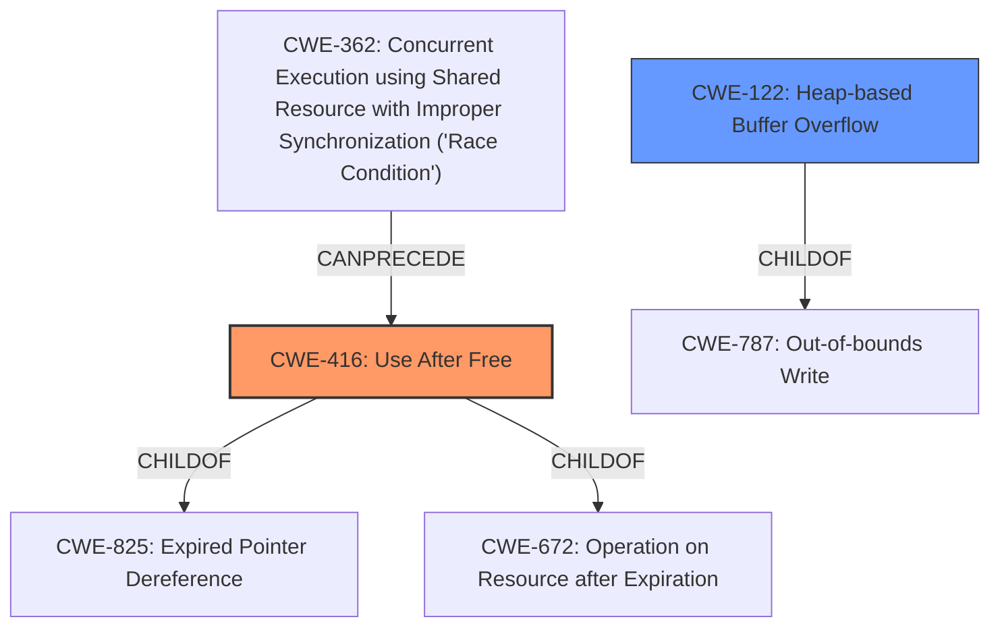

# Raw Analyzer Response for CVE-2022-1144

# Summary
| CWE ID | CWE Name | Confidence | CWE Abstraction Level | CWE Vulnerability Mapping Label | CWE-Vulnerability Mapping Notes |
|---|---|---|---|---|---|
| CWE-416 | Use After Free | 1.0 | Variant | Allowed | Primary CWE |
| CWE-122 | Heap-based Buffer Overflow | 0.5 | Variant | Allowed | Secondary Candidate |

## Evidence and Confidence

*   **Confidence Score:** 0.9
*   **Evidence Strength:** HIGH

## Relationship Analysis
The primary CWE selected is CWE-416, which is a Variant of both CWE-825 (Expired Pointer Dereference) and CWE-672 (Operation on Resource after Expiration). CWE-416 can be a result of CWE-362 (Concurrent Execution using Shared Resource with Improper Synchronization ('Race Condition')). CWE-122 is a ChildOf CWE-787 (Out-of-bounds Write).

## Vulnerability Chain
The vulnerability chain starts with a **use after free** (CWE-416) which leads to **heap corruption** and potentially arbitrary code execution.

## Summary of Analysis
The primary weakness is **use after free** (CWE-416). The vulnerability description states: "Use after free in WebUI in Google Chrome prior to 100.0.4896.60 allowed a remote attacker who convinced a user to engage in specific user interaction to potentially exploit **heap corruption** via specific input into DevTools." The "CVE Reference Links Content Summary" also confirms the "root_cause" as "Use after free in WebUI." with the weakness as "Use After Free" and "impact" as "Arbitrary code execution". The "Retriever Results" also list CWE-416 as the top combined result with a score of 0.421. CWE-416 is a Variant level CWE which is a preferred level of abstraction.

CWE-122 (Heap-based Buffer Overflow) was considered as a secondary candidate since the vulnerability description mentions **heap corruption**. It is possible that the **use after free** leads to **heap corruption** due to a buffer overflow. However, the description does not explicitly state a buffer overflow, therefore the confidence in CWE-122 is lower.
CWE-366, CWE-843, CWE-665, CWE-1021, CWE-123, CWE-362, CWE-415, and CWE-404 were considered but are not the primary weakness. CWE-366 and CWE-362 relate to race conditions which are not explicitly mentioned in the vulnerability description. CWE-843 relates to type confusion, which is not applicable here. CWE-665 relates to improper initialization, which is also not applicable. CWE-1021 relates to clickjacking, which is not relevant. CWE-123 relates to write-what-where condition, which is a possible impact of use-after-free, but not the root cause. CWE-415 relates to double free, which is not applicable. CWE-404 relates to improper resource shutdown or release, which is not applicable.