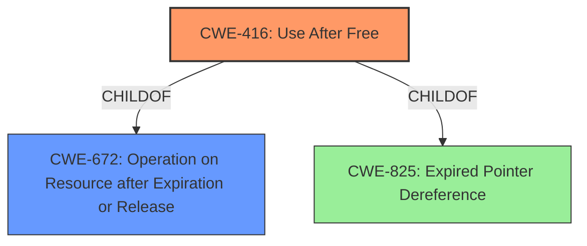

# Analysis Report for CVE-2022-1145

# Vulnerability Analysis Report: CVE-2022-1145

## Description


## Analysis (with Relationship Data)

# Summary
| CWE ID | CWE Name | Confidence | CWE Abstraction Level | CWE Vulnerability Mapping Label | CWE-Vulnerability Mapping Notes |
|---|---|---|---|---|---|
| CWE-416 | Use After Free | 1.0 | Variant | Allowed | Primary CWE |
| CWE-672 | Operation on Resource after Expiration or Release | 0.7 | Class | Allowed-with-Review | Secondary CWE |

## Evidence and Confidence

*   **Confidence Score:** 0.9
*   **Evidence Strength:** HIGH

## Relationship Analysis
The primary CWE selected is CWE-416, which is a Variant of CWE-825 (Expired Pointer Dereference) and CWE-672 (Operation on Resource after Expiration or Release). The vulnerability description explicitly mentions "use after free," making CWE-416 the most specific and appropriate choice. CWE-672 is a more general class that encompasses the specific error of using memory after it has been freed, and it is considered as a possible secondary CWE.



## Vulnerability Chain
The vulnerability chain starts with the **use after free** condition (CWE-416) which leads to **heap corruption**. The final impact is profile destruction.

## Summary of Analysis
The primary weakness is clearly a **use after free** condition as stated in the Vulnerability Description Key Phrases and the CVE Reference Links Content Summary, making CWE-416 the most accurate.

>   **Vulnerability Description Key Phrases**
>   - **rootcause:** **use after free**

>   **CVE Reference Links Content Summary**
>   **Root cause of vulnerability:**
>   * Use-after-free vulnerability

CWE-416 is a Variant level CWE, which is the preferred level of abstraction. The relationship analysis supports that this weakness is a specific type of resource management error. Other CWEs like race conditions or improper initialization were considered but deemed less relevant since the core issue is using memory after it has been freed, not concurrent access or initialization problems.

Relevant CWE Information:

# Enhanced Context (25 CWEs)

## CWE-416: Use After Free
**Abstraction:** Variant
**Status:** Stable

### Description
The product reuses or references memory after it has been freed. At some point afterward, the memory may be allocated again and saved in another pointer, while the original pointer references a location somewhere within the new allocation. Any operations using the original pointer are no longer valid because the memory "belongs" to the code that operates on the new pointer.

### Relationships
ChildOf -> CWE-825
ChildOf -> CWE-672

### Mapping Guidance
**Usage:** Allowed
**Rationale:** This CWE entry is at the Variant level of abstraction, which is a preferred level of abstraction for mapping to the root causes of vulnerabilities.

## CWE-672: Operation on Resource after Expiration or Release
**Abstraction:** Class
**Status:** Draft

### Description
The software performs an operation on a resource after the resource has expired or been released.

### Relationships
ParentOf -> CWE-416

### Mapping Guidance
**Usage:** Allowed-with-Review
**Rationale:** This CWE entry is a Class and might have Base-level children that would be more appropriate
**Comments:** Examine children of this entry to see if there is a better fit
**Reasons:**
- Abstraction


## CWE Relationship Analysis

Current CWEs represent these abstraction levels: .


### Vulnerability Chain Analysis

**Chain starting from CWE-672:**
- 672 (Operation on a Resource after Expiration or Release) - ROOT


**Chain starting from CWE-825:**
- 825 (Expired Pointer Dereference) - ROOT


### CWE Relationship Diagram

```mermaid
graph TD
    classDef primary fill:#f96,stroke:#333,stroke-width:2px
    classDef secondary fill:#69f,stroke:#333
    classDef tertiary fill:#9e9,stroke:#333
```


*Report generated on 2025-03-30 17:56:50*
